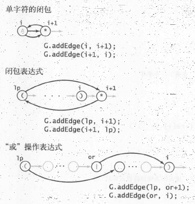

正则表达式规则

<!-- more -->

# 正则表达式

## 描述模式

|          |                      |
| -------- | -------------------- |
| 连接操作 | `AB <=> {AB}`        |
| 或操作   | `A|B <=>{A,B}`       |
| 闭包操作 | `A* <=> U{A^i} i>=0` |
| 空字符串 | `eps`                |
| 括号     | 提升优先级           |

### 正则表达式的定义

一个正则表达式可以是：

1. 空字符串
2. 单个字符
3. 被括号包含的一个正则表达式
4. 两个正则表达式连接成的表达式
5. 由或运算分隔的两个表达式
6. 由闭包运算标记的表达式

##### 

### 描述符

| 名称       | 记法                        | 例子       |
| ---------- | --------------------------- | ---------- |
| 通配符     | `.`                         | `A.B`      |
| 指定的集合 | 包含在`[]`中的字符          | `[ABC]*`   |
| 范围       | 包含在`[]`中，由`-`分隔     | `[A-Z0-9]` |
| 补集       | 包含在`[]`中的，且以`^`开头 | `[^A-Z]`   |

### 闭包的简写

| 选项                       | 记法     | 例子                       |
| -------------------------- | -------- | -------------------------- |
| 至少一次                   | `+`      | `[0-9]+`（与下面这个等价） |
| 至少 0 次                  | `*`      | `[0-9][0-9]*`              |
| 指定次数 `n`               | `A{n}`   | `[0-9]{11}`                |
| 指定次数范围 `a <= n <= b` | `A{a-b}` | `[A-Z]{0-2}`               |

### 转义符：

- 任意空白字符：`\s`
- 表示闭包的字符：`\*`，...
- 其他常见的字符：`\n`，`\t`，...

