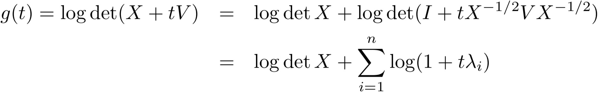
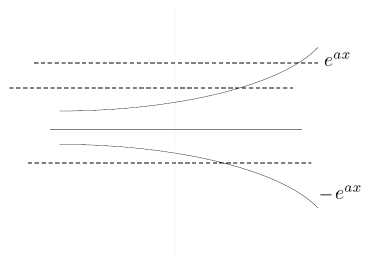
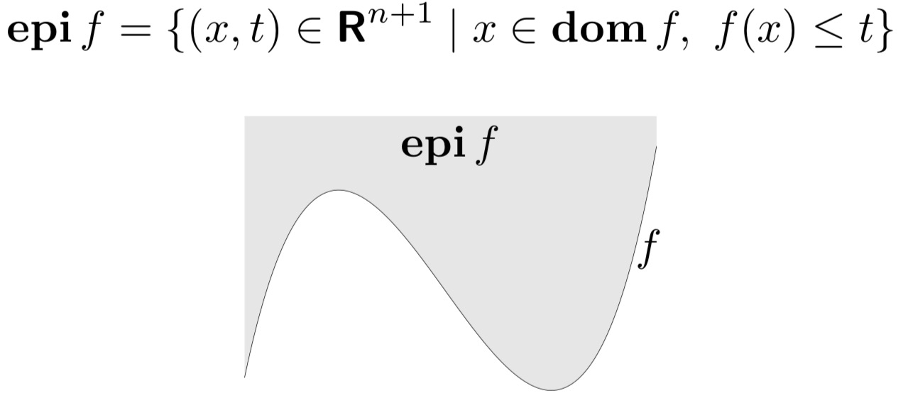
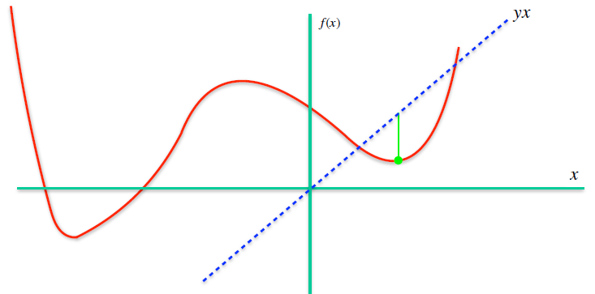
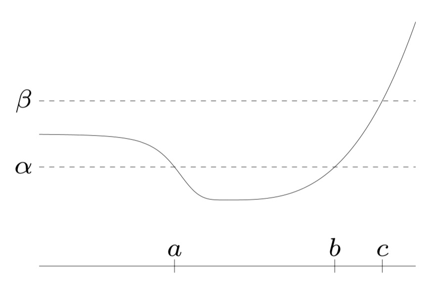
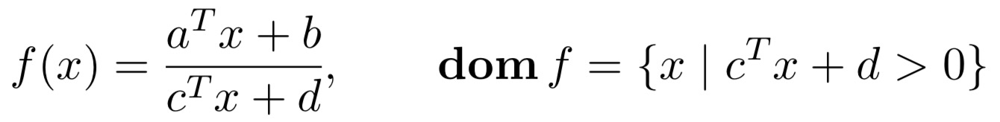

凸函数

<!-- more -->

## 凸函数

1. **基本性质和案例**
2. **保凸运算**
3. **共轭函数**
4. *拟凸函数*
5. *对数-凹函数和对数-凸函数*
6. *关于广义不等式的凸性*

### 基本性质和案例

#### 凸函数

- $f:\R^n\rightarrow \R$ 为凸函数，则其满足定义域为凸集，且
  $f(\theta x+(1-\theta) y)\le \theta f(x) + (1-\theta)f(y), \forall x, y \in \mathrm{dom}~f, 0\le \theta \le 1$
- 若$f$为凹函数，则$-f$为凸函数
- 仿射函数

**严格凸函数**

- $f:\R^n\rightarrow \R$ 为凸函数，则其满足定义域为凸集，且
  $f(\theta x+(1-\theta) y) < \theta f(x) + (1-\theta)f(y), \forall x, y \in \mathrm{dom}~f, 0\le \theta \le 1$

##### 约束凸函数到直线

**Thm**：$f:\R^n\rightarrow\R$ 为凸函数$\iff g(t)=f(x+tv)$ 为凸函数，$\forall x\in\mathrm{dom}f,v\in \R^n$

> 例如：$f:S^n\rightarrow \R,~where~f(X) = \log\det X,\mathrm{dom} f = S^n_{++}$ 为凹函数

##### 扩展值延伸

- 用$\tilde f(x) = f(x), x\in \mathrm{dom} , \tilde f(x) = \infty , x\in \mathrm{dom} f$
- 简化表示$0\le\theta\le 1\Rightarrow \tilde f(\theta x+(1-\theta)y)\le \theta \tilde f(x) + (1-\theta)\tilde sf(y)$

> 例：凸集的示性函数是凸函数
>
> - $I_c(x)=0~if~x\in C~else~undefined.$
> - $\tilde I_c(x)=0~if~x\in C~else~+\infty.$

##### 一阶条件

- 函数 $f$ 可微，且满足$f$的定义域是开集，且梯度：$\nabla f(x)$ 处处存在

**Thm**（一阶条件）（**定义域为凸集的可微函数**）$f(y) \ge f(x) +\nabla f(x)^T(y-x),~\forall x, y \in \mathrm{dom}~f$ 是 f 为凸函数的充要条件。

- 函数 f 的一阶近似表示全局下估计

- 一阶条件的证明：$f为凸函数\iff g(t) = f(x+tv)为凸函数\iff g(t)\ge g(\tilde{t})+g(\dot t)(\tilde{t}-t)\iff f(y)\ge f(x) +\nabla f^T(x) (y-x)$

##### 二阶条件

**Thm**（二阶条件）f 二阶可微，即对于 $\mathrm {dom}~f$ 内的任意一点，Hessian 矩阵存在或 $\nabla^2f$ 存在，且函数定义域是**开集**，则：$f$是凸函数$\iff$Hessian矩阵半正定，即 $\forall x \in \mathrm{dom}~f,~\nabla^2f(x)\succeq 0$

- 正定 ==> 严格凸函数（反之不成立）

##### 例子

二次函数：$\displaystyle f(x) = \frac 1 2 x^TPx + q^Tx+r~(with P\in S^n)$
$$
\begin{aligned}
&\frac{\partial x^TAx}{\partial x} = Ax+A^Tx,\\
&\frac{\partial a^Tx}{\partial x} = a  
\end{aligned}
$$

- $f(x)=1/x^2$：注意定义域不是凸集

- 仿射函数：$ax+b$

- （指数函数）$e^{ax}$

- （幂函数）$x^a,x\ge 0$ 

- （绝对值的幂函数）$|x|^p,p\ge1$

- （对数函数「凹函数」）$\log x$（$\ln x$）

- （负熵）$x\log x$

- （范数）$R^n$ 中的范数 $P(x)$

  > 注意：零范数（计算非零元素的数目）——不是范数

- （极大值函数）$f(x)=\max\{x_1,...,x_n\}$

- （指数和的对数）$f(x)=\log(e^{x_1}+\cdots+e^{x_n})$（Softmax)
  - $\max\{x_1,\dots,x_n\}\le f(x)\le \max\{x_1,\dots,x_n\}\log n$
  - 利用柯西施瓦兹不等式证明：$(a^Ta)(b^Tb)\ge (a^Tb)^2$
- 几何平均函数：$f(x) = (\Pi^{n}_{i=1}x_i)^{(1/n)}$
- $f=\log \det X$ 凹函数

### 保凸运算

#### 非负加权求和

**Def**（非负乘积）$\alpha f$ 不改变凸性

**Def**（求和）$+$ 不改变凸性

**Def**（非负加权求和）

- 可拓展到无限项：$g(x)=\int_A\omega(y)f(x,y)\mathrm dy$

  其中，$f(x,y)$ 对集合 A 中的每一个 y，为凸函数

#### 复合仿射映射

**Def**（复合仿射映射）$f$是凸函数，则$f(Ax+b)$ 是凸函数

例如：

1. 线性不等式的对数惩罚函数 $\displaystyle f(x)=-\sum_{i=1}^m\log(b_i-a_i^Tx)$
2. 仿射函数的任意范数

#### 逐点最大函数

**Def**（逐点最大）$f_i$ 为凸函数，则$f(x) = \max\{ f_1, f_2,...,f_m\}$ 为凸函数

- 分段的线性函数 $f(x)=\max(a_i^Tx+b_i)$为凸函数
- 最大 r 个分量之和：$f=\sum_{i=1}^r x_{[i]}$

#### 逐点上确界

**Def**（逐点上确界）若 $f$ 为凸函数，$g(x)=\sup_{y\in A}f(x,y)$ 为凸函数

例如：

1. 在集合 C 中距离 $x$ 最远点的距离函数 $f(x)=\sup_{y\in C}\|x-y\|$
2. 对称矩阵的最大特征值 $\lambda_{\max}(X)=\sup_{\|y\|_2=1}y^TXy$

#### 函数复合

**Thm**：$g:R^n\rightarrow R^k, h:R^k\rightarrow R, f(x) = h(g(x))$

- h 凸，不减 & g 凸 → f 凸函数
- h 凸，不增 & g 凹 → f 凸函数
- h 凹，不减（增） & g 凹（凸） → f 凹

例如：

- g 凸函数，则 $\exp g(x)$ 为凸函数
- g 为凹函数，且为正，则$\log g(x)$ 为凹函数，$1/g(x)$ 是凸函数

#### 最小化

**Thm**：若 $f(x,y)$ 是关于 $(x,y)$ 的凸函数，且集合 $C$ 为凸集。则$g(x)=\inf_{y\in C}f(x,y)$ 是凸函数

例如：

$$
\begin{aligned}
&f(x,y)=x^TAx+2x^TBy+y^TCy\\
&其中\left[\begin{matrix}
A&B\\
B^T&C
\end{matrix}\right]\ge 0,C>0
\end{aligned}
$$

则 $g(x)=\inf_{y}f(x,y)=x^T(A-BC^{-1}B^T)x$ 为凸函数

#### 透视函数

**Def**（透视函数）函数$f:R^n\rightarrow R$的透视函数，形如 $g(x,t) = tf(x/t)$ 且 $f$ 为凸函数

例如：

1.  $f(x)=x^Tx,g(x,t)=tf(x/t)$

2. 相对熵：$\sum u_i\log (u_i/v_i)$

3. KL散度：$D_{kl}=\sum(u_i\log(u_i/v_i)-u_i+v_i)$（比较概率分布差异）

### More

下水平集：

- $f$ 的 $\alpha$-下水平集 $C_\alpha=\{x\in \mathrm {dom}~f|f(x)\le \alpha\}$
- 凸函数的所有下水平集都是凸集

上境图：

共轭函数 $\displaystyle f^*(y)=\sup_{x\in \mathbf{dom}f}*(y^Tx-f(x))$：

- 可微$f$的共轭函数$f^*(y)=\sup_{x\in\mathbf{dom}f}(y^Tx-f(x))$ 为凸函数
- 凸函数$f$且为闭函数：$(f^*)^*=f$

例如：

1. 负对数 $f(x)=-\log x$

$$
\begin{aligned}
f^*(y)&=\sup_{x>0}(xy+\log x)\\
&=\begin{cases}
-1-\log(-y)&y<0\\
\infty&otherwise
\end{cases}
\end{aligned}
$$

### 拟凸函数

**Def**（拟凸函数）$f$ 为拟凸函数，当其定义域为凸集，且其下水平集对于所有$\alpha$为凸集。

也就是说：$f(\theta x+(1-\theta)y)\le \max\{f(x),f(y)\}$

例如：

1. 向量的长度（最后一个⾮零元素的位置）
2. 线性分数函数

3. 向量的零范数（非零元素的个数）

拟凸函数的二阶条件：

### 对数凸函数、对数凹函数

例如：

对数凹函数：

### 基于广义不等式的凸函数