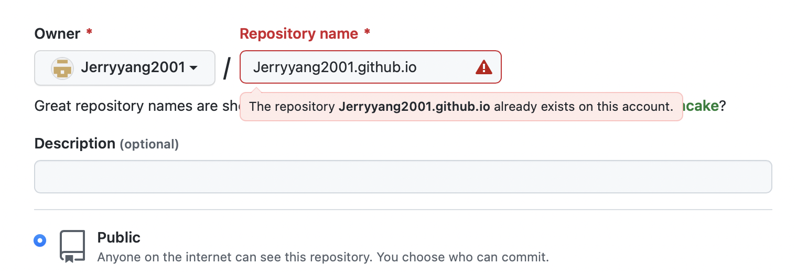
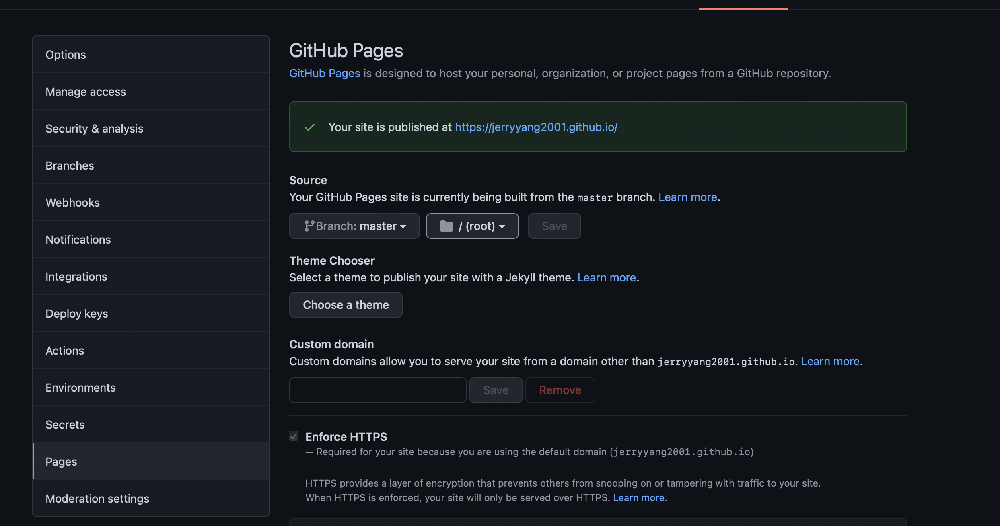

三十分钟实现你的Hexo博客。

<!-- more -->



1. 一定的命令行操作基础（`cd`等基础命令的使用）
2. （可能需要）科学上网，以登入 Github
3. 一定的耐心（来调bug）

软件上：

1. 代码编辑器，例如vscode
2. [Node.js](http://nodejs.cn/download/)
3. git：下载地址[tuna](https://mirrors.tuna.tsinghua.edu.cn/) 点右侧的`获取下载链接`按钮，找Git。安装时全默认即可。



## 创建你的 Github 账号和与你的账号关联的repo

> Reference: [https://pages.github.com](https://pages.github.com)

### Github 账号

这个超级简单，就不展开了，但需要记住你的 `username`（例如我的是Jerryyang2001）

### 创建repo

repo创建时，必须满足：

1. Public访问权限（通过下面的选项来确定）
2. 名字：必须是 `username.github.io`

例如：



### 测试效果

实际上，你已经完成了这里面（[https://pages.github.com](https://pages.github.com)）最难的一个部分，下面要测试你的网站的代码仓库是否成功创建：

## 配置网站

### 下载 repo 到本地

首先，先打开一个terminal（Windows下的Powershell），并且用cd命令转到一个用来存放你的网站源码的文件夹，例如我的：

```
cd D:/Documents/Repositories/
```

通过：

```
git clone https://github.com/username/username.github.io
```

来下载你这个网站对应的代码。

#### 打开你的repo

首先，你需要一个vscode（或者sublime，或者任何一个轻量级的代码编辑器），用它打开这个repo的文件夹（想必大家都很熟悉）



创建一个新的 `index.html` 文件

内容简单的写一句：

```
Hello world!
```

就可以了～

然后将它push到远端：

```
git add --all
git commit -m "Initial commit"
git push -u origin main
```

然后稍微等等，然后访问：`https://username.github.io` 网站，应该就能看到结果。



```bash
npm install -g hexo-cli
```

接着，执行：

```
hexo init .
npm install
```

然后，在当前文件夹应该就能看到hexo和npm自动生成了你的blog源码，配置好了相关环境。从这里起，你的Blog之旅将正式开始。

### 站点配置

一个Hexo站点主要由五部分组成：

1. 软件框架环境（Hexo、Nodejs等）
2. 主题文件（一个主题 一个文件夹，可以通过npm指令安装，也可以直接放在`themes`文件夹下）
3. sourse文件夹下的blog内容，markdown格式
   1. 其中的`_posts`为内容
   2. 其他的文件夹下为一些特殊页面的内容，例如about me，categories，tags页面的布局和特殊设置
4. 不同的branch！一般而言，repo中需要包含【源代码】和用源代码生成的、用于给用户看到的【网页源码】，但是【网页源码】和【源代码】不需要放在一起，就像开发人员开发了一个app，给你的只是一个软件，而不是源代码一样。我们希望实现这样的功能
   1. 在一个分支部署网站，用来存放【网站源码】，供github**自动**部署。
   2. 在另一个分支存放自己的源代码。例如：
5. github远端

### 部署

> [https://hexo.io/docs/one-command-deployment](https://hexo.io/docs/one-command-deployment) 只有Git章节有用

先讲讲第四部分，就是不同的branch组织源码库。这一部分需要：

```
npm install hexo-deployer-git --save
git branch gh-pages-source
git checkout gh-pages-source
```

然后在你的`_config.yml`文件中添加：

```
deploy:
  type: git
  repository: git@github.com:username/username.github.io.git
  branch: master # 这里就是你存放【网站源码】的地方
  message: Site updated:{{ now('YYYY-MM-DD HH:mm:ss') }})
```

然后试试看：

```
hexo deploy
```

就能直接把生成的【网站源码】push到github仓库中，让github自动部署网站到`username.github.io`。






## 资料

我正在用的主题：[Volantis](https://volantis.js.org)

曾经用过，感觉还行的一个主题：[Fluid文档](https://fluid-dev.github.io/hexo-fluid-docs/start/) [Fluid 官网](https://hexo.fluid-dev.com)

一些更多的折腾资料：

一定要多看 hexo 的官网介绍：

1. [一键部署](https://hexo.io/docs/one-command-deployment#Git)
2. [站点基础组织结构](https://hexo.io/docs/setup)
3. [站点配置文件](https://hexo.io/docs/configuration)

## 当然也可以：

如果你懒的话，也可以直接clone我的源码嘛。毕竟都是配置好的东西，拿来就用就是了。（记得把我的内容全都删了）

在clone完我的源码之后需要注意的是：

我的【源代码】在`gh-pages-volantis`分支下。记得checkout到这个分支上，然后：

1. 删除`sourse/_posts`文件夹下的所有文件
2. 修改`sourse/about` `sourse/categories` `sourse/chat` 等源码中的一些不属于你的标题……
3. 修改所有的config文件中的东西（`_config.volantis.yml` 和 `_config.yml`

就这样？后面挺复杂的（细节太多了）各位慢慢摸索吧，百度上都有相应的解决方案的。
