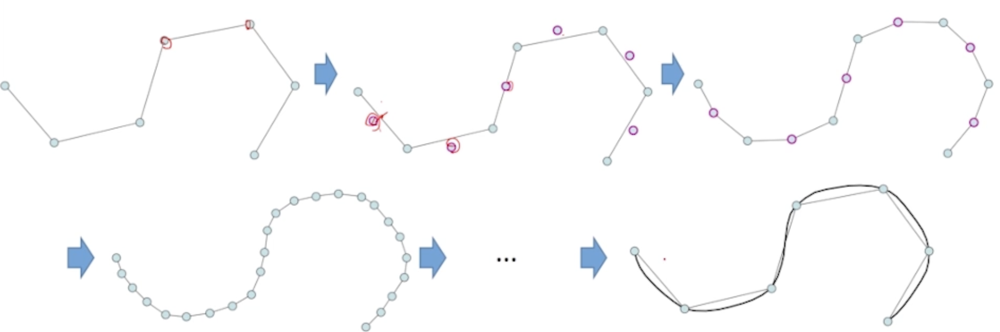

<!--more-->

## B-样条

Bezier 曲线问题：无法表示圆弧

### 投影几何：

齐次坐标：
$$
x\rightarrow \left(wx, w\right)
$$
提出有理Bezier曲线

### 有理Bezier曲线

在每个控制顶点上设置权函数
$$
f^{eucl}(t) =\sum_{i=0}^n\mathbf p_i\frac{B_i^d(t) \omega_i}{\sum_{j = 1} ^ n B_j^{d} (t) \omega _i}=\sum_{i=0}^n\mathbf q_i(t)p_i
$$

## NURBS — 非均匀有理B样条

定义：
$$
f(t) = \frac{\sum_{i = 1} ^ n N_i^{(d)} (t) \omega_i \mathbf p_i}{\sum _ {i = 1} ^ n N_i^{(d)} \omega_i}
$$
影响 NURBS 曲线因素：

1. 控制顶点 — 用户交互
2. 节点向量 — 决定了 B-样条基函数
3. 权系数 — 形状

## 细分曲线

回顾 Bezier 曲线作图法

- 逐步割角、磨光

### 思想

1. 拓扑规则：加入新的点 — splitting
2. 几何规则：移动顶点 — averaging

### Chaikin细分

割角法

1. 每条边取中点，生成新的点
2. 取相邻点的平均作为新的点

如果用矩阵表示，
$$
x' = M x
$$
那么可以用极限来计算

好的细分规则，则其最大特征根 $= 1$

### 插值型细分方法

细分方法：

1. 保留原有顶点
2. 对每个边增加新顶点
3. 迭代生成新曲线

可以看成“补角”法

#### 四点插值细分

$$
p'_{2i + 1} = \frac{p_i+p_i+1}{2}+ \alpha (\frac{p_i + p_ i + 1}{2}- \frac{p_{i - 1} + p _ {i + 2}}{2})
$$

## 隐式曲线

隐函数定理：存在且唯一 — 难以找到

### 隐式曲线

升高一维：
$$
z = f(x, y)
$$
可以看作是二元函数的零等值线

同时可以定义曲线的内部和外部。

### 隐式曲线的绘制

例如：

1. 直线 — 三元一次方程

#### 等值线抽取

1. 输入：一个二院隐式函数
2. 输出：等值线

目的 — 参数化

Marching Cubes算法：最常用算法

思想：

1. 在离散格子上求值
2. 利用局部连续性来插值
3. 按一定的顺序形成离散曲线

还有很多其他歧义的情况。

Adaptive Grids：

### 隐式曲线拟合

输入：平面上的一些点（设为自封闭曲线）

输出：拟合这些点的一个隐式曲面

转化为拟合问题。

构造方法很多

## NURBS曲面

参数曲面 — $\mathbb R ^ 2 \rightarrow \mathbb R ^ 3$

基本方法：张量积函数转化为张量积曲面

可以看作是曲线的曲线

两个参数的顺序无关。

### Bezier 曲面

曲面性质 — 类似于曲线

作图法：de Casteljau

Bezier曲面拼接连续

### 表达带“洞”/非矩形边界的曲面

使用参数域上的洞来表达

三角面片也可以对应定义Bazier曲面片

### 总结

张量积曲面：

- 两个独立方向的“曲线的曲线”
- 性质类同于曲线的性质
- 表达、公式形式比曲线情况更加复杂
- 特殊性 — 角点是否光滑？

张量积体：

- Bezier 体

