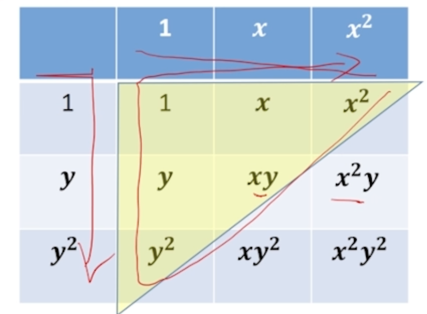
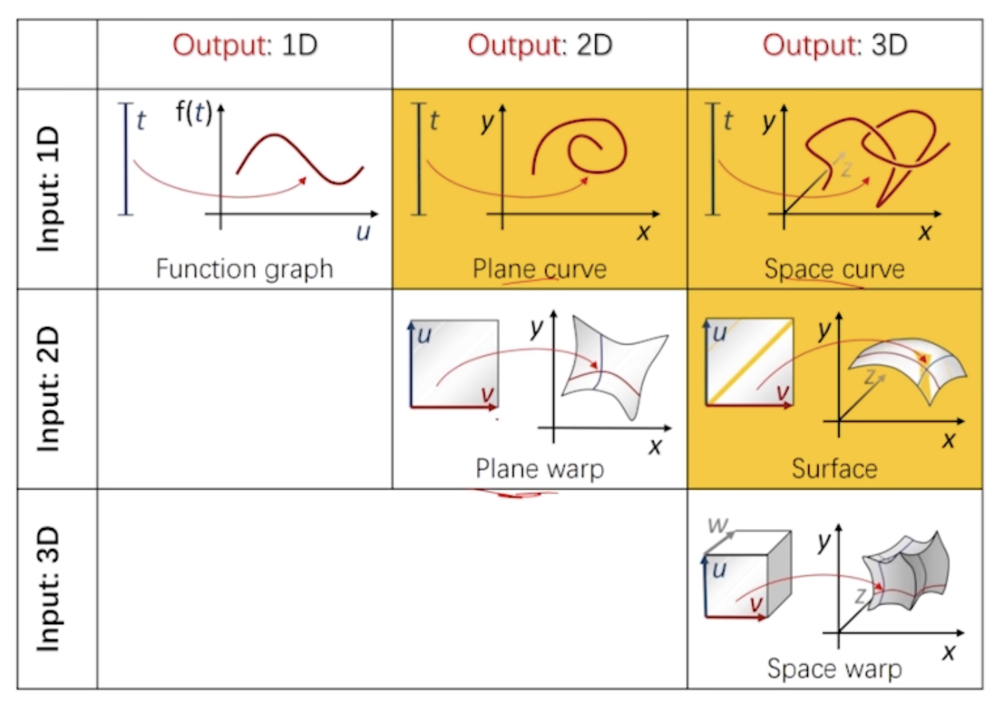

几何建模与处理

<!--more-->

## 多元函数

$$
f:\R ^n \rightarrow \R
$$

### 二元函数基函数构造

方法：**张量积**（两两相乘）

优点：定义简单，多个一元基函数的乘积形式

不足：

- 维数增加 – 基函数个数 $n^2$ – 变量（参数数量）增加

### 神经网络表达

- 用单变量函数 $\sigma(x)$ 和不同的仿射变换来构造基函数。

## 向量值函数

$$
f:\R^m \rightarrow \R^n
$$

- 看成多个单变量函数，各个函数独立无关。
- 共享基函数

几何上：

- 对于$m=1$ – 轨迹为曲线 — 本质维度=1
- 对于 $\R^2 \rightarrow \R^3$ — 参数曲面 — 本质维度=2 — 
- $3\rightarrow3$ — 变形 – 应用：有限元、图像变形
- $3\rightarrow 2$ — 降维映射 — 例如 AutoEncoder

## 曲线拟合

### 曲线拟合问题

- 输入：给定平面上的点
- 输出：一条参数曲线，拟合这些点

$$
f:\R \rightarrow \R^2
$$

参数化 — 
$$
\begin{cases}
x = x(t)\\
y = y(t)
\end{cases}
$$

- 问题转化为：对数据点 $(x_i,y_i)$，对应哪个参数$t_i$？

- $E = \sum\|\mathbf p (t_i) - \mathbf p_i\|$

如何确定 $t$

- 均匀参数化（Equidistant Parameterization）
- 弦长参数化 $t_{i+1} - t_i =\|\mathbf b_{i+1} -\mathbf b\|$

- 中心参数化

> **需要好的参数化**
>
> 目的：保持原有结构！

### 曲面参数化

- 三维点找二维的参数 — 降维问题

例如：

- 纹理映射
- 世界地图

