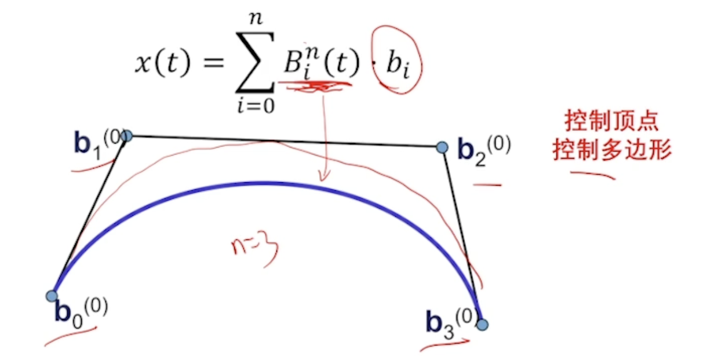
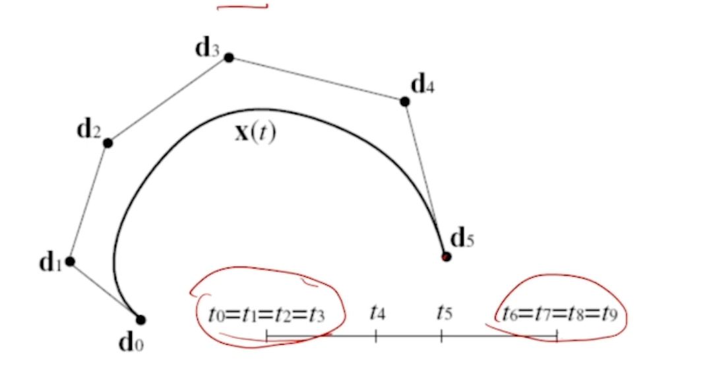

GAMES 102 -- 5 B样条曲线

<!-- more -->

## B 样条曲线

### 建模的两种形式

1. 重建 – 形状已经有了，猜出来– 基函数组合
2. 设计 – 产生 – 自行组合权系数

### 如果用 Bernstein 基函数？

顶点和曲线的关联性强，具有较高的几何意义

$n$ 次Bernstein基函数
$$
B_i ^{(n)} (t) = C_n ^ i t ^ i ( 1- t ) ^{n - i}
$$
从而：
$$
\mathbf f ( t ) = \sum_{i = 1} ^ n b_i ( t )\mathbf p_i, \quad t \in [0, 1]
$$
我们使用Bernstein基函数替代权函数：
$$
x(t) = \sum_{i=0}^n B_i^n(t) b_i
$$

## B曲线的性质

观察基函数：

1. 具有对称性（关于 $i$）
2. 当 $t = i/n$ 最大
3. 非负性 + 权性（加和为1）— 具有凸包性
   1. 曲线始终在凸包内
4. 基性 – 是$n$次多项式空间的基
5. 递推公式（从组合系数证明）
6. 端点差值 – 经过始末顶点
7. 端点性质 –
   1. 插值
   2. 切线方向和边相同
8. 升阶 — 通过递推公式来推导

## de Casteljau 算法

输入：点

输出：在 $t$ 位置的值

思想：反复用 $t \mathbf x + (1-t)\mathbf y$ 作用在相邻点上

复杂度 – $O(n^2)$

算法只有线性运算，计算稳定

应用：离散、求根

## 两Bezier曲线的拼接条件

要求$C^1$：要求有连接点同向

要求$C^2$：要求连接点是中点

### 广义样条曲线

分段的多项式曲线（Bezier曲线）

## B 样条

Bezier 曲线的不足：

1. 全局性！牵一发而动全身-不利于设计

思考：怎样统一表达？

类比：每个控制顶点用一个基函数
$$
x(t) = \sum N_{i, k}(t) \cdot d_i
$$
性质：

1. 局部性
2. 正、权性
3. ……

启发：根据递推公式–

1. 局部类似，由一个基函数平移得到
2. 高阶的由两个低阶的基函数升阶得到

### B-样条

对于均匀节点$\cdots,i,i+1,\cdots$

定义如下：
$$
N_i^1(t) = \begin{cases}
1, & i \le t < i + 1\\
0
\end{cases}
$$
那么：
$$
N_i^k= \frac{t-i}{k-1}N_i^{k-1} + \frac{i+k-t}{k-1}N_{i+1}^{k-1}
$$
对于非均匀节点：$t_0< t_1 < \cdots<t_n$
$$
N_i^1(t) = \begin{cases}
1, & t_i \le t < t_{i + 1}\\
0
\end{cases}
$$

$$
N_i^k= \frac{t-t_i}{t_{i+k-1}-t_i}N_i^{k-1} + \frac{t_{i+k}-t}{t_{i + k} - t_{i + 1}}N_{i+1}^{k-1}
$$

### 样条曲线

从而根据上述基函数，可以定义样条曲线。

设置重数：

### 其他理论知识

性质很多：

1. 局部凸包性
2. 变分缩减性
3. 包络性
4. 导数、积分
5. 几何作图

