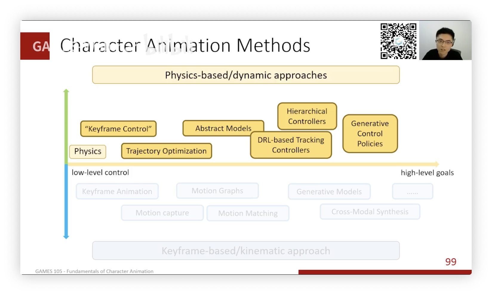

## Introduction to Computer Animation -- in 3D.

### What is character animation

1. Animate Movie
2. Virtual Idle... Digital Human...

**Compare with CG**:

- ... -> Geometry -> Animation -> Rendering -> ...
- simulation: **Phenomenon**
- character animation: **Behaviour**

*Simulation + Control = Character Animation*

### Why study C.A.

1. A character typically has 20+ joints, 50-100+ parameters.
    1. 传统：手调参数
2. 角色动画
    1. Understanding the mechanism behind the motions and behaviors
    2. "Compute Intensive"

A Pipeline :

1. Rigging & skining:绑定、蒙皮
2. Skeletal Animation：骨骼动画
3. 1 + 2 = Animated Character

### where does motion come frome

1. brain
2. muscle
3. force
4. physics
5. body **pose**

Two approach: 

1. Key Frame-Based / Kinematic Approach: Ignore the idea, update pose directly.(Simple)
2. Physics-based /dynamic Approach: merge 123, simplified control & physics.

Two target:

1. Low-Level Control: More details.
2. High-Level Goals: focus on target. (e.g. lift up the box)

> Disney's 12 priciples.

## key frame based. 

### Two key techniques

(Keyframe Animation)

1. forward Kinematics: Given rotations of every joints, compute rotations of every joints.
2. Inverse Kinematics

other solution: 

1. Motion Capture.
2. Motion Retargeting.

### Motion Graphs / State machines (in game)

> 2002: Motion Graph

... Motion Matching ...

在游戏中阻力较大：新技术，区别于状态机。

### Learning Based.

Generative Model.

1. Input: Control Signal + Current Pose
2. Output: Next Pose

Iterative.

e.g. Character Controllers using Motion VAEs.

## Physics based

1. force, torque -> simulation
2. PD(Proportional Derivative)

Approaches

1. Keyframe Control
2. Spacetime/Trajectory Optimization.
3. Abstract Models
4. Reinforcement Learning.
5. Generative Control Policies.

