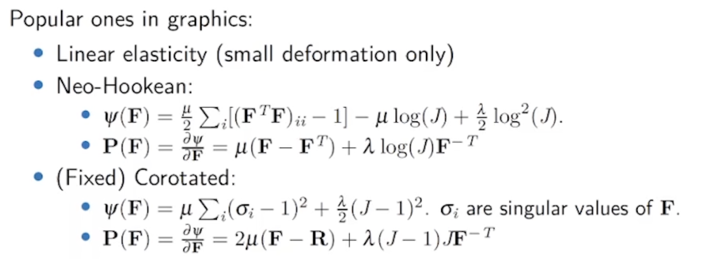
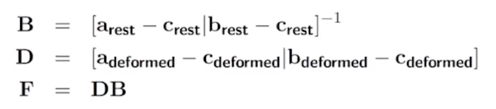

GAMES 201 -高级物理引擎实战 - 4 - 拉格朗日视角

<!--more-->

## 变形 – Deformation

> Reading：
>
> 1. The classical FEM method and discretization methodology
> 2. The MPM for simulating continuous …

形变就是一个单对单的映射：(从静止的位置映射到形变的位置）
$$
\phi : \mathbb R^3 \rightarrow \mathbb R^3
$$
从而形变梯度为：
$$
\mathbf F = \frac{\partial \mathbf x_{deformed}}{\partial \mathbf x_{rest}}
$$
不难发现到$\mathbf F$是平移不变的。

体积变化即为：$J = \det \mathbf F$

## 弹性

弹性
: 材料有恢复原始状态的性质

> 考虑超弹性模型

- 我们只观察超形变物体（有strain能量函数$\Psi$）的

Potential Function: 惩罚函数，惩罚**形变**。$\varPsi(\mathbf F)$

注意区别：

1. stress - 应力：材料**内**部的弹性力 - 就是Deformation Gradient
2. strain - 应变：（形变的Measure）直接替换为 $\mathbf F$

### Stress Tensor

表明了材料微元和其他材料微元的相互作用：

有不同的stress tensor（三种常用的）

- PK1：$\mathbf P(\mathbf F) = \partial \Psi (\mathbf F) /\partial \mathbf F$ 
    - 容易计算，但在rest space
- Kirchhoff stress：$\tau$
- Cauchy Stress：$\sigma$

相互关系为：

$$
\tau = J \sigma = \mathbf P\mathbf F^T
$$

- Traction = $\mathbf t = \sigma^T \mathbf n$

#### 常用属性（描述弹性材料）

1. 杨氏模量 – $E = \sigma / \varepsilon$ - 对应弹簧的 $k$
2. Bulk modulus - 常见于可压缩液体的仿真
3. 泊松比 $\nu \in [0, 0.5)$ - 泊松比是材料的一个力学参数，定义为横向应变与纵向应变的比值，也叫横向应变系数。

考虑 Lame Parameters：

- $\mu$
- $\lambda$

可以相互转换，只要指定$\mu$和杨氏模量

#### 常用超弹性模型

1. Linear elsaticity – 小形变下可以，但对于旋转没有惩罚 - 导出的是线性方程组
2. **Neo-Hookean**
3. **Fixed Corotated**

## FEM basics

目标：建立离散方程（PDE）

### Linear Tetrahedral FEM(Triangular)

假设对每一个元素 Deformation map 是仿射变换，即$F$为常数。

对于每一个元素（三角形） $e$，弹性势能为：

$$
U(e)=\int_e \psi(\mathbf F(\mathbf x))\mathbf x = V_e \psi (\mathbf F_e)
$$

简单求解一个线性方程组即可解得 $\psi = Fx + B$

> 力是势能$U$对位置$x$的导数

求出力：

$$
f_{t, i} = - \frac{\partial U}{\partial \mathbf x_i}= - \sum_e V_e \mathbf P(\mathbf F_e)\frac{\partial \mathbf F_e}{\partial \mathbf x_i}
$$

> *FEM Table*

