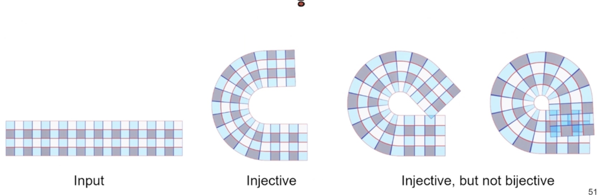

---
title： Games 301
---

## 曲面参数化

### 引入

- 几何直观：从三维曲面展开成2d曲面
- 数学本质：三维曲面在二维平面的嵌入/映射
    - 构建曲面到平面的一一对应
    - 3d曲面的本质是2d的：2d流形（拓扑同胚）

#### 应用：曲面贴图

1. 纹理、法相、偏置、颜色、材质……
2. 工业界：uv图

#### 应用：纹理地图（Texture Atalas）

1. Segmentation & Packing

#### 应用：曲面拟合

1. 曲线：B样条
2. 曲面：T样条、NURBS

#### 应用：曲面渲染

1. 虚拟纹理
2. 虚拟几何
3. mipmap
4. LOD

……

### 表达方法

1. 基函数 -- 连续函数
2. 分片映射方法
    1. 三角网格
    2. 线性映射拼接

#### 参数化的度量：什么是“最优”的参数化？

不同的范数（或度量）下，最优是不同的。

#### Jacobian 的几何意义

$$
Jf(\mathbf x)
$$

定义了局部的形变量。

行列式表明面积的变化

#### 保持xx的映射

1. 保角映射 - conformal （共形）
2. 保面积 - authalic（等积）
3. 等距

Theorem： 共形映射总是存在的。

共形映射 

- 对数共形因子
- Yamabe 方程 （内蕴高斯曲率）

等距映射：保持任意两点的测地曲率。

- 可展曲面：高斯曲率处处为0
    - 只有三种：柱面、锥面、切线面

### 几何形变 distortion

svd on $J$：

- 保角：$\sigma _1 = \sigma _2$
- 等积：$\sigma _ 1 \sigma _ 2 = 1$
- 等距：$\sigma _ 1 = \sigma _ 2 = 1$

#### Locally bijactive = Injective

The sufficient condition:

$$
det Jf > 0\quad\forall x
$$

#### Global Bijective v.s. Locally Bijective.

#### Distortion Metric

1. Conformal (2003): $\sigma_2 / \sigma _ 1$
2. MIPS: $\sigma _ 1 / \sigma _ 2 + \sigma _ 2 / \sigma _1$
3. Symm Dirichlet: $\sigma_1^2 + \frac 1 {\sigma_1 ^ 2} + \sigma_2 ^ 2 + \frac 1 {\sigma_2 ^ 2}$

### 广义参数化和数据降维

相容性网格：构建曲面的映射（双）

体参数化(Volumetric Parameterization).

都属于**几何映射**：Inversion free Geometric mapping construction: A Survey (Fu 2021 CVM)

参数化表达：何为参数？

1. 本征维度
2. 维度估计：高维数据可能存在低维结构。

