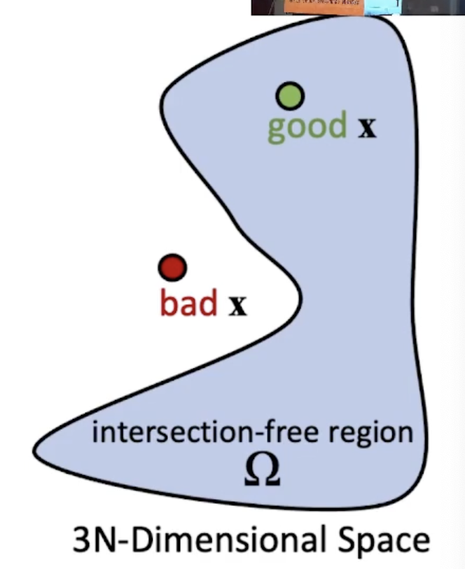
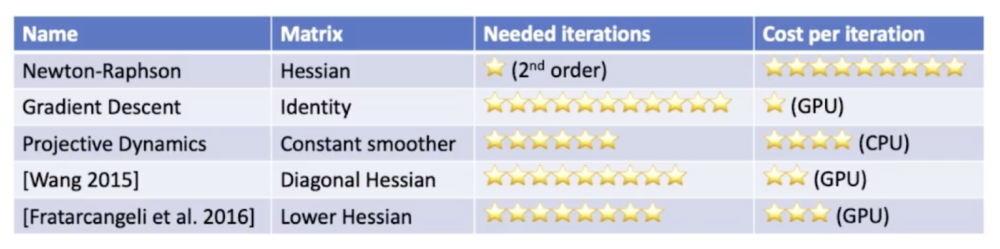

Real-Time Cloth Simulation on GPU -- by Huaming Wang 2021

<!-- more -->

## Introduction

Dynamic Solver：

- High resolution
- High nonlinearity
- High stiffness — 多次迭代、计算量

Collision:

- Collision detection
- Collision Response.

### Problem Definitions

#### Terms

Position Vector:
$$
\mathbf x = [\mathbf x_0 \mathbf x_1 \cdots \mathbf x_N]'
$$
Velocity:
$$
\mathbf v = \dot {\mathbf x}\quad \mathbf M = diag(m_0, \dots, m_N)
$$
Energy – Holonomic(Position only):
$$
E(\mathbf x)
$$
例如：

1. 重力势能
2. 弹簧能量
3. Fixing Energy — $\frac{\sigma}2 (\mathbf x_i -\mathbf y_i)^2$

#### Time Integration

常用：隐式欧拉法

求解方法：

1. 消去 $\mathbf v^{t + \Delta t}$
2. 转化为非线性优化问题

从而，整个问题都变为：
$$
\mathbf x^{t + \Delta t} = \arg\min_{\mathbf x} F(\mathbf x)
$$
其中 $F$ 由动能和势能组成。

#### 碰撞

作为约束项出现：
$$
\mathbf x^{t + \Delta t} = \arg\min_{\mathbf x} F(\mathbf x) \\
s.t.\quad \mathbf x^{t + \Delta t} \in \Omega
$$

上式存在隧穿问题(Tunnel)。故采用CCD。
$$
\mathbf x^{t + \Delta t} = \arg\min_{\mathbf x} F(\mathbf x) \\
s.t.\quad s \mathbf x^t + (1-s)  \mathbf x^{t + \Delta t} \in \Omega \forall s\in [0,1]
$$

## Dynamics

非线性优化通常有如下的形式：
$$
\mathbf x ^{k+1} = \mathbf x^k - \alpha^{k + 1} \left(A^{k+1}\right)^{-1} \mathrm{grad}
$$

###  Newton 法

优点

- 2 阶方法
- Hessian Matrix

问题

- 如何求解 $A^{-1}f$  — 计算量大
- 不一定收敛
  - 减小 $\alpha$
  - 要求 Hessian 正定

### 梯度下降

$$
A = \mathrm{id}
$$

优点

- GPU++
- 简单

缺点

- 1阶收敛 – 慢
- 没有任何实时模拟器使用

### Projective Dynamics

用常矩阵代替 $A$

优点：

- CPU++，（C 可以被预分解）
- 收敛快 — smoother

缺点

- GPU不友好
- 1阶收敛速度（总体上很慢）

### Diagonal Hessian

$$
\mathbf A^{k+1} = \mathrm{diag\ grad}
$$

优点

- 收敛快于GD
- GPU++

缺点

- 速度仍然差于牛顿

### Lower Hessian

使用hessian的下三角

优缺点同 Diag Hess

### Acceleration

- Chebyshev — GPU Firendly
- Multiscale Acceleration

### Conclusion

CPU：Projective Dynamics + Newton-Raphson

GPU：Chebyshev + Diagonal Hessian / Newton + PCG

### More

#### PBD — Position-Based Dynamics

**NVCLOTH**

#### Regular Grid Mesh

- Avoid Topology info
- mem access
- more suitable for high resolution

## 碰撞

两部分：碰撞检测 + 碰撞响应 具体看综述

### 检测

mesh -> pair -> collision

### Response

1. Iterative Position-Based Repulsion
2. Impact Zone Method
3. Untangling

## Other Topics

- Friction
- Nonelastic
- Locking
- Physical model and measurement

