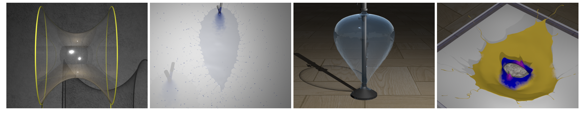
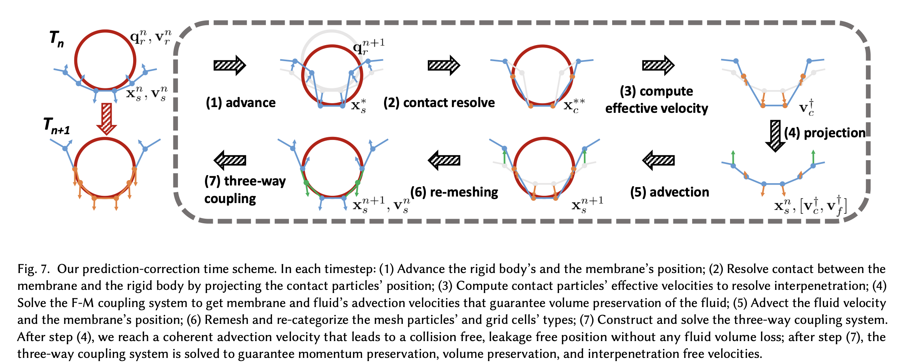
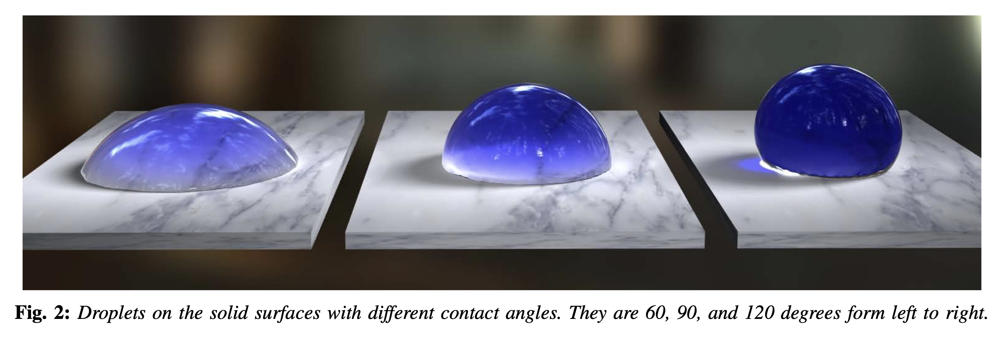
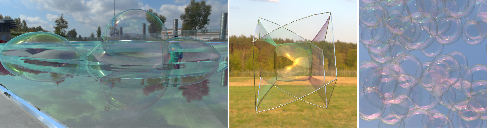
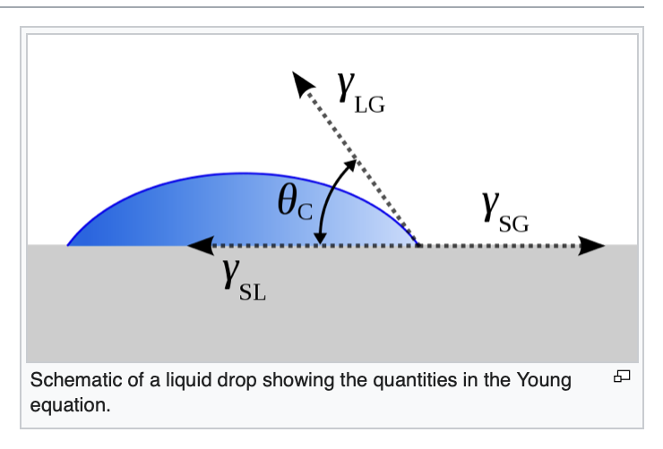
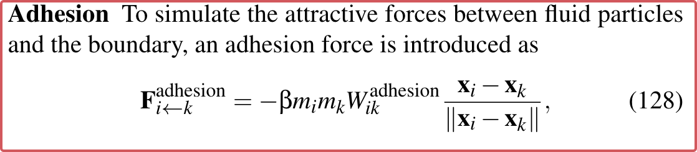
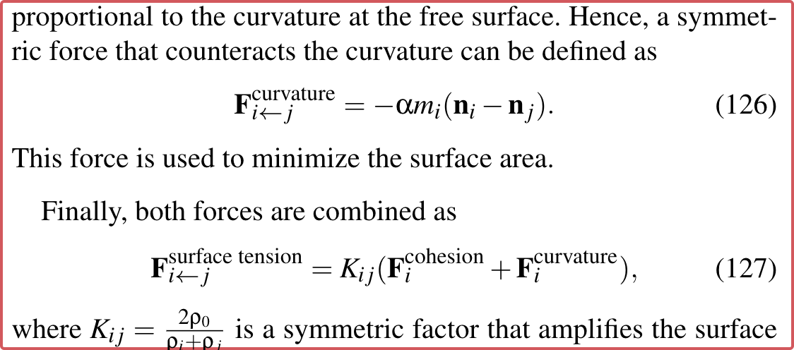
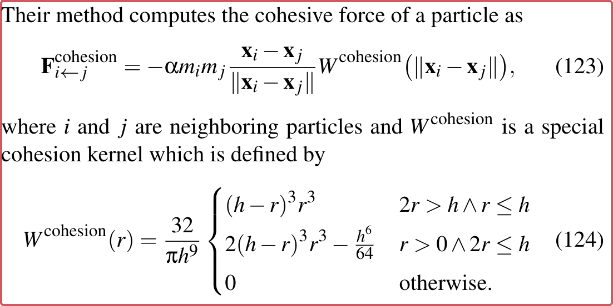

## 资料汇总

### Fluid Simulation in Computer Graphics (Bridson 15-Book)

Chapter 8 Water - Section 5 Surface Tension P131

> The physical chemistry of surface tension is conceptually simple. **Water molecules are more attracted to other water molecules than to air molecules, and vice versa.** Thus, water molecules near the surface tend to be pulled in towards the rest of the water molecules and vice versa. In a way they are seeking to minimize the area exposed to the other fuid, bunching up around their own type. **The simplest linear model of surface tension can in fact be phrased in terms of a potential energy equal to a surface-tension coefhicient ay times the surface area between the two fuids** ($\gamma$ for water and air at normal conditions is approximatelv $0.073J/m^2$). The force seeks to minimize the surface area.

欧拉方法

Surface Area of Fluid = 
$$
A = \iint_{\partial\Omega}1=\cdots =\iiint_\Omega \nabla \cdot \nabla \phi
$$
"Pressure" at the surface of water = 
$$
p = \gamma \nabla \cdot \nabla \phi = \gamma \kappa
$$
其中 $\kappa$ 为流体表面的平均曲率。

由此推出：

1. Explicit 方法：容易出现数值问题$\Delta t \le O(\Delta x^{3/2} \sqrt{\rho / \gamma})$
2. Implicit 方法：仍然需要改进（难整合进现有求解器）
3. ……

（不完整列表）

### Codimensional Surface Tension Flow on Simplicial Complexes

> * SIG 14
> * Bo Zhu (Stanford University)
> * [PDF](http://physbam.stanford.edu/~fedkiw/papers/stanford2014-01.pdf)

主要工作是在类似于肥皂泡的“一层”流体上进行的：

​

拉格朗日视角下，基于单纯复形进行。

### Codimensional Surface Tension Flow using Moving-Least-Squares Particles

> * SIG 2020
> * Hui Wang (Shanghai Jiao Tong University)

利用codimensional surface tension model，利用MLS进行求解。

### Solid-fluid interaction with surface-tension-dominant contact

> * SIG 21
> * Liangwang Ruan (PKU)
> * [PDF](https://arxiv.org/pdf/2105.08471.pdf)

主要在MPM框架下进行，

我们将我们的技术贡献总结如下： 

1. 一种新颖的拉格朗日薄膜表示，可准确捕获由强表面张力驱动的固体和流体之间的接触相互作用。
2. 整体耦合框架，满足所有速度和位置约束，同时保持动量。
3. 预测-校正接触处理方案，以实际物理参数准确处理流固接触。

​

### Versatile surface tension and adhesion for SPH fluids

> * SIG 13
> * Nadir Akinci
> * [PDF](https://cg.informatik.uni-freiburg.de/publications/siggraphasia2013/2013_SIGGRAPHASIA_surface_tension_adhesion.pdf)

SPH方法，分为Adhesion和Cohesion。与综述中一致。

### Simulation of bubbles

> SIGGRAPH 2006
>
> [Link](https://dl.acm.org/doi/10.1016/j.gmod.2009.08.001)
>
> **Abstract**: We present a novel framework based on a continuous fluid simulator for general simulation of realistic bubbles, with which we can handle as many significant dynamic bubble effects as possible. To capture a very thin liquid film of bubbles, we have developed **a regional level set method allowing multi-manifold interface tracking**. Based on the definitions of regional distance and its five operators, the implementation of the regional level set method is very easy. An implicit surface of liquid film with arbitrary thickness can be reconstructed from the regional level set function. To overcome the numerical instability problem, we exploit a new semi-implicit surface tension model which is unconditionally stable and makes the simulation of surface tension dominated phenomena much more efficient. An approximated film thickness evolution model is proposed to control the bubble's lifecycle. All these new techniques combine into a general framework that can produce various realistic dynamic **effects of bubbles**.

- 主要侧重点在于气泡的模拟
- 流体-空气边界

### A stable and efficient method for treating surface tension in incompressible two-phase flow.

> SIAM Journal on Scientific Computing, 2009
>
> [PDF](https://www.math.fsu.edu/~sussman/SussmanOhta08.pdf)
>
> [Link](https://epubs.siam.org/doi/10.1137/080732122)
>
> **Abstract**: A new approach based on volume preserving motion by mean curvature for treating surface tension in **two-phase flows** is introduced. Many numerical tests and a theoretical justification are included which provide evidence regarding the efficacy of the new approach. For many flows, which exhibit stiff surface tension effects, the new approach gives a factor of at least three and sometimes five or more speed-up for a given accuracy. The new method is easy to implement in the context of (1) level set methods, or coupled level set and volume-of-fluid methods, (2) complicated interfaces separating gas from liquid, and (3) three-dimensional axisymmetric, or fully three-dimensional adaptive mesh refinement.

### An Extended Cut-Cell Method for Sub-Grid Liquids Tracking with Surface Tension.

> TOG 2020
>
> [Link](https://dl.acm.org/doi/10.1145/3414685.3417859)
>
> **Abstract**: Simulating liquid phenomena utilizing Eulerian frameworks is challenging, since highly energetic flows often induce **severe topological changes, creating thin and complex liquid surfaces**. Thus, capturing structures that are small relative to the grid size become intractable, since continually increasing the resolution will scale sub-optimally due to the pressure projection step. Previous methods successfully relied on using higher resolution grids for tracking the liquid surface implicitly; however this technique comes with drawbacks. The mismatch of pressure samples and surface degrees of freedom will cause artifacts such as hanging blobs and permanent kinks at the liquid-air interface. In this paper, we propose an extended cut-cell method for handling liquid structures that are smaller than a grid cell. At the core of our method is a novel iso-surface Poisson Solver, which converges with second-order accuracy for pressure values while maintaining attractive discretization properties such as symmetric positive definiteness. Additionally, we extend the iso-surface assumption to be also compatible with surface tension forces. Our results show that the proposed method provides a novel framework for handling arbitrarily small splashes that can also correctly interact with objects embodied by complex geometries.

- 欧拉网格
- 主要处理计算速度问题

### A deformable surface model for real-time water drop animation.

> IEEE Trans on Visualization & Computer Graphics 2012
>
> [Link](http://kunzhou.net/2011/surface_water_drop.pdf)
>
> **Abstract**: A water drop behaves differently from a large water body because of its strong viscosity and surface tension under the small scale. Surface tension causes the motion of a water drop to be largely determined by its boundary surface. Meanwhile, viscosity makes the interior of a water drop less relevant to its motion, as the smooth velocity field can be well approximated by an interpolation of the velocity on the boundary. Consequently, we propose a fast deformable surface model to realistically animate water drops and their flowing behaviors on solid surfaces. Our system efficiently simulates water drop motions in a Lagrangian fashion, by reducing 3D fluid dynamics over the whole liquid volume to a deformable surface model. In each time step, the model uses an **implicit mean curvature flow operator to produce surface tension effects**, a **contact angle operator to change droplet shapes on solid surfaces**, and a set of mesh connectivity updates to handle topological changes and improve mesh quality over time. Our numerical experiments demonstrate a variety of physically plausible water drop phenomena at a real-time rate, including capillary waves when water drops collide, pinch-off of water jets, and droplets flowing over solid materials. The whole system performs orders-of-magnitude faster than existing simulation approaches that generate comparable water drop effects.

- 处理了流体-固体-气体边界
- 流体动，固体不动

### Double bubbles sans toil and trouble: Discrete circulation-preserving vortex sheets for soap films and foams

> TOG 2015
>
> [Link](https://dl.acm.org/doi/10.1145/2767003)
>
> **Abstract**: Simulating the delightful dynamics of soap films, bubbles, and foams has traditionally required the use of a fully three-dimensional many-phase Navier-Stokes solver, even though their visual appearance is completely dominated by the thin liquid surface. We depart from earlier work on soap bubbles and foams by noting that their dynamics are naturally described by a Lagrangian vortex sheet model in which circulation is the primary variable. This leads us to derive a novel circulation-preserving surface-only discretization of foam dynamics driven by surface tension on a non-manifold triangle mesh. We represent the surface using a mesh-based multimaterial surface tracker which supports complex bubble topology changes, and evolve the surface according to the ambient air flow induced by a scalar circulation field stored on the mesh. Surface tension forces give rise to a simple update rule for circulation, even at non-manifold Plateau borders, based on a discrete measure of signed scalar mean curvature. We further incorporate vertex constraints to enable the interaction of soap films with wires. The result is a method that is at once simple, robust, and efficient, yet able to capture an array of soap films behaviors including foam rearrangement, catenoid collapse, blowing bubbles, and double bubbles being pulled apart.

- 只考虑单层的流体 – 肥皂泡等

### Surface-only liquids

> TOG 16
>
> **Abstract**: We propose a novel surface-only technique for simulating incompressible, inviscid and uniform-density liquids with surface tension in three dimensions. The liquid surface is captured by a triangle mesh on which a Lagrangian velocity field is stored. Because advection of the velocity field may violate the incompressibility condition, we devise an orthogonal projection technique to remove the divergence while requiring the evaluation of only two boundary integrals The forces of surface tension, gravity, and solid contact are all treated by a boundary element solve, allowing us to perform detailed simuIations of a wide range of liquid phenomena, including waterbe lls, droplet and jet collisions, fuid chains, and crown splashes.

- 处理了流体-固体-气体边界，同样假定固体不动
- 只在流体表面进行计算，计算速度快

### A hyperbolic geometric flow for evolving films and foams.

> TOG 17
>
> **Abstract**: Simulating the behavior of soap films and foams is a challenging task. A direct numerical simulation of films and foams via the Navier-Stokes equations is still computationally too expensive. We propose an alternative formulation inspired by geometric flow. Our model exploits the fact, according to Plateau's laws, that the steady state of a film is a union of constant mean curvature surfaces and minimal surfaces. Such surfaces are also well known as the steady state solutions of certain curvature flows. We show a link between the Navier-Stokes equations and a recent variant of mean curvature flow, called hyperbolic mean curvature flow, under the assumption of constant air pressure per enclosed region. Instead of using hyperbolic mean curvature flow as is, we propose to replace curvature by the gradient of the surface area functional. This formulation enables us to robustly handle non-manifold configurations; such junctions connecting multiple films are intractable with the traditional formulation using curvature. We also add explicit volume preservation to hyperbolic mean curvature flow, which in fact corresponds to the pressure term of the Navier-Stokes equations. Our method is simple, fast, robust, and consistent with Plateau's laws, which are all due to our reformulation of film dynamics as a geometric flow.

- 主要处理气泡（薄的、“一层”液体）

### Semi-implicit surface tension formulation with a Lagrangian surface mesh on an Eulerian simulation grid.

> JCP 2012
>
> [Link](https://www.researchgate.net/publication/220207188_Semi-implicit_surface_tension_formulation_with_a_Lagrangian_surface_mesh_on_an_Eulerian_simulation_grid)
>
> **Abstract**: We present a method for applying semi-implicit forces on a Lagrangian mesh to an Eulerian discretization of the Navier Stokes equations in a way that produces a sparse symmetric positive definite system. The resulting method has semi-implicit and fully-coupled viscosity, pressure, and Lagrangian forces. We apply our new framework for forces on a Lagrangian mesh to the case of a surface tension force, which when treated explicitly leads to a tight time step restriction. By applying surface tension as a semi-implicit Lagrangian force, the resulting method benefits from improved stability and the ability to take larger time steps. The resulting discretization is also able to maintain parasitic currents at low levels.

### A new incompressibility discretization for a hybrid particle MAC grid representation with surface tension.

> JCP 2012
>
> **Abstract**: We take a particle based approach to incompressible free surface flow motivated by the fact that an explicit representation of the interface geometry and internal deformations gives precise feedback to an implicit solver for surface tension. Methods that enforce incompressibility directly on the particles are typically numerically inefficient compared to those that utilize a background grid. However, background grid discretizations suffer from inaccuracy near the free surface where they do not properly capture the interface geometry. Therefore, our incompressibility discretization utilizes a particle based projection near the interface and a background MAC grid based projection for efficiency in the vast interior of the liquid domain - as well as a novel method for coupling these two disparate projections together. We show that the overall coupled elliptic solver is second order accurate, and remains second order accurate when used in conjunction with an appropriate temporal discretization for parabolic problems. A similar second order accurate discretization is derived when the MAC grid unknowns are located on faces (as opposed to cell centers) so that Navier-Stokes viscosity can be solved for implicitly as well. Finally, we present a fully implicit approach to surface tension that is robust enough to achieve a steady state solution in a single time step. Beyond stable implicit surface tension for our novel hybrid discretization, we demonstrate preliminary results for both standard front tracking and the particle level set method.

### Codimensional surface tension flow on simplicial complexes.

> TOG 2014
>
> **Abstract**: Many visually interesting natural phenomena are characterized by thin liquid sheets, long filaments, and droplets. We present a new Lagrangian-based numerical method to simulate these codimensional surface tension driven phenomena using non-manifold simplicial complexes. Tetrahedra, triangles, segments, and points are used to model the fluid volume, thin films, filaments, and droplets, respectively. We present a new method for enforcing fluid incompressibility on simplicial complexes along with a physically-guided meshing algorithm to provide temporally consistent information for interparticle forces. Our method naturally allows for transitions between codimensions, either from tetrahedra to triangles to segments to points or vice versa, regardless of the simulation resolution. We demonstrate the efficacy of this method by simulating various natural phenomena that are characterized by thin fluid sheets, filaments, and surface tension effects.

### Nonlinear dynamics of surface-tension-driven instabilities. (Wiley Online Library)

> A century after Henri Bénard discovered cellular convective structures, thermal convection in fluid layers still remains a central subject in nonlinear physics. Within this framework, surface-tension-driven instabilities have increasingly been the subject of attention over the last few years, owing to the even greater variety of pattern and wave-forming phenomena observed in this situation. This book provides readers with a progressive and complete insight into this vast field, describing as it does a number of "first principle" analyses of realistic set-ups, including several physicochemical processes at interfaces. Nonetheless, much emphasis is placed on the generality of the results and methods used, by way of the detailed derivation and analysis of a number of generic nonlinear equations known to hold in many physical systems, even outside the realm of fluid mechanics.
>
> The first introductory chapter describes nonlinear dissipative structures at a general level, with several examples of hydrodynamic instabilities in systems with interfaces. Chapter 2 contains a summary of the derivation of thermo-hydrodynamic equations, including boundary conditions prevailing at interfaces, while the third chapter is devoted to linear stability analyzes and identification of basic instability modes. The following two chapters deal with weakly nonlinear theories, both monotonic and oscillatory. Chapter 6 presents experimental and theoretical results on solitonic and shock-like surface waves, while Chapter 7 explores examples of multiple bifurcations. Finally, Chapter 8 presents recent results on strongly nonlinear surface-tension-driven convection and chaotic interfacial dynamics.

### Numerical models of surface tension.

> Annual Review of Fluid Mechanics 2018
>
> [Link](https://www.annualreviews.org/doi/10.1146/annurev-fluid-122316-045034)
>
> **Abstract**: Numerical models of surface tension play an increasingly important role in our capacity to understand and predict a wide range of multiphase flow problems. The accuracy and robustness of these models have improved markedly in the past 20 years, so that they are now applicable to complex, three-dimensional configurations of great theoretical and practical interest. In this review, I attempt to summarize the most significant recent developments in Eulerian surface tension models, with an emphasis on well-balanced estimation, curvature estimation, stability, and implicit time stepping, as well as test cases and applications. The advantages and limitations of various models are discussed, with a focus on common features rather than differences. Several avenues for further progress are suggested.

### 「Unsorted」

1. A coupled volume-of-fluid and level set method based on general curvilinear grids with accurate surface tension calculation.(JCP)
2. A new incompressibility discretization for a hybrid particle MAC grid representation with surface tension.(JCP)
3. Simulating surface tension with smoothed particle hydrodynamics. International journal for numerical methods in fluids
4. Modeling of surface tension and contact angles with smoothed particle hydrodynamics. Physical Review
5. Thin-film smoothed particle hydrodynamics fluid. ACM Transactions on Graphics (TOG)

## 物理解释

> [Surface Tension](https://en.wikipedia.org/wiki/Surface_tension)
>
> 表面张力在概念上很简单。水分子比空气分子更容易被其他水分子吸引，反之亦然。因此，表面附近的水分子倾向于被拉向其余的水分子，反之亦然。在某种程度上，他们正在寻求最小化暴露于其他流体的区域，聚集在他们自己的同类型流体周围。表面张力最简单的线性模型实际上可以用势能等于两个流体之间的表面积的超临界值r乘以（在正常条件下的水和空气约为$0.073J/m^2$）来表述。该力提供将表面积降至最低的趋势。

表面张力是静止液体表面收缩到尽可能小表面积的趋势。

在液体-空气边界面上，表面张力源于「液体分子间吸引力」（Cohesion）大于「液体和空气分子间吸引力」（Adhesion）：

* Adhesion：不相同（相似）的粒子或表面“粘附”在一起的力（流体和其他物体之间）
* Cohesion：相同（相似）的粒子或表面“粘附”在一起的力（流体内部产生）

> 与不同物体的 Adhesion 以及自身 Cohesion 的大小关系，给出了液体和其他物体之间的**润湿程度**、**接触角**和**弯月面形状**。
>
> ​

流体内部**在平衡情况下**，表面张力为0，不平衡情况下，有缩小表面积的趋势。物理中的（在平衡状态下）表面张力（参数）实际上对应上图中的几个向量，即发生在流体与其他物体**接触面的边界**上，但并没有给出整个接触面上如何进行表面张力的计算公式（Wikipedia中没有给出）。

之前讨论的SPH方法中，其中有一项$\alpha$和$\beta$是人为指定的参数，其实考虑的也只是流体和空气的边界面，即不需要算出流体对于空气的作用力。

对于流体-固体边界面，则需要通过公式算出流体对于固体的力，可以进行双向耦合。(SIGGRAPH21) Solid-fluid interaction with surface-tension-dominant contact 给出了基于MPM流体的流固耦合方法，该方法基于物理公式，求解了计算流固边界上表面张力。

总的来说，可以分为几类问题：

1. 流体和空气边界：
   1. 水滴等常规形状的流体 – 仍然是NS方程主导，附加表面张力
   2. 肥皂泡 – 表面张力主导的“单层”流体
2. 流体、空气、固体边界（弯月面形状、角度等）
   1. 固体不动，流体动
   2. 固体动，流体也动，但固体是刚体
   3. 软体、流体 - [Position-based Surface Tension Flow](https://dl.acm.org/doi/abs/10.1145/3550454.3555476)

