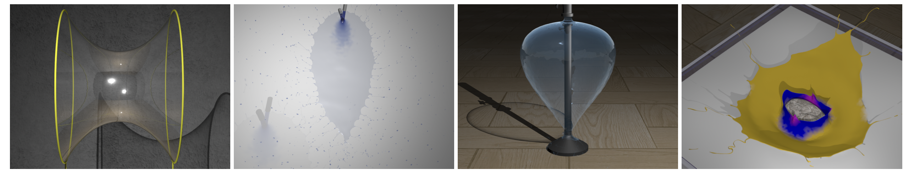
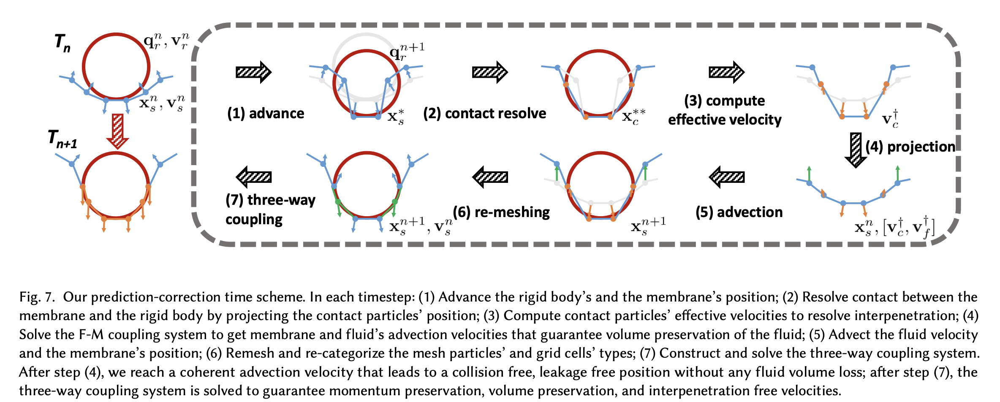

# 流体-表面张力

## 物理解释

> [Surface Tension](https://en.wikipedia.org/wiki/Surface_tension)

表面张力是静止液体表面收缩到尽可能小表面积的趋势。

在液体-空气边界面上，表面张力源于「液体分子间吸引力」（Cohesion）大于「液体和空气分子间吸引力」（Adhesion）：

* Adhesion：不相同（相似）的粒子或表面“粘附”在一起的力（流体和其他物体之间）
* Cohesion：相同（相似）的粒子或表面“粘附”在一起的力（流体内部产生）

> Adhesion 和 Cohesion 的大小关系，给出了液体和其他物体之间的**润湿程度**、**接触角**和**弯月面形状**。
>
> ​​

## 相关论文

（不完整列表）

### Codimensional Surface Tension Flow on Simplicial Complexes

> * SIG 14
> * Bo Zhu (Stanford University)
> * [PDF](http://physbam.stanford.edu/~fedkiw/papers/stanford2014-01.pdf)

主要工作是在类似于肥皂泡的“一层”流体上进行的：

​​

拉格朗日视角下，基于单纯复形进行。

### Codimensional Surface Tension Flow using Moving-Least-Squares Particles

> * SIG 2020
> * Hui Wang (Shanghai Jiao Tong University)

利用codimensional surface tension model，利用MLS进行求解。

### Solid-fluid interaction with surface-tension-dominant contact

> * SIG 21
> * Liangwang Ruan (PKU)
> * [PDF](https://arxiv.org/pdf/2105.08471.pdf)

主要在MPM框架下进行，

我们将我们的技术贡献总结如下： 

1. 一种新颖的拉格朗日薄膜表示，可准确捕获由强表面张力驱动的固体和流体之间的接触相互作用。
2. 整体耦合框架，满足所有速度和位置约束，同时保持动量。
3. 预测-校正接触处理方案，以实际物理参数准确处理流固接触。

​​

### Versatile surface tension and adhesion for SPH fluids

> * SIG 13
> * Nadir Akinci
> * [PDF](https://cg.informatik.uni-freiburg.de/publications/siggraphasia2013/2013_SIGGRAPHASIA_surface_tension_adhesion.pdf)

SPH方法，分为Adhesion和Cohesion。与综述中一致。

‍
