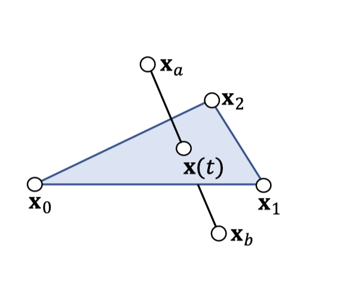
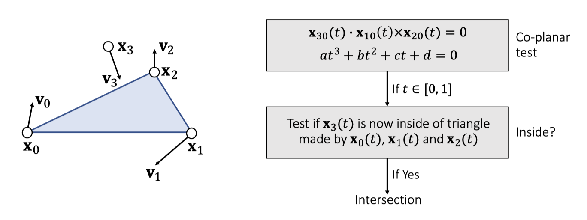
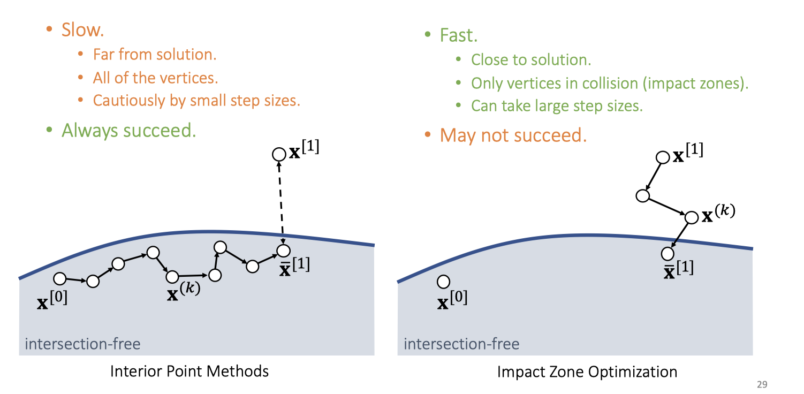
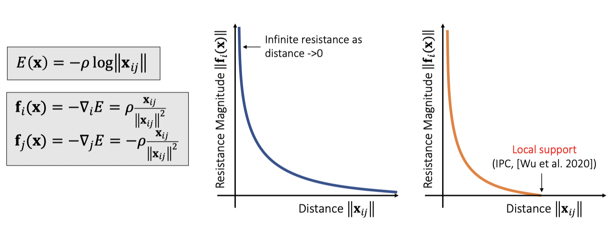
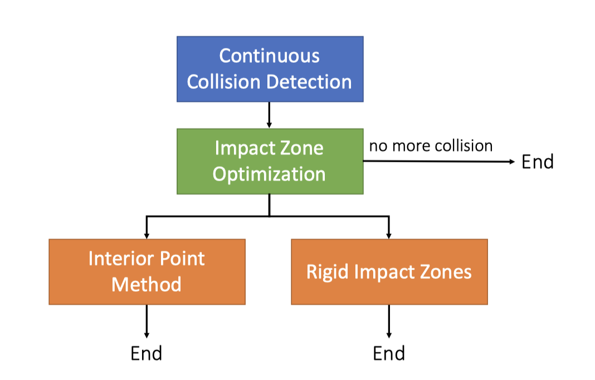

碰撞检测相关介绍

<!-- more -->

# 碰撞检测

众所又周知啊，碰撞检测是一个老大难的问题，在很多的仿真模拟、游戏引擎中间都会用哈

碰撞检测的主要流程是 [^1]：


其中：

- $\{\mathbf x, \mathbf x^{new}\}$ 分别是更新前后的顶点位置向量
- Pair Condidates 是指可能发生碰撞的 primitive pairq
- Colliding Pairs 是指真实发生碰撞的 primitive pair

> **注意**：
>
> 一般而言，所谓的 primitive 是指组成这个 body (不管是 deformable 还是 rigid) 的单位元素，例如：
>
> 1. 三角网格 (mass-spring 模型）中的三角面片
> 2. 多边形模型（例如 FEM ）中的面片
> 3. 图的顶点、边

可以看出，总体上的碰撞检测分为两个阶段：第一阶段（Broad-Phase）去除不可能出现的pairs（当然肯定使用反向计算出可能产生 collision 的 pair 去做的。第二阶段（Narrow-Phase）去针对每一个pair计算。

## Broad-Phase

碰撞剔除两种常见的方法：

1. Spatial Hashing：空间哈希
2. BVH：层次包围盒

### 空间划分

#### 基本思想

将整个空间划分为各自，然后将Primitive存在单元格内。（有相交就存储，可能出现在多个格子里面）

对于每一个格子里面的所有 Primitive-Pair 输出。

#### 动态过程

我们将 $x^{new}$ 和 $x$ 都认为是其位置，再进行划分。

#### 存在的问题

三维空间的格子 – 100x100x100 – 计算量大

可能出现：分布不均匀

1. 浪费存储空间
2. 大量的三角形聚集在几个格子里

#### 改进方案

##### 排序


**目的**：所有的Pair都按照格子的编号排列（类似于稀疏矩阵压缩），从而节约内存开销。

##### 为了达到连续内存访问

使用 `Morton Code` 编码，

### BVH 层次包围盒

递归的建立一棵树，例如：


Idea：把包围盒组合成新的包围盒

如何检查：

```c
ProcessNode(A) {
	for_each(B: A.child){
		ProcessNode(B);
	}
	for_each([B, C]: A.childrenPair) {
		if B-C intersect {
			ProcessPair(B, C)
		}
	}
}

ProcessPair(B, C) {
	for_each(B': B.child) {
		for_each(C': C.child) {
			if B'-C' intersect {
				ProcessPair(B', C')
			}
		}
	}
}
```

#### 常见的包围盒

1. **AABB**：intersect 当且仅当在轴上有相交
2. 球
3. OBB：任意方向的包围盒

#### 问题

难以处理紧邻的情况。 – 只有便利到底层才能解决

> Energy-based Self-Collision Culling for Arbitary Mesh Deformations
>
> 1. 形变越大，越容易相交

### 对比

SH => Edge-Triangle

1. Easy to implement
2. GPU-Friendly
3. Need to recompute after updating obj.

BVH => VT & EE

1. More Involved
2. Not GPU Friendly
3. To update BVH, just update BV

## Narrow Phase

进一步看是否真的有碰撞，两种：DCD和CCD

### DCD — 相交检测

只考虑是否相交（而非碰撞）

对于Triangle Mesh，只考虑 Edge-Triangle.
$$
\begin{cases}
((1-t) x_a+tx_b -x_0)\cdot x_{10} \times x_{20} =0\\
t = \frac{x_{0a}\cdot x_{10} \times x_{20}}{x_{ba}\cdot x_{10} \times x_{20}}
\end{cases}
$$
若解出来的 $t\in [0, 1]$ 则能够判断出在 $t$ 处相交



#### 问题

可能会产生穿透问题（运动很快的情况）。对于大体积问题的概率低，但是如果是cloth等薄物体，容易发生。

1. 减少dt

### CCD

测试两个状态（之间）有无碰撞产生。

一般是做 VT 和 EE 的检测：




共同点：

1. 解一元三次方程。观察解的情况

#### 数值问题

1. 公式法：开三次方的数值误差大
2. 牛顿法：速度
3. GPU — 单精度
4. Expensive — 可以考虑加强 Broad-Phase

> Bridson2002-Robust … …

# 碰撞处理



### 内点法

> 截断 – IPC



反复进行碰撞检测

> Robust……

### Impact Zone Method.

### 备选

1. Rigid Impact Zone 



# 相交解除

> 碰撞不是灾难，可以在发生之后进行解除

处理当前已有的相交情况。

> Untangling Cloth.

改进方法：

期望相交曲线变短，直到相交解除

- Not always work.

> Resolving Service Collisons through 

---

> 实际上，Narrow Phase 还可以继续细分：
>
> The narrow phase obtains the collision pair list and for every pair, using their actual geometry, it checks whether the two partners are colliding. This phase can get arbitrarily complex, so in the context of real-time physics simulation, the participating colliding shapes are usually restricted to being convex. For nonconvex shapes, only the convex hull will then be used for collision detection. In most cases this is good enough—for example if the concavities are small or constitute object parts where you don't want a game character to go anyway, such as the exhaust pipes of a spacecraft or other irrelevant places. To improve collision quality and performance, we can decompose big or concave objects into convex pieces. A game object therefore might hold a simplified collision geometry that is different from the one displayed. In this chapter we investigate a narrow-phase algorithm for determining the distance between two convex objects. For the two objects in Figure 33-1b, the contact point marked with the yellow star is detected, and its location is calculated and stored with the collision pair.（转化为凸包，进一步简化加速）

根据 [Provet97] [^2] 的描述，其可以通过

---

UE4 中的碰撞检测：

- 射线检测RayCasts
- 重叠检测Overlaps
- 渗透深度计算Penetration Depth
- Sweeps检测
- InitialOverlaps检测

> https://zhuanlan.zhihu.com/p/33529865

刚体碰撞

Penalty Method

Impulse Method

空间划分 — Spatial Hashing

- Easy Implement
- GPU Friendly
- Recompute after updating.
  包围盒 AABB
- More involved
- Not gpu friendly
- Update BVH -> Update Bounding Volumes.

两种碰撞检测方式：

DCD — Discrete Collision Detection

- 当前状态下有无自相交
  CCD — Continuous Collision Detection
- 两个状态之间是否相交
- 对于三角网格：
  - 点 - 三角
  - 边 - 边
- Co-planar
- Issues:
  - 误差 - 三次方程 - GPU-float32
  - 比 DCD 慢很多
  - 难以实现

处理方法：

- Interior Point Method
  - 每一步都是安全的
  - Slow - far from solution - all of vertices - cautiously by small steps
  - Log-Barrier IPM. E(x) = -log |xij| + Gradient Descent
    - IPC - not GD.
    -
- Impact Zone Optimization
  - 逐步满足 Constraint
  - Fast - Close To solution - only vertices in collision - can take large steps sizes
  - May not succeed. (Due to large dT)
- Rigid Impact Zones.
  - 回到前一帧 -> 没有碰撞（视为刚体）
    CCD -> IZO -> IPM or RIZ

相交解除

- Not always intersection free.

V-V intersection
C-V intersection

- 推出即可
  C-C
- 无法处理边界
- 难以在 GPU 上实现


---

## Reference

[^1]: GAMES103 Collision Handling
[^2]: Collision and self-collision handling in cloth model dedicated to design garments
