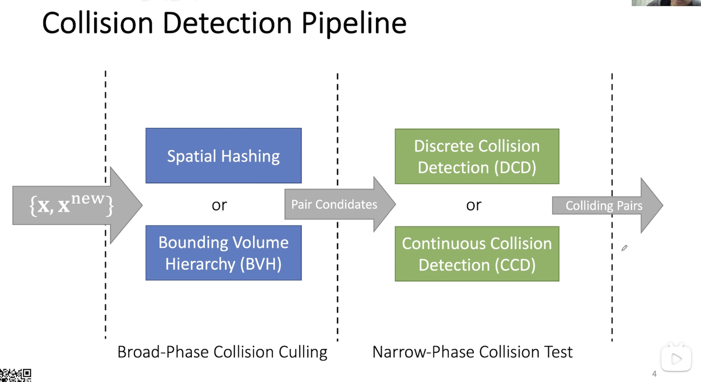

有关 Collision Detect 的一些文章整理

<!-- more -->

# Collision Detection

碰撞处理的主要流程是 [^1]：

其中：

- $\{\mathbf x, \mathbf x^{new}\}$ 分别是更新前后的顶点位置向量
- Pair Condidates 是指可能发生碰撞的 primitive pairq
- Colliding Pairs 是指真实发生碰撞的 primitive pair

> **注意**：
>
> 一般而言，所谓的 primitive 是指组成这个 body (不管是 deformable 还是 rigid) 的单位元素，例如：
>
> 1. 三角网格 (mass-spring模型）中的三角面片
> 2. 多边形模型（例如 FEM ）中的面片
> 3. 图的顶点、边

## 几种思路

## 解析求解

根据 [Provet97] [^2] 的描述，其可以通过

---

刚体碰撞
Penalty Method
Impulse Method
空间划分 — Spatial Hashing 

- Easy Implement
- GPU Friendly
- Recompute after updating.
包围盒AABB
- More involved
- Not gpu friendly
- Update BVH -> Update Bounding Volumes.

两种碰撞检测方式：
DCD — Discrete Collision Detection
- 当前状态下有无自相交
CCD — Continuous Collision Detection 
- 两个状态之间是否相交
- 对于三角网格：
    - 点 - 三角
    - 边 - 边
- Co-planar
- Issues:
    - 误差 - 三次方程 - GPU-float32
    - 比 DCD 慢很多
    - 难以实现

处理方法：
- Interior Point Method 
    - 每一步都是安全的
    - Slow - far from solution - all of vertices - cautiously by small steps
    - Log-Barrier IPM. E(x) = -log |xij| + Gradient Descent
        - IPC - not GD.
        - 
- Impact Zone Optimization
    - 逐步满足Constraint
    - Fast - Close To solution - only vertices in collision - can take large steps sizes
    - May not succeed. (Due to large dT)
- Rigid Impact Zones.
    - 回到前一帧 -> 没有碰撞（视为刚体）
    CCD -> IZO -> IPM or RIZ

相交解除
- Not always intersection free.

V-V intersection
C-V intersection
- 推出即可
C-C
- 无法处理边界
- 难以在GPU上实现

期望相交曲线变短 直到相交解除
Not always work.
Resolving Service Collison

[^1]: GAMES103 Collision Handling
[^2]: Collision and self-collision handling in cloth model dedicated to design garments

