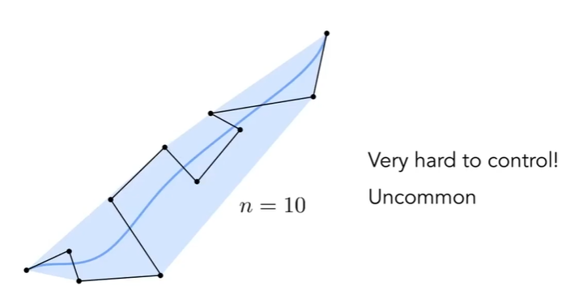
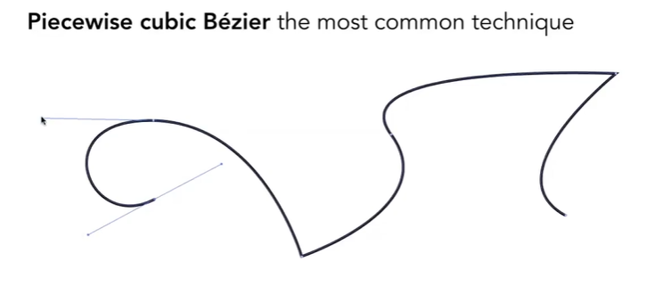

# Lecture 11: Geometry 2 - curves and surfaces

> Lecture Notes of [GAMES 101](https://www.bilibili.com/video/BV1X7411F744?p=11&spm_id_from=pageDriver)

继续上一节的内容

### 显式曲面表示方法

#### 点云

1. 是最简单的表示方法，

2. 难以处理

#### 多边形面

> 特别是三角形和四边形面。

1. 保存顶点数据
2. 容易做处理和模拟，以及自适应的采样
3. 稍复杂的数据结构

##### 图形学中的表示方法

`.obj`文件：在CG的Research中最常见的内容。

- 文本文件
- 记录了顶点、法向量、材质和**他们之间的连接关系**

## Bezier Curves（贝塞尔曲线）

贝塞尔曲线的原理图：

### 贝塞尔曲线的生成

#### de Casteljau Algorithm

先考虑*三个点*的情况:

现在考虑*四个点*的情况：

简单而言，通过使用在时间t上的Lerp函数来Reduce，即可得到贝塞尔曲线。

总体类似于*牛顿插值公式*，但这里利用Berstein多项式：
$$
\boldsymbol b^n(t) = \sum_{j=0} ^\infty \boldsymbol b_j B_j^n(t)
$$
其中：
$$
B_j^n(t)=\left(\begin{array}c n\\i
\end{array}\right)t^i(1-t)^{n-i}
$$
几点性质：

1. 在三次插值情况下：$\boldsymbol b'(0) =3(\boldsymbol b_1 - \boldsymbol b_0)$ 且 $\boldsymbol b'(1) = 3(\boldsymbol b_3 - \boldsymbol b_2)$

2. 在仿射变换下不变：曲线变换时，只需要将控制点做仿射变换即可

   注意，对于*投影变换*是不成立的

3. 凸包性质：

   贝塞尔曲线一定在控制点形成的凸包内。

### 逐段的贝塞尔曲线

考虑高阶情况的贝塞尔曲线

用逐段三次贝塞尔曲线来制作：

$C^0$ 连续是指函数在函数值处的连续。但注意，使用三次贝塞尔曲线时，$C^1$连续是指切向量的：

1. 方向相同
2. 大小相等

### 其他曲线获取方法

#### 样条

总的来说，就是一个可控的曲线。

#### B-样条

- Basis Splines
- 具有局部性
- **极其复杂**

## 曲面

### 贝塞尔曲面

Bicubic Bezier Surface Patch算法：实际上和曲线插值没有任何区别，思想即为：

> 点动成线，线动成面

### 网格操作

1. 网格细分
2. 网格简化
3. 网格正则化（Mesh Regularization）尽量使得大多数三角形都近似为正三角形。
