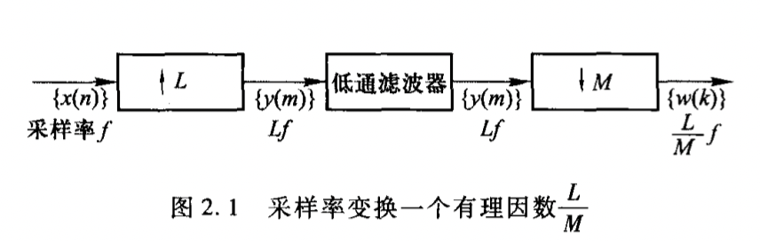

# 采样

## 模拟信号的采样和重建

### 理想采样

$$
\hat x(t) = x(t)\cdot M(t)
$$

其中的
$$
M(t) = \sum_{n = -\infty}^{\infty} \delta(t - nT)
$$

### 理想采样信号的频谱

$$
\hat X_a(j\Omega) = \frac 1 T \sum_{m = -\infty} ^ \infty X_a(j \Omega - j m \Omega_s),\quad \Omega_s = 2 \pi f_s
$$

### 重建 —— 理想内插

通过一个理想低通滤波器：
$$
G(j\Omega) = \begin{cases}
T &  |\Omega| < \Omega_s / 2\\
0 & otherwise
\end{cases}
$$
等效于对采样信号进行内插：
$$
\begin{aligned}
	x_a(t) &= x_a(nT) g(t - nT)\\
	&= \sum_{n = -\infty}^ \infty x_a(nT) \cdot \mathrm{sinc} \left( \frac \pi T(t-nT) \right)
\end{aligned}
$$

## 采样和重建中的模拟低通滤波器的指标特性

1. 滤波器的幅频特性
   - 通带内以误差 $\delta_1$ 逼近1
   - 阻带内以误差 $\delta_2$ 逼近0
2. 模拟抗混叠滤波器和平滑滤波器的指标特性

## 连续时间带通信号的采样

对于 $\Omega_1\le |\Omega| \le \Omega_2$ 的频率范围内的带通信号
$$
\Omega_s = 2 \cdot \Delta \Omega = 2(\Omega_ 2 - \Omega _ 1)
$$

## 离散时间信号的采样和插值

### 整数M倍抽取

$$
y(n) = x(nM)
$$

新的采样频率为：
$$
f'_s = \frac{f_s}{M}
$$

### 抽取信号的频谱特征和抗混叠滤波

抽取信号 $y(m)$ 和原信号 $x(n)$ 的DTFT的关系
$$
Y(e^{j\omega'}) = \frac{1}{M} \sum_{i = 0}^{M - 1} X(e^{j(\omega ' - 2\pi l)/M})
$$
式中数字角频率为 $\omega' = 2\pi fT$ 若信号 $X(e^{j\omega})$ 满足：
$$
X(e^{j\omega}) =0,\quad \pi /M \le |\omega|\le \pi
$$

### 离散时间信号的插值 —— 整数 L 倍内插

$$
y_0(m) = \begin{cases}
x\left(\frac m L\right) & m = 0, \pm L, \cdots
\\
0&otherwise
\end{cases}
$$

### 插值信号的频谱特征和抗混叠滤波

和原信号的DTFT关系为
$$
Y_0(e^{j\omega '}) = X(e^{j\omega'L})
$$
可见，频谱中不仅包含基带频率、也包含以 $\pm 2\pi / L\cdots$ 为中心的基带的镜像分量。

### 采样率以 L/M 改变

