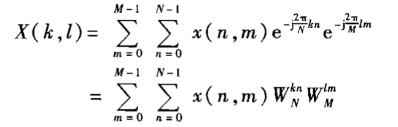

# DFT 和 FFT

## DFT

### DFS的定义

$$
\tilde X(k) = \sum_{n = 0} ^ {N - 1} \tilde x(n) W_{N}^{nk}\\
\tilde x(n) = \frac 1 N\sum_{n = 0} ^ {N - 1} \tilde X(k)W_{N}^{-nk}
$$

### DFT的定义

$$
X(k) = \sum_{n = 0} ^ {N - 1} x(n) W_N^{kn} \quad k = 0,\cdots ,N-1\\
x(n)= \frac 1 N\sum_{n = 0} ^ {N - 1} X(k)W_{N}^{-nk}\quad n =0,\cdots, N-1
$$

### DFT 和 z 变换及其DTFT的关系

$$
X(k) = X(e^{jk\omega_N})
$$

其中的 
$$
\omega_N = \frac{2 \pi}{N}
$$

> 这说明了DFT是对于DTFT的采样结果。

### Parseval定理

$$
\sum_{n = 0}^{N - 1} |x(n)|^2 = \frac 1 N\sum_{k = 0}^{N-1} |X(k)|^2
$$

## DFT频谱分析

对于非周期序列，会出现如下问题：

1. 混叠：采样频率较低

2. 泄漏：信号截断、周期咽唾的过程中，会出现分散的扩展谱线的情况

3. 栅栏效应：会分析不出某个信号频率的情况（DFT对DTFT的采样问题）

   可以通过在末尾补充0值，变动DFT的点数，减少栅栏效应

4. DFT的分辨率：

   增加$x(n)$的有效长度可以提高DFT的分辨率

连续周期信号的频谱分析：

应该按照周期的整数倍进行截取，否则

## FFT

观察到DFT的两个基本特点：

1. 系数的对称特性和周期特性
2. 长度为 N 的序列的DFT由长度更小的DFT复合而成。

按时间抽取的基二FFT

1. 蝶形计算
2. 原位计算
3. 蝶形类型随着迭代次数增加
4. 序数重排

按频率抽取的基二FFT

基四FFT基本思想

### Chirp-z变换

在更一般的周线上求 z 变换的值
$$
z_k = AW^{-k}\qquad m = 0,1,\cdots,M-1
$$
其中
$$
W=W_0 e^{-j\varphi _0},\quad A = A_0e^{j\theta_0}
$$

#### 快速计算方法

$$
X(z_k) = W^{\frac{k^2}{2}}\sum_{n = 0}^{N - 1} x(n)A^{-n} W^{-\frac{(k-n)^2}{2}}
$$

那么：
$$
g(n) = x(n) A^{-n} W^{\frac{n^2}2}\\
h(n) = W^{-\frac{n^2}{2}}
$$

## FFT 应用

### 计算 IDFT

$$
x(n) = \frac{1}{N} (FFT[X^*(k)])^*
$$

共轭 -- FFT -- 共轭 -- 1/N

### 实数序列FFT

一次求两个：
$$
g = x + jy\Rightarrow G = G_r + jG_i
\\
\Rightarrow X = \frac 1 2(G_r(k) + G_r(N-k)) + \frac 1 2 j
(G_r(k) - G_r(N-k))
\\
\Rightarrow Y = \frac 1 2(G_r(k) + G_r(N-k)) - \frac 1 2 j
(G_r(k) - G_r(N-k))
$$
2N点的实序列用N点的FFT求得：

#### 线性卷积的FFT算法

用循环卷积求解线性卷积的必要条件是：
$$
L \ge N_1 + N_2 - 1
$$
常见的情况是
$$
x*h
$$
其中的$x$很长$h$较短。

可以用重叠相加法和重叠保留法进行计算，如下。

#### 重叠相加法

$$
x_i(n) = 
\begin{cases}
	x(n) & iN_2\le n \le (i + 1) N_2 - 1\\
	0&
\end{cases}
$$

那么卷积可以表示为：
$$
y(n) = \sum_{i = -\infty}^{\infty} y_i(n)
$$
注意到其中相邻两段的$y_i$序列必然有$N_1 - 1$点的部分发生重叠。

#### 重叠保留法

重叠了输入信号短，可以省掉输出段的重叠相加。

输入为 $N = (N_1+N_2 - 1)$ 其中的$N_1 -1$点发生重叠。由于进行循环卷积，所以要去掉$y_i(n)$的混淆部分（前$N_1-1$点）

### FFT 计算相关函数

相关函数的定义为：
$$
r_{xy}(m) = \sum_{n = 0}^{N-1}x(n) y(n+m)
$$
不难看出，其DFT：
$$
R_{xy}(k) = X^*(k)Y(k)
$$
那么有：
$$
r_{xy} = \frac{1}N \sum_{k = 0} ^{N-1} X^*(k) Y(k) e^{j\frac{2\pi}Nkm}
$$
相对应的，自相关函数定义为：
$$
r_{xx}(m)=\frac 1 N \sum_{k = 0}^{N - 1} |X(k)|^2e^{j\frac{2\pi}{N}km}
$$

### FFT计算二维离散DFT

