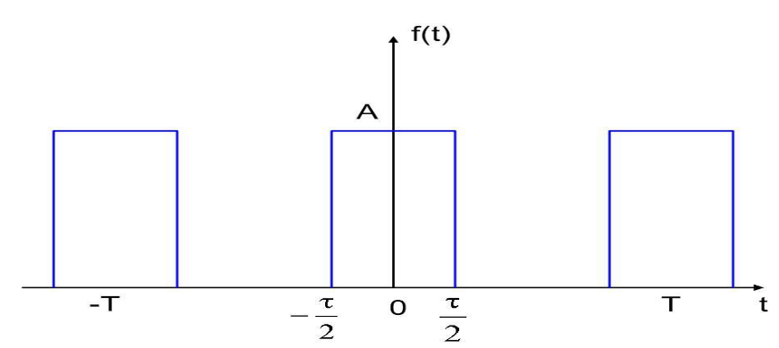

连续信号的正交分解「信号频域分析」

<!-- more -->

# Chapter 3 连续信号的正交分解「信号频域分析」

## 引言

信号的特性：

1. 时域上：
   1. 函数$f(t)$单元信号$\delta (t)$子响应$h(t)$
   2. 波形
2. 频域上：
   1. 频域表示

## 信号在正交函数集中的分解

设有一个函数集$\{g_0(t), g_1(t),...,g_n(t)\}$在$(t_1,t_1+T)$满足：

$$
<g_i,g_j>=0\iff i\ne j
$$

> [Chapter 6 - 内积空间](https://www.wolai.com/foZ6JFW1ZZuMCdxStRqfLe)

若该函数集是「规范正交基」则所有函数都可以表示为$g_i$的线性组合。

若同时使得均方误差最小，则（正交分解）

$$
a_k=\frac{\int _{t_1}^{t_1+T} f(t)g_k(t)^*\mathrm dt}{\int_{t_1}^{t_1+T}|g_k(t)|^2\mathrm dt}
$$

> Notes：在正交集中分解：分量系数$a_k$可以独立计算、平均功率=各个分量的平均功率和（Parseval 定理）

> Notes 正交函数集：三角函数集、指数函数集、Walsh 函数

## 信号的 Fourier 级数表示

### 三角形式

若周期信号$f(t)$满足 Dirichlet 条件（充分，非必要）

1. 一个周期内有有限个间断点
2. 一个周期内有有限个极值点
3. 一个周期内能量有限（→ 功率信号）\*\*

则可以展开为 FS：

$$
f(t)=\frac{a_0}2+\sum_{n=1}^\infty (a_n\cos n\Omega t+b_n\sin n\Omega t), \Omega =\frac{2\pi}{T}
$$

其中：

1. $a_n=\frac 2 T \int _{t_1}^{t_1+T}f(t)\cos n\Omega t \mathrm dt,\quad n=0,1,\cdots$
2. $b_n=\frac 2 T\int_{t_1}^{t_1+T}f(t)\sin n \Omega t\mathrm dt,\quad n = 1, 2, \cdots$

从而：

$$
f(t)=\frac{A_0}2+\sum_{n=1}^\infty A_n\cos (n\Omega t + \varphi_n)
$$

→ $f(t)$=直流+各次谐波分量

1. $A_n=\sqrt{a_n^2+b_n^2}=A_{-n},\quad n=0,1,2,\cdots$
2. $\varphi_n=-\arctg\frac{b_n}{a_n}=-\varphi_{-n}$

### 指数形式

利用欧拉公式，引入负频率

$$
f(t)=\frac {A_0}2+\sum_{n=1}^\infty \frac {A_n}2 (e^{j(n\Omega t+\varphi n)}+e^{-j(n\Omega t+\varphi n)})=\sum_{n=-\infty}^\infty \frac{\dot A_n}{2}e^{jn\Omega t}
$$

其中傅里叶复系数：

$$
\dot A_n=A_ne^{j\varphi_n}=a_n-jb_n=\frac 2 T \int_{t_1}^{t_1+T}f(t)e^{-jn\Omega t}\mathrm dt
$$

1. $\dot A_n = \dot A_{-n}^*$→ 共轭对称
2. 指数函数集分解：正交完备$\{ e^{jk\Omega t}|k\in Z \}$

### 信号波形和傅立叶系数的关系

一般性的结论：

1. 收敛性：$n\uparrow\Rightarrow a,b\downarrow$
2. 叠加过程 P93:
   1. 叠加项数大 →Gibss 现象（9%的过冲情况）
   2. 时域变化快 → 高频、时域变化慢 → 低频
3. 若$f(t)$是偶函数，则级数中只有$a_n$项，
   若$f(t)$是奇函数，则级数中只有$b_n$项
4. 偶半波对称（偶谐）： $f(t+\frac T 2)=f(t)$→ 只有偶次谐波项 → 实际周期为 $T/2$
   奇半波对称（奇谐）：只有奇次谐波项
5. 对于一般的信号， $f(t)$总可以分解 $f=f_o+f_e$
6. 若 $f(t)\rightarrow \dot A_n$，$f(t-t_0)\rightarrow \dot A_n'$则：

   $$
   \dot A_n'=\dot A_n e^{-jn\Omega t_0}
   $$

   $\mathrm{cf}:\quad f(t-t_0)\leftrightarrow F(s) e^{-st_0}$

## 周期信号的频谱

由三角形式$f(t)=\frac {A_0}2+\sum_{n=0}^\infty A_n \cos(n\Omega t+\varphi_n)$

→ 幅度谱 $A_n\sim n\Omega , n = 0 , 1, ...$（单边谱）

→ 相位谱 $\varphi_n\sim n\Omega , n = 0 , 1, ...$（单边谱）

指数形式：**双边谱** **→** 通常画单边谱

> 注意其幅度谱是 $A_n/2$ 还是 $A_n$

**例子：（周期矩形脉冲）**

$$
\dot A_n = \frac {2A \tau} T Sa(\frac{n\Omega \tau}2)
$$

- 其中：$Sa(x) = \sin x / x$称为**抽样（Sample）函数**

---

1. 周期信号频谱的特点
   1. **离散性**：离散频率（时域中的周期 → 离散频域）
   2. **谐波性**：只在谐波频率 $n\Omega$上出现
   3. **收敛性**： $n$足够大，其余高频分量可以忽略
2. 有效频宽/带宽$B$
   1. $A_n$最大值的 1/10 为限；
   2. 第一个过零点，例如$B=2\pi /\tau\Rightarrow B\tau =Constant$
   3. 总功率的 90%为限 → 帕斯瓦尔定理
3. 波形变化时，频谱的变化
   1. $T$不变，$\tau$改变 → 间隔$\Omega$不变，过零点$\omega _0=\frac {2\pi}\tau$改变
      1. $\tau$增加，$w_0$减少，有效频宽内的谱线数减小
         $\tau\rightarrow T$，只剩下 $A_0$，只有直流分量
      2. $\tau$减小，谱线数增加，$\tau \rightarrow 0, \omega_0\rightarrow \infty$
   2. $\tau$不变，$T$改变 → $\omega_0$改变， $\Omega$改变
4. $T\rightarrow \tau\Rightarrow \omega_0=\frac{2\pi}{\tau}=\Omega$→ 直流
5. $T\rightarrow\infty,\Omega \rightarrow \mathrm d\omega ,\dot A_n\rightarrow 0$但是各个分量有相对大小，且 $f(t)\rightarrow非周期信号$

## 非周期信号的频谱

### 傅里叶正、反变换

傅里叶复系数

$$
\dot A_n = \frac 2 T \int_{t_1}^{t_1+T}f(t)e^{-jn\Omega t}\mathrm dt
$$

反应了**相对大小**的量：

$$
F(jn\Omega)=\frac{\dot A_n}{2/T}
$$

从而 **频谱密度函数（频谱）**：

$$
F(j\omega) = \lim_{T\rightarrow \infty} F(jn\Omega)
$$

傅立叶变换：

$$
F(j\omega)=\int_{-\infty}^\infty f(t)e^{-j\omega t}\mathrm dt
$$

傅立叶反变换：

$$
f(t) = \frac 1 {2\pi} \int _{-\infty} ^\infty F(j\omega) e^{j\omega t} \mathrm d\omega
$$

一般的， $F(j\omega)=|F(j\omega)| e^{j\varphi(\omega)}$

### 频谱密度函数 $F(j\omega)$

1. 密度函数
2. **特点**：
   1. 单个矩形脉冲的傅立叶变换：
      $f(t) = \varepsilon(t+\tau/2)-\varepsilon(t-\tau/2)$
      $F(j\omega) = \lim_{T\rightarrow \infty}\dot A_n / (2/T) = A\tau Sa(\frac{\omega \tau}2)$
      单边指数信号
      $f(t) = e^{-\alpha t}\varepsilon(t)$
      $F(j\omega)=\frac 1 {\alpha+j\omega }$
      三角脉冲
      $f(t) = A[1-\frac {|t|}{\tau}][\varepsilon(t+\tau)-\varepsilon(t-\tau)]$
      $F(j\omega ) = A \tau Sa^2(\frac{\omega \tau}{2})$
   2. 时域非周期 → 频域连续谱；
      时域周期 → 频域离散谱
   3. 收敛性 ← 能量有限才存在 FT
   4. 有效带宽（频带）：（三种定义方法）
      1. 最大幅度的 1/10（对于单调递减的频谱）
      2. 第一个过零点（Sa）
      3. 总能量的 90%为界（帕斯瓦尔定理）
   5. 包络一致性： $F(j\omega)$与 $\dot A_n$**包络一致**
      互换关系：
      $$
      F(j\omega) = \frac {\dot A_n}{2/T}|_n
      $$
   6. 共轭对称性：$F(j\omega) = F^*(-j\omega)$，即：
      $$
      \begin{aligned}
      |F(j\omega)| \sim \omega 偶对称\\\varphi(\omega) \sim \omega 奇对称 \end{aligned}
      $$
   7. 奇偶对称性：
      - 实偶 ←→ 实偶
      - 实奇 ←→ 虚奇
   8. 延时特性：
      若 $f(t)\leftrightarrow F(j\omega)$
      则 $f(t-t_0)\leftrightarrow F(j\omega)e^{-j\omega t_0}$

## 广义傅立叶变换（广义谱）

1. $\delta(t)\leftrightarrow \mathcal F\{\delta(t)\}=1$
   → $\delta(t)$ 的广义定义为 $\displaystyle\frac {1}{2\pi} \int_{-\infty}^{\infty}1\cdot e^{j\omega t}\mathrm d\omega$
2. $\varepsilon (t)\leftrightarrow\pi \delta (\omega ) + \frac 1 { j \omega }$
3. $A\leftrightarrow 2 \pi A \delta (\omega)$
4. $\mathrm{sgn} (t) \leftrightarrow 2/j\omega$
5. $e^{j\omega_ct}\leftrightarrow 2\pi \delta (\omega - \omega_c)$
   $e^{-j\omega_ct}\leftrightarrow 2\pi \delta (\omega + \omega_c)$
6. $\cos \omega t = \pi(\delta (\omega -\omega _c ) + \delta(\omega +\omega _c))$
7. $\sin \omega t = j\pi(\delta (\omega +\omega _c ) - \delta(\omega -\omega _c))$
8. 周期信号：$f_T(t) = \sum _{n=-\infty}^\infty \frac{\dot A_n}{2} e^{jn\Omega t} \leftrightarrow F(j\omega) = \pi \sum_ {-\infty} ^{\infty} \dot A_n\delta(\omega - n\Omega)$
9. 周期性冲激序列：
   $f(t) =\sum _{n=-\infty}^{\infty}\delta(t-nT)=\sum\frac 1 T e^{jn\Omega t}$
   $F(j\omega) = \Omega \sum \delta (\omega - n \Omega)$

## 傅立叶变换的基本性质

> 前提：假设 FT 存在

1. 线性性质：
   齐次性+叠加性
2. 延时特性：
   $f(t-t_0) \leftrightarrow F(j\omega) e^{-j\omega t_0}$
3. **调制（移频）性质：**
   $f(t)e^{j\omega t} \leftrightarrow F(j\omega ) |_{\omega = \omega - \omega _c}$
   → $f(t)\cos \omega _c t \leftrightarrow \frac 1 2 [F(j\omega - j\omega_c) + F(j\omega + j \omega _c)]$
   → $f(t)\sin \omega _c t \leftrightarrow \frac 1 {2j} [F(j\omega - j\omega_c) - F(j\omega + j \omega _c)]$

   > $1\leftrightarrow 2 \pi \delta(\omega)\Rightarrow e^{-j\omega_c t} \leftrightarrow 2\pi \delta (\omega + \omega _c)$

   > $\cos (\omega_c t )\varepsilon(t) \leftrightarrow \cdots$

4. 尺度变换（比例性质）：
   $f(at) \leftrightarrow \frac 1 {|a|} F(j\omega /a)$
   $f(at-t_0) \leftrightarrow \frac 1 {|a|} F(j\frac \omega a)e^{-j\frac \omega a t_0}$
5. **互易（对称）性质** [#important]

   $$
   f(t)\leftrightarrow F(j\omega)\Rightarrow F(jt) \leftrightarrow 2\pi f(-\omega)
   $$

   - $f$实偶 → $F(j\omega)$也是实偶
   - $\mathcal F\{ F(t) \}=2\pi f(\omega)\Rightarrow f(t) = \frac 1{2\pi} \mathcal F\{ F(t)\}|_{\omega = t}$
   - $F_3= \varepsilon(\omega + \omega_1) - \varepsilon (\omega - \omega_1) \leftrightarrow f_3(t) = \frac {\omega_1}{\pi} Sa(\omega_1t)$

6. **时域微积分性质**（微积分组合性质更加常用）
   微分性质：

   $$
   \frac{\mathrm d^nf(t)}{\mathrm dt^n} \leftrightarrow(j\omega)^nF(j\omega)
   $$

   积分性质：

   $$
   g(t)\leftrightarrow G(j\omega),\\
   \int_{-\infty}^t g(\tau)\mathrm d\tau\leftrightarrow G( j\omega)/j\omega + \pi G(0)\delta (\omega ),\quad G(0) =\int_{-\infty}^{+\infty } g(t) \mathrm dt
   $$

   组合性质：

   $$
   f(t) \leftrightarrow \frac{\mathcal F[\frac{df(t)}{dt}]}{j\omega} + \pi (f(+\infty) +f(-\infty)) \delta (\omega)
   $$

   > 注意其中的加号： $\displaystyle f(t) = \int_{-\infty}^{t} \frac{df(\tau)}{d\tau}\mathrm d\tau+f(-\infty)$

7. 频域微（积）分性质
   $$
   (-jt)^nf(t) \leftrightarrow \frac{\mathrm d^n F(j\omega)}{\mathrm d\omega^n}
   $$
8. 卷积定理[#important]
   时域卷积定理：

   $$
   f_1*f_2\leftrightarrow F_1\times F_2
   $$

   频域卷积定理：

   $$
   f_1\times f_2\leftrightarrow \frac 1 {2\pi}F_1*F_2
   $$

> 3.17(ac) 3.21(135) 3.23 3.24

## Parseval 定理、能量频谱，功率谱和能量谱

### 周期信号的功率谱

1. 功率谱的概念
   $$
     P = \frac 1 T \int_{0}^Tf_T^2(t)\mathrm dt=\sum _{n=0}^\infty P_n=\sum_{n=0}^\infty\frac{\dot A_n^2}{2}
   $$
2. 周期信号的有效值
   $$
   I = \sqrt{P}
   $$

### 能量信号的能量谱

$$
\overline W = \int_{-\infty}^\infty |f(t)|^2\mathrm dt = \int _{0}^\infty \frac{|F(j\omega)|^2}{\pi }\mathrm d \omega
$$
