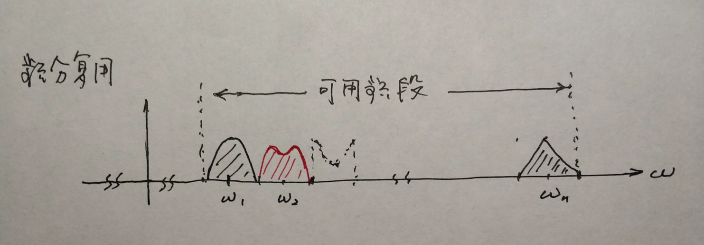

信号与系统-连续时间系统的频域分析
<!-- more -->
# Chapter 4 连续时间系统的频域分析

## Intro

1. FT分析法
2. 理想滤波器的频响和冲激响应
3. 调制和解调→ 调幅

## 信号通过系统的频域分析方法（用傅里叶变换求零状态响应）

周期信号通过系统的响应→正弦稳态响应

非周期→ FT

### FT分析法

对$D(p)r(t) = N(p)e(t)$做傅里叶变换：

$$
R(j\omega) = \frac{N(j\omega)}{D(j\omega)}E(j\omega) =H(j\omega)E(j\omega)
$$

其中$H(j\omega)$为系统的频响。则

$$
f(t) = \mathcal F^{-1}\{R(j\omega)\} = \mathcal F^{-1} \{H(j\omega)E(j\omega)\}
$$

### 频响 $H(j\omega)$

求法：

1. 直接求： $H(j\omega)=\frac{N(j\omega)}{D(j\omega)}$
2. 电路： $H(j\omega) = \frac{\dot R(j\omega)}{\dot E(j\omega)}|_{ZS}$
3. $H(j\omega) = \frac{\mathcal F\{ r_{zs}(t) \}}{\mathcal F\{e(t)\}}$
4. $H(j\omega) = \mathcal F\{h(t)\}$
5. $H(j\omega) = \frac{e^{j\omega t} 作用下的零状态响应}{e^{j\omega t}}$

## 理想低通滤波器的冲激响应和阶跃响应

理想低通滤波器的频谱特性为：

$$
H(j\omega) = K(\varepsilon(\omega + \omega_{c0})-\varepsilon(\omega - \omega_{c0}))e^{-j\omega t_0}
$$

冲激响应为：

$$
h(t) = \frac{\omega_{c0}K}{\pi} Sa(\omega_{c0}(t-t_0))
$$

特性：

1. 延时： $t-t_0$（相频特性→群时延）
2. 缓慢变化：上升时间 $\displaystyle t_r\approx \frac \pi {\omega _{c0}}$
3. 非因果性

*阶跃响应：

$$
r_\varepsilon(t) = \frac K 2 [1+\frac 2 \pi Si(\omega_{c0} (t-t_0)],\quad Si(x) =\int_0^x \frac {\sin t}t\mathrm dt
$$

## 佩利-维纳准则和物理可实现滤波器

因果系统必须满足 Paley-Wiener 条件

1. Paley-Wiener条件：
	$$
	\int_{-\infty}^\infty\frac{|\ln |H(j\omega)|}{1+\omega ^ 2}\mathrm d \omega < \infty
	$$
	
	若满足平方可积条件的时候，可以证明系统满足因果性的充要条件是 Paley - Wiener 条件
2. 常见滤波器：
	1. 巴特沃斯滤波器
	2. 切比雪夫滤波器

## 调制、解调

### 调制和解调的概念

> 主要是调幅波

1. 载波：$a_0 = A_0\cos (\omega_ct+\varphi_c)$
2. 已调波：$a(t) = A(t) \cos (\omega_c(t) t + \varphi_c(t))$（调幅、调相、调角）

考察重点：

1. 调幅波的定义→波形
2. 功率
3. 频谱

定义：$a(t) = [A_0+e(t)]\cos \omega_ct,e(t) =\sum E_{nm}\cos(\Omega_n t+\varphi_n)$

1. 上调幅系数：$m_上=\frac{A_{\max} - A_0}{A_0}$
	下调幅系数：$m_下=\frac{A_0-A_{\min}}{A_0}$
	若$e(t)$上下对称：$m_上=m_下=m=(A_{\max}-A_{\min})/(A_{\max} +A_{\min})$
	**部分调幅系数**：$m_n=\frac{E_{nm}}{A_0}$
2. 调幅波的功率：（单个频率）
	1. 最大平均功率（额定功率）：$P_{\max}=\frac{1}{2}A_{\max}^2=\frac 1 2 A_0^2(1+m)^2=(1+m)^2P_c$
	2. 载波平均功率：$P_c=\frac{A_0^2}{2}$
	3. 总平均功率：$\bar P = \frac 1 T \int _0^TP_{Tc}\mathrm dt=P_c(1+m^2/2)$
	对于多频调幅：
	1. $P_c=A_0^2/2$
	2. $P_{\max} = \frac 1 2 A_0^2(1+m_{上})^2$
	3. $\bar P = P_c(1+\sum m_n^2/2)=载频功率+旁频功率$
3. 调幅波的频谱：
4. 抑制载波调幅（AM-SC）
	1. $a(t) = Ke(t)\cos(\omega_ct+\phi_c)$
5. 脉冲幅度调制（PAM）

## 频分复用和时分复用

### 频分复用

## 时分复用

---

## 信号通过线性系统不产生失真的条件

若 $r(t) = Ke (t - t_0)$ $t_0$称为**群时延**（常数）→ 不失真

理想的：

$$
H(j\omega) = Ke^{-j\omega t_0} = |H(j\omega)|e^{-j\varphi(\omega)}
$$

具体来说：

1. 幅频是常数
2. 相频是过原点的直线

实际上，在输入信号的频带范围内满足。

