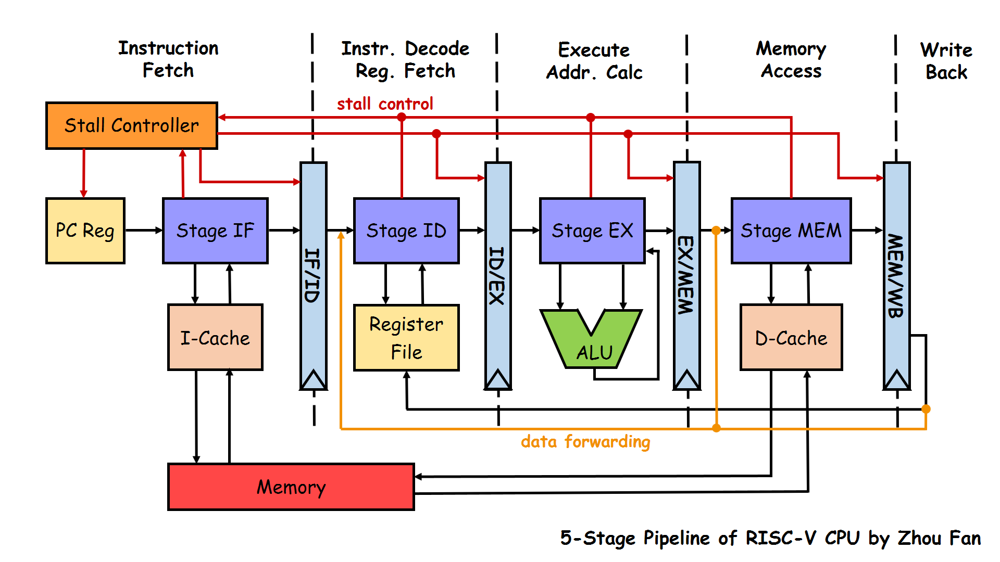

SEU 19 综合课设

<!-- more -->

Project: [reborn](https://github.com/adversarr/reborn)

## General Idea



> Reference: [RISC-V-CPU](https://github.com/Evensgn/RISC-V-CPU)

### 基本定义

```verilog
// 一字节宽度
`define WordRange 31:0
// 高电平有效
`define Enable 1'b1
`define Disable 1'b0
```

### CPU 顶层设计

首先是考虑cpu顶层如何设计（见`cpu.v`）。考虑到一些基本的信号输入输出，并根据实验要求添加一些输入输出线：

1. 基本输入输出信号
   1. `input wire clk`：CPU 时钟
   2. `input wire rst`：复位信号，高电平复位（输入时需要考虑UART串口）
   3. `input wire [5:0] interrupt_in`：中断输入信号，总共6-bit
2. Instruction Memory 输入：
   1. `input wire [31:0] instr_memory_in`：代表从MiniSys实验板，从Instruction Memory输入
   2. `output wire [31:0] instr_addr_out`：读Instruction Memory的指令地址
3. 总线相关：
   1. `input wire [31:0] bus_data_in`：总线输入，包括IO和Data Memory（主存）
   2. `output wire [31:0] bus_addr_out`: 写入总线的地址
   3. `output wire bus_enable_out`：总线读写使能，高电平表示**读写**有效
   4. `output wire bus_write_enable_out`：总线写使能，高电平表示**写**有效
   5. `output wire [3:0] bus_byte_sel_out`：控制总线选择

对于CPU内部，分别考虑五个stage之间的关系。

#### Stage：IF

IF的功能是确定下一条指令地址，即PC，并能从Instruction Memory取出，其输入输出如下（实现：`stage_if.v`）：

```verilog
input clk, // 时钟
input rst, // 同步复位信号
output reg[`WordRange] if_pc, // 当前PC，输出到Instr Mem
output wire[`WordRange] if_instr, // Stage IF的指令
input wire[`WordRange] instr_memory_in, // Instr Mem 返回的instruction
input wire pause, // 流水暂停
input wire branch_enable_in, // branch 使能
input wire[`WordRange] branch_addr_in, // branch 目标地址
input wire interrupt_enable_in,  // 异常使能
input wire[`WordRange] interrupt_pc // 异常处理程序跳转地址
```

在没有考虑 Instr Cache 的情况下，基本只有 PC 在其中需要实现，且实现逻辑上也较为简单，分情况分析即可。

从IF到ID需要传递的信号如下（实现：`tran_if_id.v`）：

```verilog
input wire[`WordRange] if_pc, 		// IF级PC
input wire[`WordRange] if_ins, 		// IF级指令
output reg[`WordRange] id_pc, 		// ID级PC
output reg[`WordRange] id_ins, 		// ID级指令
input wire pause, 								// 流水线暂停信号
input wire interrupt_enable_in    // 异常处理
```

#### Stage：ID

指令译码模块的功能是对指令进行译码，输出包括：源操作数1、源操作数2、写入的目的寄存器的运算类型（逻辑、移位、算术）。

```verilog
input wire rst,
input wire pc_in,
input wire [`WordRange] ins_in,

// Register IO:
input wire [`WordRange] reg1_data_in,
input wire [`WordRange] reg2_data_in,
output reg reg1_read_enable_out,
output reg reg2_read_enable_out,
output reg [`WordRange] reg1_read_addr_out,
output reg [`WordRange] reg2_read_addr_out,
// ALU:
output reg [`ALUOpRange] alu_op_out,
// Source Operands
output reg [`WordRange] data1_out,
output reg [`WordRange] data2_out,
// Writes to reg?
output reg reg_write_enable_out,
output reg [`RegRangeLog2] reg_write_addr_out,
// Data Correlated => From EX
input ex_write_reg_enable_in,
input wire [`WordRange] ex_write_reg_data_in,
input wire [`RegRangeLog2] ex_write_reg_addr_in,
// Data Correlated => From MEM
input mem_write_reg_enable_in,
input wire [`WordRange] mem_write_reg_data_in,
input wire [`RegRangeLog2] mem_write_reg_addr_in,
// Pipeline Stall Req Signal:
output reg pause_out,
// delay-slot: Reference pdf Page206
input wire is_in_delayslot_in,  // current instr is in slot.
output reg is_in_delayslot_out, // current instr is in slot.
output reg next_is_in_delayslot_out,  // next instr is in slot.
// Branch:
output reg branch_enable_out,
output reg[`WordRange] branch_addr_out,
output reg[`WordRange] link_addr_out,
output reg[`WordRange] ins_out,
// Interruption
// abnormal_type_out
// 31...12 预留
// 11 eret
// 10 systemcall
// 9...8 abnormal info
// 7...0 interrupt info
output reg[`WordRange] abnormal_type_out,     // information about instr
output reg[`WordRange] current_id_pc_addr_out
```

所有指令类型根据《自己动手实现CPU》实现。

#### ID→EX

从译码到执行过程中需要传递的信号（及其解释如下）

```verilog
// ALU 功能选择
ex_aluop <= id_aluop;
// ALU 数据
ex_data1 <= id_data1;
ex_data2 <= id_data2;
// （传到WB阶段）写使能
ex_write_reg_enable <= id_write_reg_enable;
ex_write_reg_addr <= id_write_reg_addr;
// 跳转地址
ex_link_addr <= id_link_addr;
// 延迟槽
ex_is_in_delayslot <= id_is_in_delayslot;
ex_next_is_in_delayslot <= id_next_is_in_delayslot;
// 指令
ex_instr <= id_instr;
// 异常处理
ex_current_pc_addr <= id_current_pc_addr;
ex_abnormal_type <= id_abnormal_type;
```

#### Stage EX

