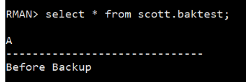
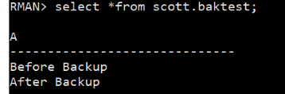
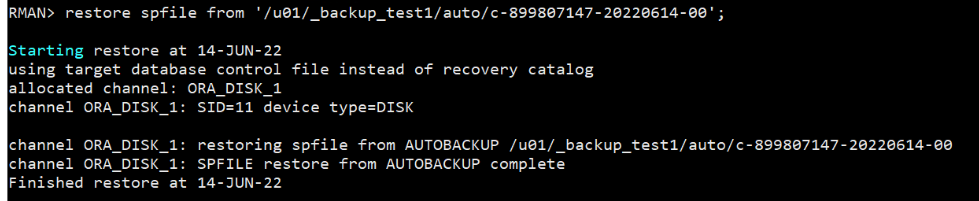
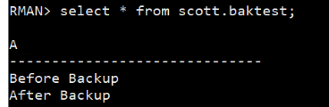

rt.

<!-- more -->

## RMAN 全库备份

前提：

1. dbca创建数据库 `ctest`（主要是怕搞错）
2. `@?/rdbms/admin/utlsampl.sql`

准备：

```bash
export ORACLE_SID=ctest
```

### 准备实验数据

创建表+checkpoint(写入)

RMAN:

```sql
create table scott.baktest(a varchar(30));
insert into scott.baktest values('Before Backup');
commit;
alter system checkpoint;
```

测试结果：



### 检查数据库情况

#### 初始化参数文件

sqlplus:

```sql
show parameter spfile;
```

```sql
SYS@ctest>show parameter spfile;

NAME                                 TYPE                   VALUE
------------------------------------ ---------------------- ------------------------------
spfile                               string                 /u01/app/oracle/product/19.3.0/dbhome_1/dbs/spfilectest.ora
```

记录下spfile的位置：

```
/u01/app/oracle/product/19.3.0/dbhome_1/dbs/spfilectest.ora
```

#### 查看控制文件位置

```sql
select name from v$controlfile;

NAME
------------------------------------------------------------------------------------------------------------------------
/u01/app/oracle/oradata/CTEST/control01.ctl
/u01/app/oracle/fast_recovery_area/CTEST/control02.ctl
```

#### ！！查看重做日志

```sql
SYS@ctest>select member from v$logfile;

MEMBER
------------------------------------------------------------------------------------------------------------------------
/u01/app/oracle/oradata/CTEST/redo03.log
/u01/app/oracle/oradata/CTEST/redo02.log
/u01/app/oracle/oradata/CTEST/redo01.log
```

#### 检查datafile

```sql
SYS@ctest>select name from v$datafile;

NAME
------------------------------------------------------------------------------------------------------------------------
/u01/app/oracle/oradata/CTEST/system01.dbf
/u01/app/oracle/oradata/CTEST/sysaux01.dbf
/u01/app/oracle/oradata/CTEST/undotbs01.dbf
/u01/app/oracle/oradata/CTEST/users01.dbf
```

#### 查看状态

```sql
SYS@ctest>select tablespace_name, status from dba_tablespaces;

TABLESPACE_NAME                                              STATUS
------------------------------------------------------------ ------------------
SYSTEM                                                       ONLINE
SYSAUX                                                       ONLINE
UNDOTBS1                                                     ONLINE
TEMP                                                         ONLINE
USERS                                                        ONLINE

```

### RMAN设置修改

> RMAN内执行

打开控制文件备份：

```
configure controlfile autobackup on;
```

创建备份目的目录：
```bash
mkdir <backup> && cd <backup>
mkdir auto 
```

设置 controlfile 备份目的地

```sql
configure controlfile autobackup format for device type disk to '/u01/<backup>/auto/%F';
```

其他的设置


```sql
# show all
alter system archive log current; # 归档日志
# 设置 channel
configure channel device type disk format '/u01/<backup>/%d_%u.bak';
# 删除之前的备份
delete backup;
```

### 执行全盘备份

> RMAN内执行

```sql
backup database plus archivelog;
```

### ！！！「举手示意，备份完成」

### 增加新数据

```sql
insert into scott.baktest values('After Backup');
commit;
select * from scott.baktest;
```



### 复制连接的日志文件

```bash
# in back directory:
sql> select * from v$logfile;
cp <...> .
cp <...> . # redo log
cp <...> .
# 或者直接 cp /u01/app/oracle/oradata/CTEST/redo0* .
```

### 破坏数据库

```bash
dbca
# 如果没有 -- vim /etc/oratab
```

### 启动例程

```bash
rman target /
startup nomount; # 不挂载（缺少spfile）
```

然后恢复启动参数文件：

```sql
restore spfile from '/u01/<>/auto/...'
```



### 创建对应的目录

bash 查看目录：

```bash
cat /u01/app/oracle/product/19.3.0/dbhome_1/dbs/spfilectest.ora
```

应该是：

```bash
mkdir -p /u01/app/oracle/admin/CTEST/adump
mkdir -p /u01/app/oracle/oradata/CTEST
mkdir -p /u01/app/oracle/fast_recovery_area/CTEST
```

### 重启例程

```sql
shutdown immediate;
exit
startup nomount
```

### 还原控制文件：

```sql
RMAN> restore controlfile from '/u01/_backup_test1/auto/c-899807147-20220614-00';

Starting restore at 14-JUN-22
using target database control file instead of recovery catalog
allocated channel: ORA_DISK_1
channel ORA_DISK_1: SID=261 device type=DISK

channel ORA_DISK_1: restoring control file
channel ORA_DISK_1: restore complete, elapsed time: 00:00:01
output file name=/u01/app/oracle/oradata/CTEST/control01.ctl
output file name=/u01/app/oracle/fast_recovery_area/CTEST/control02.ctl
Finished restore at 14-JUN-22
```

### 加载数据库

```sql
alter database mount;
```

或者：

```sql
shutdown immediate;
startup mount;
```

### 还原数据文件：

```sql
restore database;

Starting restore at 14-JUN-22
Starting implicit crosscheck backup at 14-JUN-22
allocated channel: ORA_DISK_1
channel ORA_DISK_1: SID=379 device type=DISK
Crosschecked 3 objects
Finished implicit crosscheck backup at 14-JUN-22

Starting implicit crosscheck copy at 14-JUN-22
using channel ORA_DISK_1
Finished implicit crosscheck copy at 14-JUN-22

searching for all files in the recovery area
cataloging files...
no files cataloged

using channel ORA_DISK_1

channel ORA_DISK_1: starting datafile backup set restore
channel ORA_DISK_1: specifying datafile(s) to restore from backup set
channel ORA_DISK_1: restoring datafile 00001 to /u01/app/oracle/oradata/CTEST/system01.dbf
channel ORA_DISK_1: restoring datafile 00003 to /u01/app/oracle/oradata/CTEST/sysaux01.dbf
channel ORA_DISK_1: restoring datafile 00004 to /u01/app/oracle/oradata/CTEST/undotbs01.dbf
channel ORA_DISK_1: restoring datafile 00007 to /u01/app/oracle/oradata/CTEST/users01.dbf
channel ORA_DISK_1: reading from backup piece /u01/_backup_test1/CTEST_03102deq.bak
channel ORA_DISK_1: piece handle=/u01/_backup_test1/CTEST_03102deq.bak tag=TAG20220614T201938
channel ORA_DISK_1: restored backup piece 1
channel ORA_DISK_1: restore complete, elapsed time: 00:00:07
Finished restore at 14-JUN-22
```

### !!! 复制RedoLog文件

```bash
cp redo* /u01/app/oracle/oradata/CTEST/
```

### 恢复数据库

```sql
recover database;

Starting recover at 14-JUN-22
using channel ORA_DISK_1

starting media recovery

archived log for thread 1 with sequence 8 is already on disk as file /u01/app/oracle/fast_recovery_area/CTEST/archivelog/2022_06_14/o1_mf_1_8_kbjz71dj_.arc
archived log for thread 1 with sequence 9 is already on disk as file /u01/app/oracle/oradata/CTEST/redo03.log
archived log file name=/u01/app/oracle/fast_recovery_area/CTEST/archivelog/2022_06_14/o1_mf_1_8_kbjz71dj_.arc thread=1 sequence=8
archived log file name=/u01/app/oracle/oradata/CTEST/redo03.log thread=1 sequence=9
media recovery complete, elapsed time: 00:00:00
Finished recover at 14-JUN-22
```

### 打开数据库，注意设置resetlog

```
alter database open resetlogs;
```

### 检查！

```sql
select * from scott.baktest;
```



结束

## Logminer

### 启用日志挖掘器

```sql
select SUPPLEMENTAL_LOG_DATA_MIN from v$database;
>>> NO

alter database add supplemental log data;
>>> Database altered.

select SUPPLEMENTAL_LOG_DATA_MIN from v$database;
>>> YES
```

Note: 删除方法

```sql
alter database drop supplemental log data;
>>> Database altered.

select SUPPLEMENTAL_LOG_DATA_MIN from v$database;
>>> NO
```

### 产生数据字典文件

```sql
desc dbms_logmnr_d
>>> 
PROCEDURE BUILD
 Argument Name                  Type                    In/Out Default?
 ------------------------------ ----------------------- ------ --------
 DICTIONARY_FILENAME            VARCHAR2                IN     DEFAULT
 DICTIONARY_LOCATION            VARCHAR2                IN     DEFAULT
 OPTIONS                        NUMBER                  IN     DEFAULT
PROCEDURE SET_TABLESPACE
 Argument Name                  Type                    In/Out Default?
 ------------------------------ ----------------------- ------ --------
 NEW_TABLESPACE                 VARCHAR2                IN
```

产生方法：

#### 创建目录

操作系统：

```bash
mkdir -p /u01/<dict>
```

oracle：

```sql
create directory dict1 as '/u01/dict';
```

#### 创建文件

注意大小写

```sql
execute dbms_logmnr_d.build('v816dict.ora', 'DICT1');
```

### 开始事务

```sql
conn scott/tiger
>>> Connected.
select * from emp;
>>>

update emp set sal=1800 where empno=7369;
>>> 1 row updated.

commit
>>> Commit complete.
```

### 添加需要分析的日志文件

#### 查看当前日志文件

```sql
select group#, status from v$log;
>>>
    GROUP# STATUS
---------- --------------------------------
         1 INACTIVE
         2 INACTIVE
         3 CURRENT
```

查看对应的恢复日志文件：

```sql
select member from v$logfile where group#=3;
>>>
/u01/app/oracle/oradata/CTEST/redo03.log
```

#### 添加要分析的日志

一定要注意不能写错路径查了别的数据库的log！

```sql
execute dbms_logmnr.add_logfile(LogFileName=>'/u01/app/oracle/oradata/CTEST/redo03.log', Options=>dbms_logmnr.new);
>>> 
PL/SQL procedure successfully completed.
```

### 启动分析

```sql
execute dbms_logmnr.start_logmnr(DictFileName=>'/u01/_logmin_test1/v816dict.ora');
>>>
PL/SQL procedure successfully completed.
```

### 查询结果`v$logmnr_contents`

#### 修改时间戳格式

```sql
alter session set nls_date_format='yyyy-mm-dd hh24:mi:ss';
>>>
Session altered.
```

#### 查询最终结果

```sql
select username, timestamp, sql_redo from v$logmnr_contents where username='SCOTT';
>>>

select timestamp, username, sql_redo from v$logmnr_contents where USERNAME='SCOTT';

TIMESTAMP
-------------------
USERNAME
------------------------------------------------------------------------------------------------------------------------
SQL_REDO
------------------------------------------------------------------------------------------------------------------------
2022-06-16 10:47:17
SCOTT
set transaction read write;

2022-06-16 10:47:17
SCOTT
update "SCOTT"."EMP" set "SAL" = '1800' where "SAL" = '2900' and ROWID = 'AAAR34AAHAAAAFvAAA';

2022-06-16 10:47:17
SCOTT
commit;
```

## Oracle 数据库系统结构概述

[官方参考资料](https://docs.oracle.com/en/database/oracle/oracle-database/19/cncpt/introduction-to-oracle-database.html#GUID-8F2EEEC8-0372-4419-88FF-7D77A9C0FCAD)

Oracle 数据库由`数据库存储结构`和`数据库实例`两部分构成。

- 数据库

  数据库是位于磁盘上的一组文件，用于存储数据。这些文件可以独立于数据库实例而存在。

- 数据库实例

  实例是一组管理数据库文件的内存结构。该实例由一个共享内存区域（称为系统全局区域`SGA`）和一组后台进程组成。实例可以独立于数据库文件而存在。

下图显示了数据库及其实例。对于与实例的每个用户连接，客户端进程将运行该应用程序。每个客户端进程都与自己的服务器进程相关联。服务器进程具有自己的专用会话内存，称为程序全局区域`PGA`。

[](https://liushilive.github.io/github_exercise_oracle/lsbook_import_img/2020-06-21-18-12-46.png)

其中`存储结构`包括`物理存储结构`和`逻辑存储结构`，是`数据存储及空间分配`的基础；`实例`是构成 Oracle 数据库的`软件结构`，包括`内存结构`和`后台进程`，是`数据库运行与管理`的基础。

Oracle 数据库由存放在磁盘上的数据库`DB`和对磁盘上的数据库进行管理的数据库管理系统`DBMS`两部分构成，分别对应着数据库的`存储结构`和`软件结构`。

Oracle 数据库的存储结构（Storage Structure）分为`物理存储结构`和`逻辑存储结构`两种，分别描述了在`操作系统`中和`数据库系统`内部数据的组织与管理方式。其中，物理存储结构表现为操作系统中一系列文件，逻辑存储结构是对物理存储结构的逻辑组织与管理。

Oracle 数据库的软件结构，即 Oracle 实例（Instance），包括`内存结构`与`后台进程结构`两部分。

[](https://liushilive.github.io/github_exercise_oracle/lsbook_import_img/2020-06-21-18-12-10.png)

图描述了 Oracle 数据库`内存结构`、`后台进程结构`、`存储结构`之间的关系。从图中可以看出，用户的所有操作都是通过`实例`完成的，首先在`内存结构`中进行，在一定条件下由数据库的`后台进程结构`写入数据库的`物理存储结构`做永久保存

### 存储结构

Oracle 数据库的存储结构分为`物理存储结构`和`逻辑存储结构`两种。

- 物理存储结构主要用于描述在 Oracle 数据库外部数据的存储，即在操作系统层面中如何组织和管理数据，与具体的操作系统有关。
- 逻辑存储结构主要描述 Oracle 数据库内部数据的组织和管理方式，即在数据库管理系统的层面中如何组织和管理数据，与操作系统没有关系。

物理存储结构具体表现为一系列的操作系统文件，是可见的；而逻辑存储结构是物理存储结构的抽象体现，是不可见的，可以通过查询数据库数据字典了解逻辑存储结构信息。

Oracle 数据库的物理存储结构与逻辑存储结构既相互独立又相互联系，如图所示。

[](https://liushilive.github.io/github_exercise_oracle/lsbook_import_img/2020-06-21-19-07-20.png)

从图中可以看出数据库物理存储结构与逻辑存储结构的基本关系。

- 一个数据库在物理上包含多个数据文件，在逻辑上包含多个表空间。
- 一个表空间包含一个或多个数据文件，一个数据文件只能从属于某个表空间。
- 数据库的逻辑块由一个或多个操作系统块构成。
- 一个逻辑区只能从属于某一个数据文件，而一个数据文件可包含一个或多个逻辑区。

#### 1. 物理存储结构概述

Oracle 数据库的物理存储结构是由一系列操作系统文件组成的，存放于物理磁盘上，是数据库的实际存储单元。这些文件主要包括数据文件、控制文件、重做日志文件、归档文件、初始化参数文件、跟踪文件、告警文件等。每种文件都存储特定内容的信息，其数量也因文件类型不同而不同。

- 数据文件：是数据库中所有数据的实际存储空间，所有数据文件的大小和构成了数据库的大小。
- 控制文件：记录数据库结构信息的重要的二进制文件，由 Oracle 系统进行读 / 写操作，DBA 不能直接操作控制文件。
- 重做日志文件：是以重做记录的形式记录、保存用户对数据库所进行的变更操作，是数据库中最重要的物理文件。
- 归档日志文件：是历史联机重做日志文件的集合，是联机重做日志文件被覆盖之前备份的副本。
- 初始化参数文件：是数据库启动过程所必需的文件，记录了数据库显式参数的设置。数据库启动的第一步就是根据初始化参数文件中的设置，创建并启动实例，即分配内存空间、启动后台进程。
- 跟踪文件：是数据库中重要的诊断文件，是获取数据库信息的重要工具，对管理数据库的实例起着至关重要的作用。跟踪文件中包含数据库系统运行过程中所发生的重大事件的有关信息，可以为数据库运行故障的解决提供重要信息。
- 告警文件：是数据库中重要的诊断文件，记录数据库在启动、关闭和运行期间后台进程的活动情况。

#### 2. 逻辑存储结构概述

Oracle 数据库的逻辑存储结构是从逻辑的角度来分析数据库的构成的，也就是数据库创建后利用逻辑概念来描述 Oracle 数据库内部数据的组织和管理形式。在操作系统中，没有数据库逻辑存储结构信息，而只有物理存储结构信息。数据库的逻辑存储结构概念存储在数据库的数据字典中，可以通过数据字典查询逻辑存储结构信息。

Oracle 数据库的逻辑存储结构分为 Oracle 数据块（Oracle DATE Block）、区（Extent）、段（Segment）和表空间（Table space）4 种，它们之间的关系如图所示。一个或多个连续的 Oracle 数据块构成区，一个或多个区构成段，一个或多个段构成表空间，所有表空间构成数据库。

[](https://liushilive.github.io/github_exercise_oracle/lsbook_import_img/2020-06-21-19-09-00.png)

1. Oracle 数据块

   Oracle 数据块是数据库中最小的逻辑存储单元，是数据库执行输入、输出操作的最小单位，由一个或者多个操作系统块构成。在 Oracle 11g 数据库中，数据块分为标准块和非标准块两种，其中标准块由数据库初始化参数 DB_BLOCK_SIZE 设置，其大小不可更改。Oracle 数据库的默认数据缓冲区就是由标准数据块构成的。

2. 区

   区是由一系列连续的数据块构成的逻辑存储单元，是存储空间分配的最小单位。当创建一个数据库对象时，Oracle 为对象分配若干个区，以构成一个段来为对象提供初始的存储空间。当段中已分配的区都写满后，Oracle 会为段分配一个新区，以容纳更多的数据。构成一个段的所有区只能在一个文件中。在 Oracle 数据库中，引入区的目的是为了提高系统存储空间分配的效率，以区为单位的存储空间分配大大减少了磁盘分配的次数。

3. 段

   段是由一个或多个连续或不连续的区组成的逻辑存储单元，用于存储特定的、具有独立存储结构的数据库对象。根据存储对象类型不同，分为表段、索引段、临时段和回退段 4 类。

   - 表段，又称数据段，用来存储表或簇的数据，可以细分为普通表段（TABLE）、分区表段（TABLE Partition）、簇段（Cluster）、索引化表段（INDEX-organized TABLE）。
   - 索引段用来存放索引数据，包括 ROWID 和索引键值。
   - 临时段是进行查询、排序等操作时，如果内存空间不足，用于保存 SQL 语句在解释和执行过程中产生的临时数据。会话结束时，为该操作分配的临时段将被释放。
   - 回退段用于保存数据库的回退信息，包含当前未提交事务所修改的数据的原始版本。利用回退段中保存的回退信息，可以实现事务回滚、数据库恢复、数据的读一致性和闪回查询。

4. 表空间

   表空间是 Oracle 数据库最大的逻辑存储单元，数据库的大小从逻辑上看就是由表空间决定的，所有表空间大小的和就是数据库的大小。在 Oracle 数据库中，存储结构管理主要就是通过对表空间的管理来实现的。

   表空间与数据库文件直接关联，一个表空间包含一个或多个数据文件，一个数据文件只能从属于某一个表空间，数据库对象就是存储在表空间对应的一个或多个数据文件中。

   表空间根据存储数据的类型不同，分为系统表空间和非系统表空间两类。系统表空间主要存放数据库的系统信息，如数据字典信息、数据库对象定义信息、数据库组件信息等。非系统表空间又分为撤销表空间、临时表空间和用户表空间等。其中，撤销表空间用于自动管理数据库的回退信息，临时表空间用于管理数据库的临时信息，用户表空间用于存储用户的业务数据。Oracle 11g 数据库在创建时会自动创建 6 个表空间，见表 3-1。

Oracle 11g 数据库自动创建的表空间

| 名称     | 类型       | 描述                                                      |
| -------- | ---------- | --------------------------------------------------------- |
| SYSTEM   | 系统表空间 | 存放数据字典、数据库对象定义、PL/SQL 程序源代码等系统信息 |
| SYSAUX   | 系统表空间 | 辅助系统表空间，存储数据库组件等信息                      |
| TEMP     | 临时表空间 | 存放临时数据，用于排序等操作                              |
| UNDOTBS1 | 撤销表空间 | 存储、管理回退信息                                        |
| USERS    | 用户表空间 | 存放用户业务数据信息                                      |
| EXAMPLE  | 示例表空间 | 示例表空间，存放示例的数据库方案对象信息                  |

### 内存结构

Oracle 数据库实例由一系列内存结构和后台进程组成。用户操作数据库的过程实质上是与数据库实例建立连接，然后通过实例来操作数据库的过程。用户的所有操作都在内存中进行，最后由数据库后台进程将操作结果写入各种物理文件中永久性保存。

内存结构是 Oracle 数据库体系结构的重要组成部分，是 Oracle 数据库重要的信息缓存和共享区域。根据内存区域信息使用范围的不同，分为系统全局区（System Global Area，SGA）和程序全局区（Program Global Area，PGA）。

#### 1. SGA

SGA 是由 Oracle 分配的共享内存结构，包含一个数据库实例的数据和控制信息。SGA 数据供所有的服务器进程和后台进程共享，所以 SGA 又称为共享全局区（Shared Global Area）。用户对数据库的各种操作主要在 SGA 中进行。该内存区随数据库实例的创建而分配，随实例的终止而释放。

SGA 主要由数据高速缓冲区（Database Buffer Cache）、共享池（Shared Pool）、重做日志缓冲区（Redo Log Cache）、大型池（Large Pool）、Java 池（Java Pool）、流池（Streams Pool）和其他结构（如固定 SGA、锁管理等）组成。

1. 数据高速缓冲区

   数据高速缓冲区存储的是最近从数据文件中检索出来的数据，供所有用户共享。当用户要操作数据库中的数据时，先由服务器进程将数据从磁盘的数据文件中读取到数据高速缓冲区中，然后在缓冲区中进行处理。用户处理后的结果被存储在数据高速缓冲区中，最后由数据库写入进程 DBWR 写到硬盘的数据文件中永久保存，如图所示。

   [](https://liushilive.github.io/github_exercise_oracle/lsbook_import_img/2020-06-21-19-15-14.png)

   根据数据缓冲区中存放的信息的不同，数据高速缓冲区分为下列 4 种类型。

   - 脏缓存块（Dirty Buffers）：脏缓存块中保存的是已经被修改过的数据。
   - 空闲缓存块（Free Buffers）：空闲缓存块中不包含任何数据，它们等待后台进程或服务器进程向其中写入数据。
   - 命中缓存块（Pinned Buffers）：命中缓存块是那些正被使用的数据块，同时还有很多会话等待修改或访问的数据块。
   - 干净缓存块（Clean Buffers）：干净缓存块是指那些当前没有被使用，即将被换出内存的缓存块，这些块中的数据要么没有被修改，要么在内存中有该数据块的快照。

   在 Oracle 11g 中，数据高速缓冲区由标准缓冲区和非标准缓冲区构成，两者的和决定了数据高速缓冲区大小。标准缓冲区大小由参数 DB_CACHE_SIZE 设定，非标准缓冲区由参数 DB_nK_CACHE_SIZE 设定。

2. 重做日志缓冲区

   重做日志缓冲区用于缓存用户对数据库进行修改操作时生成的重做记录。为了提高工作效率，重做记录并不是直接写入到重做日志文件中，而是首先被服务器进程写入重做日志缓冲区中，在一定条件下，再由日志写入进程 LGWR 把重做日志缓冲区的内容写入到重做日志文件中做永久性保存。在归档模式下，当重做日志切换时，由归档进程 ARCH 将重做日志文件的内容写入到归档文件中，如图所示。

   [](https://liushilive.github.io/github_exercise_oracle/lsbook_import_img/2020-06-21-19-16-17.png)

   重做日志缓存区大小由初始化参数 LOG_BUFFER 设定。

3. 共享池

   共享池用于缓存最近执行过的 SQL 语句、PL/SQL 程序和数据字典信息，是对 SQL 语句、PL/SQL 程序进行语法分析、编译、执行的区域。

   共享池由库缓存（Library Cache）和数据字典缓存（Dictionary Cache）组成。

   - 库缓存

     Oracle 执行用户提交 SQL 语句或 PL/SQL 程序之前，先要对其进行语法分析、对象确认、权限检查、执行优化等一系列操作，并生成执行计划。这一系列操作会占用一定的系统资源，如果多次执行相同的 SQL 语句、PL/SQL 程序，都要进行如此操作的话，将浪费很多系统资源。库缓存的作用就是缓存最近被解释并执行过的 SQL 语句、PL/SQL 程序代码正文、编译后代码以及执行计划，以提高 SQL、PL/SQL 程序的执行效率。当执行 SQL 语句或 PL/SQL 程序时，Oracle 首先在共享池的库缓存中搜索，查看正文完全相同的 SQL 语句或 PL/SQL 程序是否已经被分析、解析、执行并缓存过。如果有，Oracle 将利用缓存中的分析结果和执行计划来执行该语句，而不必重新对它进行解析，从而大大提高了系统的执行速度。

   - 数据字典缓存区

     数据字典缓存区中保存最常使用的数据字典信息，如数据库对象信息、账户信息、数据库结构信息等。当用户访问数据库时，可以从数据字典缓存中获得对象是否存在、用户是否有操作权限等信息，大大提高了执行效率。

     共享池的大小由初始化参数 SHARED_POOL_SIZE 设定。

4. 大型池

   大型池是一个可选的内存配置项，主要为 Oracle 共享服务器、服务器 I/O 进程、数据库备份与恢复操作、执行具有大量排序操作的 SQL 语句、执行并行化的数据库操作等需要大量缓存的操作提供内存空间。如果没有在 SGA 中创建大型池，上述操作所需要的缓存空间将在共享池或 PGA 中分配，因而会影响共享池或 PGA 的使用效率。

   大型池的大小由初始化参数 LARGE_POOL_SIZE 设定。

5. Java 池

   Java 池是一个可选的内存配置项，提供对 Java 程序设计的支持，用于存储 Java 代码、Java 语句的语法分析表、Java 语句的执行方案和进行 Java 程序开发等。

   Java 池大小由初始化参数 JAVA_POOL_SIZE 设定。

6. 流池

   流池是一个可选的内存配置项，用于对流的支持。

   流池大小由初始化参数 STREAMS_POOL_SIZE 设定。

#### 2. PGA

Oracle 创建一个服务器进程的同时要为该服务器进程分配一个内存区，该内存区称为程序全局区（Program Global Area，PGA）。PGA 是一个私有的内存区，不能共享，每个服务器进程只能访问自己的 PGA，因此 PGA 又称为私有全局区（Private Global Area）。系统同时为每个后台进程分配私有的 PGA 区。所有服务器进程 PGA 与所有后台进程 PGA 大小的和，即为实例的 PGA 的大小。PGA 随着服务器进程与后台进程的启动而分配，随着服务器进程和后台进程终止而被释放。

PGA 由下列 4 部分组成。

1. 排序区（SORT Area）：存放排序操作所产生的临时数据。
2. 游标信息区（Cursor Information）：存放执行游标操作时所产生的数据。
3. 会话信息区（Session Information）：保存用户会话所具有的权限、角色、性能统计信息。
4. 堆栈区（Stack Space）：用于保存会话过程中的绑定变量、会话变量等信息。

### 后台进程

#### 1. Oracle 进程概述

1. 进程概念

   进程是操作系统中一个独立的可以调度的活动，用于完成指定的任务。进程与程序的区别在于：

   进程是动态的概念，即动态创建，完成任务后立即消亡；而程序是一个静态实体。 进程强调执行过程，而程序仅仅是指令的有序集合。

2. 进程类型

   在 Oracle 数据库服务器中，进程分为用户进程（USER Process）、服务器进程（Server Process）和后台进程（Background Process）3 种。

   - 用户进程

     当用户连接数据库执行一个应用程序时，会创建一个用户进程，来完成用户所指定的任务。

   - 服务器进程

     Oracle 服务器进程由 Oracle 自身创建，用于处理连接到数据库实例的用户进程所提出的请求。

     服务器进程主要完成以下任务：

     1. 解析并执行用户提交的 SQL 语句和 PL/SQL 程序。
     2. 在 SGA 的数据高速缓冲区中搜索用户进程所要访问的数据，如果数据不在缓冲区中，则需要从硬盘数据文件中读取所需的数据，再将它们复制到缓冲区中。
     3. 将用户改变数据库的操作信息写入日志缓冲区中。
     4. 将查询或执行后的结果数据返回给用户进程。

   - 后台进程

     为了保证 Oracle 数据库在任意一个时刻都可以处理多用户的并发请求，进行复杂的数据操作，而且优化系统性能，Oracle 数据库启用了一些相互独立的附加进程，称为后台进程。服务器进程在执行用户进程请求时，会调用后台进程来实现对数据库的操作。

#### 2. Oracle 后台进程

Oracle 实例的主要后台进程包括数据库写入进程（DBWR）、日志写入进程（LGWR）、检查点进程（CKPT）、系统监控进程（SMON）、进程监控进程（PMON）、归档进程（ARCH）、恢复进程（RECO）、锁进程（LCKn）、调度进程（Dnnn）等，其中前 5 个后台进程是必需的。

数据库的后台进程随数据库实例的启动而自动启动，它们协调服务器进程的工作，优化系统的性能。可以通过初始化参数文件中参数的设置来确定启动后台进程的数量。

1. DBWR

   数据库写入进程负责把数据高速缓冲区中已经被修改过的数据（脏缓存块）成批写入数据文件中永久保存，同时使数据高速缓冲区有更多的空闲缓存块，保证服务器进程将所需要的数据从数据文件中读取到数据高速缓冲区中，提高缓存命中率。

   当下列某个条件满足时，DBWR 进程将启动，将数据高速缓冲区中的脏数据写入数据文件：

   - 服务器进程在数据高速缓存区中搜索一定数量的缓存块后，仍然没有找到可用的空闲缓存块，此时 DBWR 进程将被启动；
   - 检查点发生时，将启动 DBWR 进程；
   - 当数据高速缓冲区中 LRU 列表长度达到初始化参数 DB_BLOCK_WRITE_BATCH 指定值的一半时，DBWR 进程将被启动；
   - DBWR 进程发生超时（约 3s），DBWR 进程将被启动。

   > 注意：DBWR 进程启动的时间与用户提交事务的时间完全无关。

2. LGWR

   日志写入进程负责把重做日志缓冲区的重做记录写入重做日志文件中永久保存。

   DBWR 进程在工作之前，需要了解 LGWR 进程是否已经把相关的日志缓冲区中的重做记录写入重做日志文件中。如果还没有写入重做日志文件，DBWR 进程将通知 LGWR 进程完成相应的工作，然后 DBWR 进程才开始写入。这样可以保证先将与脏缓存块相关的重做记录信息写入重做日志文件，然后将脏缓存块写入数据文件，即先写重做日志文件，后写数据文件。

   当下列事件发生时，LGWR 进程会将重做日志缓冲区中的重做记录写入重做日志文件：

   - 用户通过 COMMIT 语句提交当前事务；
   - 重做日志缓冲区被写满三分之一；
   - DBWR 进程开始将脏缓存块写入数据文件；
   - LGWR 进程超时（约 3s），LGWR 进程将启动。

3. CKPT

   检查点是一个事件，当该事件发生时（每隔一段时间发生），DBWR 进程把数据高速缓冲区中的脏缓存块写入数据文件中，同时 Oracle 将对数据库控制文件和数据文件的头部的同步序号进行更新，以记录下当前的数据库结构和状态，保证数据的同步。

   在执行了一个检查点事件后，Oracle 知道所有已提交的事务对数据库所做的更改已经全部被写入到数据文件中，此时数据库处于一个完整状态。在发生数据库崩溃后，只需要将数据库恢复到上一个检查点执行时刻即可。因此，缩短检查点执行的间隔，可以缩短数据库恢复所需的时间。

   CKPT 进程的作用就是执行检查点，完成下列操作：

   - 更新控制文件与数据文件的头部，使其同步；
   - 触发 DBWR 进程，将脏缓存块写入数据文件。

4. SMON

   如果由于某种原因系统崩溃了，那么 SGA 中任何没有来得及写入磁盘文件中的信息都将丢失。如果有些已经提交的数据还没有真正写入数据文件中就会丢失了，当数据库重新启动时，SMON 进程将自动执行 Oracle 实例的恢复工作。

   除了进行数据库实例恢复外，SMON 进程还具有以下功能：

   - 回收不再使用的临时空间；
   - 将各个表空间的空闲碎片合并（表空间的存储参数 PCTINCREASE 不为 0 时）。
   - SMON 进程除了在实例启动时执行一次外，在实例运行期间，它会被定期唤醒，检查是否有工作需要它来完成。如果有其他任何进程需要使用 SMON 进程的功能，它们将随时唤醒 SMON 进程。

5. PMON

   PMON 进程的主要功能包括：

   - 负责恢复失败的用户进程或服务器进程，并且释放进程所占用的资源；
   - 清除非正常中断的用户进程留下的孤儿会话，回退未提交的事务，释放会话所占用的锁、SGA、PGA 等资源；
   - 监控调度进程和服务器进程的状态，如果它们失败，则尝试重新启动它们，并释放它们所占用的各种资源。
   - 与 SMON 进程类似，PMON 进程在实例运行期间会被定期唤醒，检查是否有工作需要它来完成。如果有其他任何进程需要使用 PMON 进程的功能，它们将随时唤醒 PMON 进程。

6. ARCH

   ARCH 进程负责在日志切换后将已经写满的重做日志文件复制到归档目标，以防止写满的重做日志文件被覆盖。

   只有当数据库运行在归档模式，并且初始化参数 LOG_ARCHIVE_START 设置为 TRUE，即启动自动归档功能时，才能启动 ARCH 进程；否则当重做日志文件全部被写满后，数据库将被挂起，等待 DBA 进行手工归档。

### 数据字典

#### 1.概述

1. 数据字典的内容与作用

   数据字典是数据库重要组成部分，是在数据库创建过程中创建的，保存了数据库系统信息以及数据库中所有的对象信息，是数据库系统运行的基础。

   Oracle 数据库的数据字典由一系列表和视图构成，这些表和视图对于所有的用户，包括 DBA，都是只读的。只有 Oracle 系统才可以对数据字典进行管理与维护。在 Oracle 数据库中，所有数据字典表和视图都属于 SYS 模式，存储于 SYSTEM 表空间中。

   Oracle 数据字典保存数据库本身的系统信息及所有数据库对象信息，包括：

   - 各种数据库对象的定义信息，包括表、视图、索引、同义词、序列、存储过程、函数、包、触发器及其他各种对象；
   - 数据库存储空间分配信息，如为某个数据库对象分配了多少空间，已经使用了多少空间等；
   - 数据库的安全信息，包括用户、权限、角色、完整性等；
   - 数据库运行时的性能和统计信息；
   - 其他数据库本身的基本信息。

   数据字典除了用于 Oracle 进行系统管理外，对于 DBA 以及普通数据库用户都有着非常重要的作用。数据字典的主要用途包括：

   - Oracle 通过访问数据字典获取用户、模式对象、数据库对象定义与存储等信息，以判断用户权限合法性、模式对象存在性及存储空间的可用性等；
   - 使用 DDL 语句修改数据库对象后，Oracle 将在数据字典中记录所做的修改；
   - 任何数据库用户都可以从数据字典只读视图中获取各种数据库对象信息；
   - DBA 可以从数据字典动态性能视图中获取数据库的运行状态，作为进行性能调整的依据。

2. 数据字典的管理与维护

   数据字典主要是由 Oracle 数据库服务器使用的，服务器通过访问数据字典基表获取用户、数据库对象、存储结构等信息，并利用这些信息进行数据库的管理与维护。只有 Oracle 系统可以对数据字典进行管理与维护。在 Oracle 数据库运行过程中，如果数据库结构发生变化，Oracle 数据库服务器会及时地修改相应的数据字典以记录这些变化。

   当数据库中执行下列各种 SQL 语句操作时，Oracle 数据库服务器会修改数据字典信息。

   - DDL 语句。如增加或减少表空间、增加或减少用户。
   - DCL 语句。如授予用户权限、回收用户权限。
   - DML 语句。某些 DML 语句，如引起表的存储空间扩展的插入、修改语句，Oracle 会将磁盘上存储空间的变化信息记录到数据字典中。

   包括数据库管理员（DBA）在内的任何用户都不能直接使用 DML 语句修改数据字典中的内容。所有用户和管理员（DBA）只能通过访问数据字典视图来得到数据库的相关信息。一些数据字典视图可以被所有用户访问，而另一些只能被数据库管理员访问。

#### 2. 数据字典的结构

数据字典主要包括数据字典表和数据字典视图两种。根据数据字典对象的虚实性不同，分为静态的数据字典和动态数据字典两种，其中，静态数据字典在用户访问数据字典时不会发生改变，但动态数据字典是依赖数据库运行的性能的，反映数据库运行的一些内在信息，所以在访问这类数据字典时往往不是一成不变的。

1. 静态数据字典表

   静态数据字典表是在数据库创建过程中自动运行 sql.bsq（`%Oracle_HOME%\RDBMS\ADMIN\sql.bsq`）脚本创建的，由 SYS 用户所拥有，表中信息都是经过加密处理的。数据字典中的所有信息实际上都是存储在静态数据字典表中的。静态数据字典表的命名中通常包含 `$` 符号。只有 Oracle 才能读 / 写这些静态数据字典表。例如，静态数据字典表 `tab$`。

2. 静态数据字典视图

   由于静态数据字典表对于用户而言是不可访问的，因此，通过对静态数据字典表进行解密和处理，创建了一系列用户可读的静态数据字典视图。在数据库创建过程中，通过自动运行 catalog.sql（`%Oracle_HOME%\RDBMS\ADMIN\catalog.sql`）脚本创建静态数据字典视图及其公共同义词，并进行授权。例如，静态数据字典视图 USER_TABLES。

3. 动态数据字典表

   动态数据字典表是在数据库实例运行过程中由 Oracle 动态创建和维护的一系列“虚表”，在实例关闭时被释放。动态数据字典表中记录与数据库运行的性能相关的统计信息，因此又称为动态性能表。通常，动态性能表的命名以 `X$`开头。动态性能表由 SYS 用户所拥有。例如，动态性能表 `X$KSPPI`。

4. 动态数据字典视图

   在动态性能表上创建的视图称为动态数据字典视图，又称动态性能视图。所有动态性能视图命名都以 V开头，Oracle自动为这些视图创建了以‘V开头，*O**r**a**c**l**e*自动为这些视图创建了以‘*V*` 开头命名的公共同义词，因此动态性能视图又称为`V$ 视图`。例如，动态性能视图 `V$DATAFILE`。

   通过查询表 dictionary，可以获得全部可以访问的数据字典表或视图的名称和解释；通过查询表 dict_columns，可以获得全部可以访问的数据字典表或视图中字段名称和解释。例如：

   ```sql
   SQL> SELECT * FROM dictionary;
   SQL> SELECT * FROM dict_columns WHERE TABLE_NAME='USER_TABLES';
   ```

   SQL

   Copy

#### 3. 数据字典的使用

1. 静态数据字典表的使用

   静态数据字典表只能由 Oracle 进行维护，用户不能对这些表进行直接操作。当用户执行 DDL 操作时，Oracle 系统自动对相应的静态数据字典表进行操作。例如，当执行 CREATE TABLE、ALTER TABLE 和 DROP TABLE 操作时，系统会自动对 `TAB$` 表进行 INSERT、UPDATE 和 DELETE 操作。

2. 静态数据字典视图的使用

   通常，用户通过对静态数据字典视图的查询可以获取所需要的所有数据库信息。

   Oracle 静态数据字典视图可以分为 3 类，各类视图具有独特的前缀，其表示形式和含义如表所描述。

   静态数据字典视图分类及其含义

   | 名称前缀 | 含义                                                         |
   | -------- | ------------------------------------------------------------ |
   | USER_    | 包含当前数据库用户所拥有的所有的模式对象的信息               |
   | ALL_     | 包含当前数据库用户可以访问的所有的模式对象的信息             |
   | DBA_     | 包含所有数据库对象信息，只有具有 DBA 角色的用户才能够访问这些视图 |

   例如，查询当前用户所拥有的表的信息、可以访问的表的信息及当前数据库所有表的信息，可以分别执行下列语句：

   ```sql
   SQL> SELECT * FROM USER_TABLES;
   SQL> SELECT * FROM ALL_TABLES;
   SQL> SELECT * FROM SYS.DBA_TABLES;
   ```

   SQL

   Copy

   注意：以 USER_、ALL_开头的数据字典视图都具有与其同名公共同义词，用户可以直接访问，而以 DBA_开头的数据字典视图归 SYS 用户所有，没有与其对应的同名公共同义词，因此非 SYS 用户访问时，需在 DBA_视图名前加 SYS 前缀。

3. 动态性能表的使用

   动态性能表是数据库实例启动后动态创建的表，用于存放数据库运行过程中的性能相关的信息。动态性能表都属于 SYS 用户，Oracle 使用这些表生成动态性能视图。

   可以通过下列语句查询当前数据库中所有的动态性能表和动态性能视图：

   ```sql
   SQL> SELECT NAME FROM V_$FIXED_TABLE;
   ```

   SQL

   Copy

4. 动态性能视图的使用

   动态性能视图是 SYS 用户所拥有的，在默认状况下，只有 SYS 用户和拥有 DBA 角色的用户可以访问。与静态数据字典表和视图不同，在数据库启动的不同阶段只能访问不同的动态性能视图。

   当数据库启动到 NOMOUNT 状态时，Oracle 数据库打开初始化参数文件，分配 SGA 并启动后台进程，因此只能访问从 SGA 中获得信息的动态性能视图，如 `V$PARAMETER`、`V$SGA`、`V$SESSION`、`V$PROCESSE`、`V$INSTANCE`、`V$VERSION`、`V$OPTION`等。

   当数据库启动到 MOUNT 状态时，Oracle 打开控制文件，因此不仅能访问从 SGA 中获得信息的动态性能视图，还可以访问从控制文件中获得信息的动态性能视图，如 `V$LOG`、`V$LOGFILE`、`V$DATAFILE`、`V$CONTROLFILE`、`V$DATABASE`、`V$THREAD`、`V$DATAFILE_HEADER`等。

   当数据库完全启动后，可以访问 `V_$fixed_table` 表中所有的动态性能视图。

   例如，利用动态性能视图查询当前数据库参数设置信息、数据文件信息。

   ```sql
   SQL> SELECT * FROM V$PARAMETER;
   SQL> SELECT * FROM DATAFILE;
   ```

## 数据类型

要使用数据库来存储数据，首先就要知道这个数据库都能存储什么类型的数据。

数据类型是在向数据表中存储数据前必须设定好的，就像如果要使用记事本查看文件内容，那么文件就要是文本的，不能有图片，否则图片是查看不了的，因为记事本中只能查看文本文件。

[官网文档](https://docs.oracle.com/en/database/oracle/oracle-database/19/sqlrf/Data-Types.html#GUID-7B72E154-677A-4342-A1EA-C74C1EA928E6)

在 Oracle 11g 中提供的数据类型有 23 种，下面介绍常用的数据类型。

### 1. 字符型

字符型在 Oracle 11g 中有 varchar2、char、nchar、nvarchar2 和 long 五种，它们在数据库中是以 ASCII 码的格式存储的。

| 数据类型    | 说明                                                         |
| ----------- | ------------------------------------------------------------ |
| CHAR(n)     | 存储固定长度的字符串，长度以字节为单位，默认和最小字符数为 1，最大字符数为 2000 |
| VARCHAR2(n) | 存储可变长度的字符串，长度以字节为单位，最小字符数是 1，最大字符数是 4000 |

### 2. 数字型

数字型在 Oracle 11g 中常用的有 number 和 float 类型两种，可以用它们来表示整数和小数。

| 数据类型     | 说明                                                         |
| ------------ | ------------------------------------------------------------ |
| NUMBER(p, s) | 可以存储 0、正数和负数。p 表示数值的总位数（精度），取值范围为 1～38；s 表示刻度，取值为−84～127 |

### 3. 日期类型

日期类型在 Oracle 11g 中常用的有 date 和 timestamp 两种类型，可以用它们来存放日期和时间。

| 数据类型     | 说明                                                         |
| ------------ | ------------------------------------------------------------ |
| DATE         | 用于存储日期和时间。可以存储的日期范围为公元前 4712 年 1 月 1 日到公元后 9999 年 12 月 31 日，占据 7 字节的空间，由世纪、年、月、日、时、分、秒组成 |
| TIMESTAMP(n) | 表示时间戳，是 DATE 数据类型的扩展，允许存储小数形式的秒值。p 表示秒的小数位数，取值范围为 0～9，默认值为 6 |

### 4. 其他数据类型

除了上面讲过的字符型、数字型、日期类型之外，在 Oracle 11g 中还有存放大数据的数据类型以及存放二进制文件的数据类型。

| 数据类型 | 取值范围（字节）                                             | 说明 |
| -------- | ------------------------------------------------------------ | ---- |
| CLOB     | 用于存储单字节或多字节的大型字符串对象，支持使用数据库字符集的定长或变长字符。在 Oracle 11g 中 CLOB 类型最大存储容量为 128TB |      |
| BLOB     | 用于存储大型的、未被结构化的变长的二进制数据（如二进制文件、图片文件、音频和视频等非文本文件）。在 Oracle 11g 中 BLOB 类型最大存储容量为 128TB |      |
| BFILE    | 用于存储指向二进制格式文件的定位器，该二进制文件保存在数据库外部的操作系统中。在 Oracle 11g 中 BFILE 文件最大容量为 128TB，不能通过数据库操作修改 BFILE 定位器所指向的文件 |      |
| RAW(n)   | 用于存储变长的二进制数据，n 表示数据长度，取值范围为 1～2000 字节 |      |
| LONG RAW | 用于存储变长的二进制数据，最大存储数据量为 2GB。Oracle 建议使用 BLOB 类型代替 LONG RAW 类型 |      |
| ROWID    | 行标识符，表示表中行的物理地址的伪列类型                     |      |
