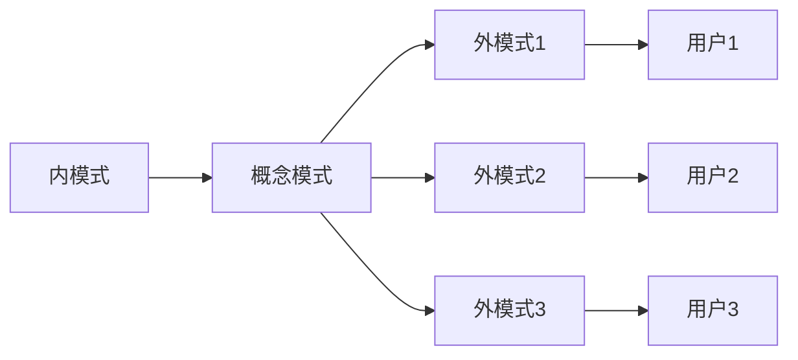

数据库原理复习提纲。

<!-- more -->

## 引言

### 数据管理的发展

#### 数据密集型应用

数据密集型应用

1. 数据量大
2. 数据不随程序的结束而消失
3. 数据为多个 app 共享

数据库对比文件系统：

1. 编写应用程序很不方便
2. 文件设计难以满足多种应用程序的不同要求 → 产生数据冗余
3. 文件结构的修改导致应用程序修改，应用程序的维护工作量大
4. 文件系统一般不支持文件的并发访问

#### 数据库系统

DBMS — 管理数据库的软件 → 数据库的**核心**

DBA — 数据库管理员

数据库系统 — app+DBMS+DBA

现代 DBMS 的功能：

1. 提供高级的数据接口（抽象出物理存储的细节 → 物理形式和逻辑形式能够互相映射、GUI、非过程的 sql 语言）
2. 查询处理和查询优化（性能）
3. 数据目录管理（包含数据的逻辑属性、存储结构定义、访问、管理的信息）
4. 并发控制
5. 恢复功能
6. 完整性约束检查（数据在**语义**上的约束—完整性约束）
7. 访问控制

> 数据管理—如何有效的组织、存储、维护和使用大量的相关数据

> 数据库 — 利用计算机进行数据管理的一种技术



数据库是一个按**数据结构**来存储和管理数据的计算机软件系统。

与数据文件相比，有如下的优点：

1. 数据库中的数据具有数据整体性
2. 数据库中的数据具有数据共享性
   1. 用法不同 - 为用户提供不同的数据是图，满足个别用户对于数据结构、数据命名、约束条件的特殊要求
   2. 同时共享 - 不同的用户可以同时存取数据库中的同一个数据

和文件系统相比的主要特点：

1. 以数据模型为基础
2. 数据冗余度小、数据共享度高
3. 数据和程序之间具有较高的独立性
   1. ：指应用程序对于数据**存储结构（物理结构）**的依赖程度。
   2. ：应用程序对于数据全局**逻辑结构**的依赖程序。
4. 通过 DBMS 实现数据安全性和数据完整性控制
5. 最小存取单位是数据项







1. 不保存大量的数据
2. 没有软件系统对于数据进行管理
3. 没有文件的概念
   - 数据组成和数据存储过程必须由程序员自行设计
4. 一组数据对应一个程序
   - 相同数据重复多





特点：

1. 管理的数据以文件的形式存储在计算机的外村中
2. 文件系统由专门数据管理软件提供有关数据的存取、查询、维护功能
3. 文件系统的数据文件已经具有对氧化
4. 文件系统的数据存取是以记录为单位

缺点：

1. 表现
   1. 数据冗余度大（Redundancy）
   2. 缺乏程序间的独立性
2. 反映
   1. 数据文件为某一特定应用服务，可重复使用率低
   2. 数据的逻辑结构改变时，必须改应用程序，修改文件结构的定义
   3. 反之，应用程序的改变，影响文件数据结构的改变





### 数据、数据模型、数据模式

#### 数据

对事物描述的符号记录是数据

1. 从数据中获取有意义的内容 → 信息
2. 数据是信息的一种存在形式，通过解释处理才成为有用的信息

#### 数据模型

数据模型是用来描述数据的一组**概念**和**定义**，数据库的设计基础是数据模型。

> 例如：层次模型、网状模型、关系模型等

1. 数据结构：数据的静态属性 → 数据的基本结构、数据间的联系(、数据的约束)
2. 数据操作：数据的动态属性 → 定义在数据上的操作
3. 数据约束条件

> 数据模型应该能自然的反应现实世界、接近现实世界的观察和理解；同时接近数据在计算机中的物理表示，便于实现、减少开销。

1.  概念数据模型（需求导向）：面向用户的、面向现实世界的数据模型，和 DBMS 无关，是用来描述一个单位的概念化结构。
    1. 和 DBMS 无关
    2. 需要相关工作人员的参与
    3. 常常用 ER 图表示
2.  逻辑数据模型 — 用户从数据库看到的数据模型
    1. 和 DBMS 有关
    2. 关系数据模型是目前最常用的逻辑数据模型
    3. 面向用户 且 面向实现
3.  物理数据模型 — 数据的逻辑结构（文件、记录、字段等）不反映存储结构，例如物理块、指针、索引等
    1. 和 DBMS 有关、和 OS 和硬件有关

对某一类数据的结构、联系、约束的描述（型的描述），成为**数据模式**。

例如：

```
数据模式：
  (name, id, gender, birth)
数据实例：
  (yang, 615, male, 2001)
```

有三级**数据模式**结构：

1. 概念模式（逻辑模式）：用**逻辑数据模型**对一个单位的数据的描述 — 最基础任务
2. 外模式 — 对用户用到的数据描述（从概念模式推导） — 逻辑数据模型
3. 内模式 — 物理数据模型对数据的描述（和内模式相互映射） — 物理数据模型

关系为：

1. 概念数据库是物理数据库的逻辑抽象形式。
2. 物理数据库是概念数据库的具体实现
3. 用户数据库是概念数据库的子集、是物理数据库子集的逻辑描述





包括：

1. 数据记录型、数据项的型、记录间联系的描述
2. 安全性定义、数据库完整性约束、寻址方式等

目的：

1. 减小数据冗余
2. 实现数据共享
3. 对所有用户的数据进行综合抽象的全局统一视图





对于各个用户或程序设计的数据逻辑结构和数据特征的描述。

设计对于子模式的数据结构、数据域、数据构造规则和数据安全性和完整性等属性的描述。

优点如下：

1. 不必考虑与自己无关的数据，无需了解数据的存储结构，简化用户、程序设计工作
2. 有利于数据的安全和保密
3. 有利于数据的独立性和共享性





对于数据的内部表示、底层描述。

设计目标：将全局逻辑模式组织称最优的无力模式，提高数据的存取效率，改善系统的性能指标。

在数据库系统中，只有物理数据库是真实存在的，是存放在外存中的数据文件。







**物理独立性**是指用户的应用程序与存储在磁盘上的数据库中数据是相互独立的。即，数据在磁盘上怎样存储由 DBMS(DataBase Management System 数据库管理系统)管理，用户程序不需要了解，应用程序要处理的只是数据的逻辑结构，这样当数据的物理存储改变了，应用程序不用改变。

**逻辑独立性**是指用户的应用程序与数据库的逻辑结构是相互独立的，即：

- 当数据的逻辑结构改变时，用户程序也可以不变。



#### 数据(data)，数据模型(data model)，数据模式(data schema)区分

##### 数据

数据是对事物描述的符号记录，是信息的存在的一种形式，只有经过解释和处理才能成为有用的信息。

数据使用数据操作语言(DML)进行修改和访问

##### 数据模型

模型是现实世界特征的模拟和抽象。数据模型是现实世界数据特征的抽象，用来描述某种数据的概念和定义。数据模型通常由数据结构、数据操作、完整性约束三部分组成。使用数据模型描述数据时不仅要描述数据本身，还要描述数据之间的联系。其中，三级数据模型分别为：概念数据模型、逻辑数据模型、物理数据模型。

1. 数据结构：数据结构是对系统静态特性的描述。常见结构有层次结构、网状结构、关系结构。
2. 数据操作：数据操作是对系统动态特性的描述。指对数据库中各种对象(型)的实例(值)运行执行的操作的集合，包括操作及有关操作的规则。数据库主要有检索和更新两大类操作，数据模型必须定义这些操作的确切含义、操作符号、操作规则(优先级)以及实现这些操作的语言。
3. 完整性约束：数据的约束条件是一组完整性规则的集合。完整性规则用以限定符合数据模型的数据库的状态以及状态的变化，以保证数据的正确、有效、相容。

##### 数据模式

数据模式是以一定的数据模型对一个单位的类型、结构、及其相互间的关系所进行的描述。

数据模型有型与值之分，型——框架，值——实例。

ps:数据模型是描述现实世界数据的手段、工具。数据模式是利用这个手段和工具对具体对象相互间关系所进行的描述。是关于型的描述。数据模型可类比为 c 语言，数据模式可类为 c 语言编写的程序。

#### 数据库的三级模式(levels of abstraction)

1. 物理模式 physical schema(内模式):表示数据库的存储结构
2. 逻辑模式 conceptual/logical schema:定义了数据模型的逻辑结构
3. 外模式 external schema(视图 view):对用户所用到的那部分数据的描述

物理模式、逻辑描述、外模式都存储与数据目录中，是数据目录的最基本内容。DBMS 通过数据目录管理和访问数据模式。

模式使用数据定义语言(DDL)定义。



数据模型是描述数据的手段，而数据模式是用给定的数据模型对具体数据的描述。





**两级映像**：

1. **外模式/模式映像**。模式描述的是数据的全局逻辑结构，外模式描述的是数据的局部逻辑结构。数据库中的同一模式可以有任意多个外模式，对于每个外模式，都存在一个外模式/模式映像，它确定了数据的局部逻辑结构与全局逻辑结构之间的对应关系。例如，在原有的记录型之间增加新的联系，或在某些记录型中增加新的数据项时，由数据库管理员对各个外模式/模式映像作相应改变，这一映像功能保证了数据的局部逻辑结构不变（即外模式保持不变）。由于应用程序是根据数据的局部逻辑结构编写的，所以应用程序不必修改，从而保证了数据与程序间的逻辑独立性。
2. **模式/内模式映像**。数据库中的模式和内模式只有一个，所以模式/内模式映像是唯一的。它确定了数据的全局逻辑结构与储存逻辑结构之间的对应关系。存储结构变化时，如果采用了更先进的存储结构，由数据库管理员对模式/内模式映像作相应的变化，使其模式仍保持不变，即把存储结构变化的影响限制在模式之下，这使数据的存储结构和存储方法较高地独立于应用程序，通过映像功能保证数据存储结构的变化不影响数据的全局逻辑结构的改变，从而不必修改应用程序，即保证了数据的物理独立性。

**好处**：

1. 保证数据独立性。将模式和内模式分开，保证了数据的物理独立性；将外模式和模式分开，保证了数据的逻辑独立性。
2. 简化了用户接口。按照外模式编写应用程序或输入命令，而不需要了解数据库内部的存储结构，方便用户使用系统。
3. 有利于数据共享。在不同的外模式下可以有多个用户共享系统中数据，减少了数据冗余。
4. 有利于数据的安全保密。在外模式下根据需要进行操作，只能对限定的数据操作，保证了其他数据的安全。





### 数据独立性(database independence)

两级数据独立性分别为逻辑数据性和物理独立性，数据独立性表示应用访问数据库时不受数据结构和存储的影响。即在我们修改数据之间的关系和数据的存储方式之后，我们无需对应用进行修改，而只需修改物理模式到逻辑模式及逻辑模式到外模式的映射。(因为应用访问的是外模式下的数据，我们只需保证用户看到的数据库视图不变)



> 要回答独立性具体是什么（物理独立性、逻辑独立性）
>
> 与此同时阐明 独立性的意义即可

总的来说：

1. 数据的物理独立性：
   1. 数据的存取和程序分离，数据存储结构与存取方法改变不要求修改程序
   2. 使得数据共享成为可能，只要知道数据测存取结构，不同程序可以共用同一个数据文件
2. 数据的逻辑独立性：
   1. 数据的使用和数据的逻辑结构分离

数据独立性是指建立在数据的逻辑结构和物理结构分离的基础上，用户以简单的逻辑结构操作数据而无需考虑数据的物理结构，转换工作由数据库管理系统实现。 数据独立性分为数据的物理独立和数据的逻辑独立。



## 数据模型

1. 层次数据模型
2. 网状数据模型

### 关系数据模型

#### 基本概念和定义

##### 属性、域

1. 属性（attribute） — 描述事物的特征
2. 域（domain） — 属性可以取值的范围。
3. 1NF 的限制 — 所有的域都是原子数据
4. 有条件的有 NULL 存在

##### 关系、元组

$$
R=(A_1/D_1, \cdots, A_n /D_n)
$$

上式事对于$R$的型的描述。→ R 的模式

$$
r = \{ t_1, t_2 \cdots , t_m\}
$$

$r$是 $R$ 的一个值。

1. 一般来说，关系模式相对稳定、关系的值相对变化

##### 键

候选键 candidate key— 唯一决定一个元组的“最小”集合

超键 superkey — 一个真子集是候选键

主键 primary key

全键 all key

主属性 prime attribute — 包含在任何一个候选键中的属性

非主属性 non-prime attribute

外键 foreign key

#### 约束

完整性约束 — 语义限制。一般有四类

1. **域完整性约束**（最基本的、最简单的）
2. 实体完整性约束
3. 引用完整性约束
4. 一般完整性约束



- 域完整性约束: 插入属性的值是否符合值域
- 实体完整性约束: 主键不能为空
- 引用完整性约束: 外键要么是空缺的要么是实际存在的主键值



#### 操作

关系代数操作— 关系操作。（关系专用、集合操作）

1. 选择操作： $\sigma_C(R)$
2. 投影操作： $\Pi_A(R)$
3. 集合操作：交并补
4. 连接操作：连接、等连接、自然连接
5. 除操作： $R\div S = \Pi _X(R) -\Pi _X(\Pi_X(R) \times S) - R)$
6. 外连接操作
7. 外并操作

#### 关系演算

##### 元组关系演算

1. 投影
2. 选择
3. 并
4. 差
5. 连接

和关系代数有相同的表达能力 — 关系完备

基本形式为：

$$
\{t|P(t)\}
$$

其中，$t$为元组变量。

其中 $P(t)$ 可以由：

1. $s\in R,s[A]\text{ op } C,s[A]\text{ op } u[B]$
2. $\neg P$
3. $P_1\vee P_2,P_1\wedge P_2$
4. $\exists t\in R.P(t),\quad \forall t\in R.P(t)$

### 对传统数据模型的评价

继承了文件的字段、记录的概念

物理级 — 借鉴了文件索引、散列的存取方法 — 在记录的基础上定义了各自数据的基本结构，约束和操作

向用户提供了统一的数据模型和相应的数据库语言。

1. 以记录为基础，不能很好的面向用户和应用
2. 不能以自然的方式表示实体之间的联系
3. 语义信息贫乏
4. 数据类型少、难以满足需要

### ER 数据模型

#### 基本概念

E-R 模型— 实体联系数据模型 → 面向现实世界的，不考虑如何实现

提出目的：

1. 建立一个统一的数据模型来概括三种传统数据模型
2. 作为三种传统数据模型转换的中间模型
3. 作为超脱 DBMS 的一种概念数据模型，以比较自然的方式模拟现实世界

三类抽象概念：

1. 实体
2. 属性
3. 联系

#### ER 图

## SQL

- 集数据定义语言(DDL),数据操纵语言(DML)，数据控制语言(DCL)功能于一体
- 可以独立完成数据库生命周期中的全部活动
- 用户数据库投入运行后，可根据需要随时逐步修改模式，不影响数据库的运行
- 数据操作符统一
- 高度非过程
- 面向集合的操作方式
- 以同一种语法结构提供多种使用方式
- 语言简洁，易学易用

### 数据库的用户接口

DBMS 需要给用户提供命令和语言 → 非过程性语言 → SQL

### SQL 语言概况

四个部分：

1. DDL → 数据定义语言
2. QL → 查询语言
3. DML → 增删改
4. DCL → 权限控制

### 数据定义语言

#### 术语、数据类型

在 SQL 中，表分为：

1. 基表 base table
2. 视图 view

```SQL
create table student
 (sno char(7) not null,
  sname varchar(8) not null,
  ...
  height dec(5,2) default 0.0,
  primary key(sno));
注意要写分号
```

#### 基表模式的修改

```sql
alter table[<creator>, ...] <table_name>
  add <column_name> <type>;

drop table <name>;

alter table <table_name>
  add primary key (<column_name>);

alter table <table_name>
  drop primary key;

alter table <t1>
  add foreign key [<fk_name>] (<column_name>)
    references <t2>
      [on delete{restrict|cascade|set null}];

```

### SQL 查询语言

#### 基本 SQL 查询

```sql
select ... from ... where ...
```

#### 一些例子

##### Union 操作的实现

```SQL
select ...
UNION
select ...

```

和：

```SQL
select ...
from ...
where c1 or c2
```

##### Intersect 操作的实现

```sql
select ... from ... where ...
INTERSECT
select ... from ... where ...
```

和：

```SQL
select ...
from ...
where c1 and c2
```

##### 嵌套查询

```SQL
select ...
from ...
where exists
  (select ... from ... where ...)

```

需要考虑是否消除非**闭包**运算。

##### 找出只被 1 个水手预定的船

```SQL
select bid
from reserves r1
where bid not in(
  select bid
  from reserves r2
  where r2.sid != r1.sid);

```

> 只被 1 个预定 iff 对于第一个人，不存在第二个人也预定了这条船

##### 除法

用集合差实现：不存在一个船，不被这个人预定。

```SQL
select s.name
from sailors s
where not exists
  (select b.bid from boats b
    except
   select r.bid from reserves r where r.sid = s.sid)
```

不用集合差实现：不存在不被我预定的船

```SQL
select s.name
from sailors s
where not exists(
  select b.bid
  from boats b
  where not exists(
    select r.bid
    from reserves r
    where r.bid = b.bid and r.sid = s.sid))

```

##### 其他的集合比较操作

1. EXIST
2. IN
3. UNIQUE
4. <op> ANY/ALL

##### 聚合函数

count, sum, avg, max, min

##### 分组 GROUP-BY

```SQL
select [distinct] target-list
from relation-list
where qualification
group by grouping-list
having group_qualification
```

需要满足：

1. group_qualification 单值
2. target-list 必须包含一个 group-list 的子集

##### 嵌套查询汇总

分为 3 类：

1. 标量子查询
2. 表表达式
3. 公共表表达式

##### 递归查询

```SQL
with agents(name, salary) as
  ((select name, salary from FedEmp
    where manager = "Hover")
    union all
   (select f.name, f.salary
    from agents as a, FedEmp as f))

```

实质上是不动点算法

### SQL 操纵语言

#### insert

```SQL
insert into T(attr-list) values (...)
```

#### delete

```SQL
delete from sc
  where c;

```

#### update

```SQL
update xxx
set new-vals
where condition
```

### 视图

```SQL
create view xxx
  as <SQL-statement>
```

#### 和表的区别

1. 从基表或其他视图导出的虚表，

对于查询：原则上可以操作

对于更新，有三个要求：

1. 三个基表的主键都在视图中 → 可以唯一确定构成它的元组
2. ……

### 嵌入式 SQL

主要是嵌入式 C 语言

#### 说明部分

sql 语句需要用

```SQL
EXEC SQL
```

开头。例如

```C
EXEC SQL BEGIN DECLARE SECTION;
  char SNO[7];
  char GIVENSNO[7];
EXEC SQL BEGIN DECLARE SECTION;

```

#### 可执行语句

例如

```C
EXEC SQL SELECT GRADE
  INTO: GRADE, : GRADEI
  FROM SC
  WHERE SNO=:GIVENSNO AND CNO=:GIVENSNO;

```

使用游标需要下面四条语句

##### 说明游标

```C
EXEC SQL DECLARE <cursor-name> CURSOR FOR
  SELECT ...
  FROM ...
  WHERE ...

```

##### 打开游标

```C
EXEC SQL OPEN <cursor-name>;
```

##### 取数语句

```C
EXEC SQL FETCH <cursor-name> INTO: hostvar1, hostvar2, ...;
```

##### 关闭游标语句

```C
EXEC SQL CLOSE <cursor-name>;
```

##### 完整实例

简单版本：

```C
EXEC SQL DECLARE C1 CURSOR FOR
  SELECT SNO, GRADE
  FROM SC
  WHERE CNO = :GIVENCNO;
EXEC SQL OPEN C1;
while (TRUE)
{
  EXEC SQL FETCH C1 INTO :SNO, :GRADE, :GRADEI;
  if (SQLCA.SQLCODE == 100) // 表示当前游标中的数已经取完
    break;
  if (SQLCA.SQLCODE < 0) // 出错
    break;
  处理游标
}
EXEC SQL CLOSE C1;
```

复杂一些的，打印绩点在 3.5 以上的学生名单：

```C
// 说明部分
EXEC SQL BEGIN DECLARE SECTION;
    char sname[20];
EXEC SQL END DECLARE SECTION;
// 游标说明
EXEC SQL DECLARE student_cursor CURSOR FOR
    SELECT sname
    FROM student
    WHERE gpa > 3.5;
// 打开游标
EXEC SQL OPEN student_cursor;
while (true)
{
    // 取数
    EXEC SQL FETCH student_cursor INTO :sname;
    if (SQLCA.SQLCODE == 100)
        break;
    if (SQLCA.SQLCODE < 0)
        break;
    printf("%s\n", sname);
}
// 关闭游标
EXEC SQL CLOSE student_cursor;
```

几个环节都不能少

## 数据库管理系统

- 基本功能 → 安全可靠的执行数据库语言的语句

### 事务

事务是 DBMS 的执行单位，它由有限个数据库操作序列组。事务有 ACID 性质：

1. 原子性（Atomic）：遵守 nothing or all 的原则 — 不允许部分完成
2. 更新操作的保持一致性（Consistency）：事务对数据库的作用应该让数据库从一个一致状态
3. 隔离性（Isolation）：如果多个并发的事务执行，应该和各个事务独立执行相同
4. 持久性（Durability）：成功执行的事务，对数据库的影响是持久的，可恢复的

> 上述四个性质被称为 ACID 准则

### DBMS 的进程结构

以进程为执行者的缺点

1. 创建、撤销、切换、通信开销大
2. 并发运行的进程数量过多 → 系统开销太大 → 性能下降
3. 不利于事务共享内存空间

以线程为执行者的优点：

1. 按照 DBMS 的需要进行线程调度
2. 线程切换可以在操作系统的用户态进行，不必进入内核态
3. 提高可移植性

## 存储结构

### DMBS 的系统结构

1. 集中式
2. 分布环境下的客户、服务器结构
3. Web 下的三层客户、服务器结构
4. 高可用、高缩放、高性能的数据库系统结构

### 数据目录

数据目录是关于数据的数据 → 元数据

DBMS 的任务是管理大量的、共享的，持久的数据。关于数据的定义、描述必须长期保存在系统中 → 数据目录。

数据目录中的数据按易变程度可以非为两类：

1. 一类来自基表、视图和索引 — 相对稳定
2. 一类来自数据库状态的统计 — 进程变化

### 数据库存储介质的特点

> 数据库是大量、持久数据的集合

内存/磁盘：

1. 容量
2. 易失存储器
3. 成本

磁盘 — 物理存储以块为单位

延迟写入、预先读取

### 记录的存储结构

#### 物理表示

记录分为若干的字段、每个字段有一个域、有定长和变长的区别，大致有是那种：

1. 定位法
2. 相对法 — 变长
3. 计数法 — 变长

#### 物理块上的分配

记录必须分配到物理块中：

1. 不跨块组织
2. 跨块组织

#### 数据压缩

### 文件结构和存取路径

对数据库的操作最重要落实到对于文件的操作。文件的访问方式大致有：

1. 查询全部 or 相当多的记录 ≥15%
2. 查询特定记录
3. 查询某些记录 — ≤ 15%
4. 范围查询
5. 数据更新

#### 数据库对于文件的要求

1. 需要附加信息 — 文件目录、文件描述块、物理块等部分；
2. 传统的文件系统主要面向批处理。但数据库要求即时访问、动态修改；
3. 传统文件都是为某一用户或某类用户服务的，用途单一；数据库文件需要被所有用户共享
4. 采用文件管理系统 → 不利于移植
5. 传统文件一旦建立，数据稳定；数据库的文件数据量变化大，文件结构应该能适应这样的变化。

#### 文件的基本类型

1. 堆文件
   1. 最简单、最原始的一种文件结构
   2. 不是所有记录都物理邻接
   3. 唯一的存取路径是：顺序搜索（扫描）
   4. 排序费时、需要解决空间回收问题
2. 直接文件

   记录的某一个属性用散列函数直接映射成记录的地址，散列的属性称为散列键

   1. 地址空间固定
   2. 只对于散列键到记录的访问有效
   3. 不便于处理变长记录
   4. 散列函数难找

3. 索引文件
   1. 如果以主键为索引键，则称该索引为主索引
   2. 与此同时更新时也用主索引做主键唯一性检查

主要分为非稠密索引、稠密索引



1. 主索引（索引是主键）
   1. 按主键排序-非稠密索引
   2. 不按主键排序 - 稠密索引
2. 次索引
   1. 簇集索引 - 按索引键排序并簇集，稠密
   2. 非簇集索引 - 不安索引键排序，稠密





1. 提高查询的效率
2. 更新时，增加了维护的开销。 - 根据应用的要求选择。

如果在文件的所有属性上都建立索引，则称为**倒排文件**。

1. 有利于多属性条件的查找
2. 数据更新时开销很大





不为每个键值都设立索引项的索引称为非稠密索引。

同一时间，只能为一个索引键（一般是主键）建立非稠密索引。

当某个单元的存储区溢出，则可以放在溢出区。

1. 可以节省索引的存储空间
2. 要求对于文件按索引键排序
3. 溢出过多时，指针链接次数增加，性能下降





记录不按索引键排序，每个键值都有一个索引项。

如果键值不唯一，那么对应的是一个地址集。



对于次索引，一个键值可能对应多个记录。如果它们分散在不同的物理块中，则索引带来的好处有时是有限的 -- 并不能减少 io。为了解决这个问题，开发了簇集索引。簇集索引的缺点如下：

1. 建立开销大、整个文件都要重新组织，建立的索引也要重建。
2. 对于和索引键相关的查询有力，对于与簇集索引键无关的访问没有影响。

### 动态索引

- 静态索引：多分树
- 动态索引：B-树、B+树

索引集的节点结构：

```
节点类型|索引键数|P0|K0|P1|K1|...|Kn-1|Pn
```

（主索引）顺序集的节点结构

```
节点类型|索引键数|前向指针|后向指针|K0|tid0|K1|tid1|...|Kn|tidn
```

（次索引）顺序集节点结构

```
类型|块中索引键数|前向指针|后向指针|K0|P0|...|Kn-1|Pn-1
```



这里，由于次索引的一个键值可能对应了**多个 TID**，数量可变，所以需要一个块来存放这些 tid（可以组成链表存储）



tid 由`块号`和块中的`指针号`组成。这样在块中移动的时候不需要修改 B+树索引的 tid，只需要修改指针号对应的块内指针。

B+树有如下的约束：

1. 秩为 k 的 B+树每个节点最多有 2k 个键值
2. 根节点至少有一个键值、其他节点至少有 k 个键值
3. 除了叶节点（顺序集节点）没有子女外，其他的节点，若有 J 个键值，则有(J+1)个子女
4. 所有叶节点都在树的同一级上（树保持平衡）



B+树实现的索引都是稠密索引。保证其提供顺序搜索功能。

搜索 B+树所需 IO 次数取决于级数。

级数取决于 N（不同的索引键值对数-区别于记录数）。若顺序集为 L 级、秩为 k，则顺序集至少有$2(k+1)^{L-2}$个节点。

$$
N \ge 2 (k+1)^{L-2} \times k
$$

那么对于 L 做估计：

$$
L\le 2 + \log_{k+1}(N/2k)\approx 1 + \log_{k+1} N / 2
$$



## 查询优化

4. 查询语句 → 查询结果的处理过程 — 查询处理
5. DBMS 需要确定一个合理有效的执行策略 — 查询优化

不同方法：

1. 对查询语句本身变换 — 代数优化
2. 对根据系统所提供的存取路径的优化，选择合理的存取策略 — 物理优化

### 代数优化

基本原则为：

1. 尽量所见查询过程中的中间结果
2. 选择和投影先做 → 二元操作
3. 连接时先做小关系的连接，再做大关系的连接
4. 公共表表达式

具体而言：

1. 以 select 子句对应投影操作、From 子句对应笛卡尔成绩、Where 子句对应选择操作，生成原始查询树
2. 应用变换规则：
   1. $\sigma$的交换律
   2. $\sigma_C(R\times S) = \sigma_C(R)\times S $其中 $Attr(C)\subseteq Attr(R)$
   3. $\sigma_{C_1 \wedge C_2}(R\times S) = \sigma_{C_1}(R)\times \sigma_{C_2}(S)$其中 $Attr(C_1)\subseteq Attr(R)$$Attr(C_2)\subseteq Attr(S)$
   4. 交、并、差运算对于 $\sigma$的分配律
   5. 投影和集合并运算的分配律
3. 应用连接和笛卡尔积的结合律，按照小关系先做的原则，重新安排连接的次序
4. 如果笛卡尔乘积后还需要按照按连接条件进行选择操作，可以将两者组合成连接操作
5. 对叶节点进行必要的投影操作，消除对于查询无用的属性。

### 物理优化 — 依赖于存取路径的规则优化

#### 选择操作实现和优化

选择条件有等值、范围、集合之分。

1. 最原始的实现方法：**顺序扫描**。
2. B+树索引、Hash 散列

#### 连接操作的实现和优化

1. 嵌套循环法：应当将物理块绍的关系作为外关系
2. 利用索引或散列寻找匹配元组法
3. 归并排序法：需要 RS 都按照连接属性排序
4. 散列连接法

#### 投影操作的实现

如果在投影的属性集合中没有主键，投影结果中可能出现重复元组 → 排序或散列去重

#### 集合操作的实现

笛卡尔积一般用嵌套循环法实现 — 少用

#### 组合操作

## 事务

### 恢复引论

主要可能有四类错误：

1. 事务内部的故障：事务在运行至正常终点前被终止
   有的是可以由事务程序发现的，有些是非预期的事务终止；事务可以通过 rollback 修复预期之中故障，更多的故障是非预期的，如运算溢出、死锁
2. 系统故障（软故障）：CPU 错误、系统断电等造成的系统运转停止
   系统故障不破坏数据库，只会造成事务的非正常终止，内存中数据库缓冲区丢失

   系统故障的恢复需要：

   1. 撤销（undo）所有未完成的事务（事务非正常终止）
   2. 重做（redo）所有已提交的事务（有些已完成的事务可能有部分留在缓冲区尚未写入数据库）

3. 介质故障（硬故障）：磁盘损坏、强磁场干扰造成的介质故障
4. 计算机病毒

两个措施：

1. 可靠性
2. 故障恢复

对于恢复：数据**冗余是必须的**。

1. 单纯以后背副本为基础的恢复技术
2. 以**后备副本**和**运行记录**为基础的恢复技术

   1. 前像 BI — 更新前的映像 — undo
   2. 后像 AI — 更新后的映像 — redo
   3. 事务状态：
      1. 提交 commit — 成功执行标志
      2. 消除事务对数据库的影戏那个 — rollback / abort

   用的最多、独立失效模式

3. 基于多副本的恢复技术 — 独立的失效模式

### 运行记录的结构

记录和数据库一般不在一张磁盘上。

运行记录一般包括：

1. 活动事务表 ATL：正在执行、未提交的事务标识符 TID
2. 提交事务表 CTL：已经提交的事务 TID
3. 前像文件：`undo(undo(..undo(x)..)) = undo(x)`
4. 后像文件：`redo(redo(..redo(x)..)) = redo(x)`

### 更新事务的执行和恢复

更新事务应该满足如下的原则：

1. 提交原则：后像必须在事务提交之前写入非易失存储器中
2. 先记后写规则

因此有三种可能的解决方案，都可以通过判断所在 ATL 和 CTL 的位置来进行恢复。

#### AI 在 Commit 前写入

1. TID→ATL
2. BI→log
3. AI→DB,log
4. TID→CTL
5. ATL 删除 TID

#### AI 在提交后写入

1. TID→ATL
2. AI → LOG
3. TID → CTL
4. AI → DB
5. 从 ATL 删除 TID

#### AI 在提交前后写入

1. TID→ATL
2. AI, BI → LOG
3. AI → DB（部分）
4. TID → CTL
5. AI → DB（继续）
6. ATL 删除 TID

### 消息的处理

### 失效类型和恢复对策

#### 事务失效

1. 事务无法执行、自行夭折（例如没有要访问的数据、输入数据类型不对、除数=0）
2. 操作员操作失误，撤销事务
3. 调度原因，终止事务执行（死锁等）

恢复策略：

1. 丢弃事务的消息队列
2. 如果需要 undo
3. 从 ATL 删除事务的 TID，删除事务资源

#### 系统失效

1. 掉电
2. 除了储存介质故障之外的软硬件故障

策略：

1. 重启 DMBS 和操作系统
2. 恢复到一致状态



因为事务可以在提交前和提交后将数据的 AI 分别写入数据库，因此，对于 CTL 中的事物只能**全部**redo，很费时间。

> 虽然可能 CTL 中的很多事务都已经写入，但是鉴别的代价很大



> 可以设置检查点 CP，来强制写入已提交但没有更新数据库的后像。

取 CP 的过程一般如下：

1. 暂停事务的执行和接受新的事务
2. 上一个 CP 之后的所有事物 AI 写入数据库
3. 在运行记录的 CTL 中记下检查点
4. 恢复数据库、恢复事务的正常运行

好处：对于**系统失效**恢复，只需要对于最近的检查点之后提交的更新事务进行 redo。

缺点：影响数据库的正常运行。

#### 介质失效

磁盘故障导致的数据库受损。

恢复如下：

1. 修复系统、磁盘
2. 重新启动系统
3. 加载最近的后备副本
4. 用档案存储器内`运行记录`中的 AI，redo 后备副本之后的所有更新事务

### 并发控制

#### 数据库系统中的并发

#### 目的

1. 改善利用率和吞吐率
2. 改善短事务的响应时间

#### 问题

1. 丢失更新 — 写-写冲突
2. 读脏数据 — 读-写冲突
3. 读值不可复现 — 读-写冲突

#### 正确性原则

调度
: 对 n 个事务的安排

**目标等价**
: 对于同一个事务集，可能有多种调度。如果其中两个调度在任何初始状态下读出的数据相同，最终数据库状态相同，那么称两个调度是目标等价的。

**冲突等价**

1. 冲突的操作 — 冲突的操作会影响执行的结果
2. 不冲突的操作 — 次序可以相互调换，不会影响结果

**可串行化的**
: 调度和一个串行调度等价

冲突可串行化 → 目标可串行化（充分条件）

一般指冲突可串行化

### 加锁协议

#### X 锁

X-排他锁

|               |     |     |
| ------------- | --- | --- |
| 请求\其他事务 | NL  | X   |
| X             | y   | n   |
| NL            | y   | y   |



过早的释放了锁，导致了读值不可复现。

解决方法：锁保持到事务结束



#### 两段加锁

1. 若加锁动作都在所有释放锁之前 — 两段事务
2. 合式事务 Well-Formed

若所有事务都是合式、两段事务 → 可串行化的

> 加锁机制发展- 提高并发控制能力

> 应该规定 FCFS

#### SX 锁

- S（Share Lock）用于读访问
- X（eXclusive Lock）用于写访问

| 请求\其他事务 | NL  | S   | X   |
| ------------- | --- | --- | --- |
| S             | y   | y   | n   |
| X             | y   | n   | y   |
| NL            | y   | y   | y   |

#### SUX 锁

| 请求\其他事务 | S   | U   | X   | NL  |
| ------------- | --- | --- | --- | --- |
| S             | y   | y   | n   | y   |
| U             | y   | n   | n   | y   |
| X             | n   | n   | n   | y   |
| NL            | y   | y   | y   | y   |

注意 U-U 是不允许的，因为会导致死锁问题。



不能，需要有正确的锁顺序。例如：

```
A: X(a) -> S(b)
B: X(b) -> S(a)
```

发生循环等待。

可以用相同的加锁顺序来防止死锁发生。



### 死锁的检测处理和防止

1. 检测、处理
   1. 超时法
   2. 等待图法
1. 防止
   1. 等待死亡法
   2. 击伤等待法

## 关系数据库规范化

### 规范化的必要性

基本要求：

1. 满足 1NF：每一个分量必须是不可分的数据项
2. 数据库中的数据冗余尽可能少
3. 不能因为数据更新导致数据不一致的问题
4. 不能在执行插入时发生插入一场
5. 不能在执行删除时产生删除一场问题
6. 考虑查询需求，数组组织合理

可能出现的问题：

1. 数据冗余大
2. 插入一场
3. 删除异常
4. 更新异常

### 关系表示法

关系的简化表示法：

$$
R\langle U,D,Dom,F\rangle
$$

分别表示：

1. 关系属性集合$U$
2. 属性集$U$中属性的数据域
3. $Dom$为从属性到域的映射
4. $F$ 为函数依赖集

### 范式

1NF
: 所有属性都是简单属性（每个属性都不可再分）

2NF
: 1NF 的前提下，每一个非主属性都完全依赖于**码**。

3NF
: 2NF 前提下，不存在这样的码 X、属性组 Y、非主属性 Z，使得 X$\rightarrow$Y，Y$\not\rightarrow$X，Y$\rightarrow$Z。

BCNF
: 满足如下条件

1. 非主属性对每一个码都是完全函数依赖
2. 所有主属性对每一个不包含它的码是完全依赖
3. 没有任何属性依赖于非码的任何一组属性

### 关系模式分解方法

函数依赖闭包
: 逻辑蕴含的函数依赖全体（从 $F$ 到 $F^+$）

属性集闭包
: 对$X$，从$F$中能够推出的属性集$X_F^+$

函数依赖集的等价
: 闭包相等

#### 函数依赖集的最小化

最小依赖集
: 满足如下条件

1. F 中的任一函数依赖的右部只有 1 个属性
2. 不存在函数依赖$X\rightarrow A$使得$F\sim F-\{X\rightarrow A\}$
3. 不存在函数依赖$X\rightarrow A$，$X$有真子集$Z$使得$F-\{X\rightarrow A\}\cup\{Z\rightarrow A\}\sim F$



1. 检查函数依赖，对于条件 1 拆分
2. 逐个检查函数依赖$X\rightarrow A$，检查条件 2，若$A\in X_{F-\{X\rightarrow A\}}^+$则从 F 中消除这个依赖
3. 逐个检查函数依赖$X\rightarrow A$，对于$X=B_1\cdot B_m$，若$A\in (X-B_i)^+_F$那么用$X-B_i$取代$X$



码
: 设 $R\langle A_1, ..., A_n\rangle$ 是一个关系模式，$F$ 是一组函数依赖，如果 X 满足：（1）$X\rightarrow A_1,...,A_n \in F^+$（2）真子集 Y 都不满足（1）条件；那么称 X 是 R 的码。

#### 算法



1. 先求出正则覆盖 Fc
2. 对于 Fc 里面的所有函数依赖 a->b,均转化为 Ri=ab
3. 对于所有的模式 Ri
   1. 如果包含候选码，进行第 4
   2. 如果都不包含候选码， 将任意一个候选码添加到模式 Ri 里面
4. 如果一个模式被另一个模式包含，则去掉此被包含的模式。





1. 求出保持函数依赖的3nf分解 $\rho$，设 X 是 R 的码，$\tau = \rho \cup \{ R ^*\langle X, F_X\rangle\}$
2. 观察新组成的分解模式中，是否存在包含关系，有则去掉被包含的。





【例】关系模型R< U, F >，U={A，B，C，D，E}，F={A→BC，ABD→CE，E→D}

**算法一**：将关系R转化3NF的保持函数依赖的分解

第一步：首先计算出F的最小依赖集（算法详见最小函数依赖），得到F'={A→BC，AD→E，E→D}。

第二步：观察U中是否有属性不在F'中的出现，如果有，则这个个属性组成一对关系R,并在原来的U中删除这些属性。而例子中U中的属性都出现在F中，则可以跳过这一步。

第三步：对F'中的函数依赖，把左边的相同分为一组，一组中出现的所有属性为一个关系。如F={A→B，A→C，……}，左边都为A的分为一组，出项的所有属性组为一个关系R{A，B，C，……}。例题中左边都不相同，所以一个函数依赖组为一个关系得到转化为3NF的保持依赖分解R1{A,B,C}，R2{A,D,E}，R3{E,D}。

**算法二**：将关系R转化3NF的既有无损连接性又保持函数依赖的分解

第一步：先将R转化3NF的保持函数依赖的分解，由算法一得出R1{A,B,C}，R2{A,D,E}，R3{E,D}。

第二步：求出F的候选码（算法相见候选码算法）得出候选码X为AD和AE。

第三步：将候选码单独组成关系得R4{A,D}和R5{A,E}，然后与保持函数依赖后的分解取并集。得R1{A,B,C}，R2{A,D,E}，R3{E,D}，R4{A,D}，R5{A,E}。

第四步：观察新组成的分解模式中，是否存在包含关系，有则去掉被包含的。如R3{E,D}，R4{A,D}，R5{A,E}都包含于R2{A,D,E}，则删去，最终得到转化3NF的既有无损连接性又保持函数依赖的分解R1{A,B,C}，R2{A,D,E}。





1. let $\rho = R\langle U , F \rangle$
2. 检查 $\rho$ 是否满足BCNF
3. 对于不满足BCNF的 Ri 分解，因为Ri中必然有 $X\rightarrow A\in F_i,A\notin X$且X不是Ri的码，XA是Ui的真子集。Ri分解为 $\{S_1, S _ 2\}$，$U_{S_1} = XA, U_{S_2} = U_i-\{A\}$返回2




## 题目汇总



假设物理块的有效大小 B=492 字节，块的指针为 6 字节，Sailors 表的 sid 属性 2 字节，sname 占 4 字节，rating 占 1 字节，age 占 1 字节，master 占 2 字节。每个记录除属性外，还需增加一个字节作为删除标记。

1. 若 Sailors 表的 rating 属性上建有 B+树簇集索引，求 B+树的秩 k？（6 分）

   索引集 ： 2k \* 1 (K) + (2k+1)\* 6 (P) ≤ 492

   顺序集 ： 2k \* 1 (K) + 2 \* 6 (前后向指针) + 2k \* 6 (P 因为是次索引) ≤ 492

2. 若 Sailors 表的 sid 属性上建有 B+树的主索引，求 B+树的秩 k？（6 分）

   索引集 ： 2k \* 2 + (2k + 1)\* 6 ≤ 492

   顺序集 ： 2k \* 2 (K) + 2 \* 6 (前后向指针) + 2k \* (6+2) (tid= P + 块内偏移值 = 6+2，因为是主索引、块有效大小为 492，需要 2B 作为块内偏移值) ≤ 492

3. 数据块的块因子是指一个块能够存放的记录数目：p = B/(2+4+1+1+2+1) = 492/11 = 44





```sql
create trigger <trigger_name>
{before | after} <trigger_event>
on <table_name>
[referencing <ref_name>]
for each {row | statement}
when <condition>
<action>

<trigger_event>:= insert | update | delete [of <attribute_list>]
<ref_name> := old [row] [as]<name>
              new [row] [as]<name>
              old table [as]<name>
              old table [as]<name>
```

其中的`action`常为：

```SQL
insert
    into
    select * from ne
    where ne.grade < 3.0
```

```SQL
rollback
```

其中的 insert 语句的语法为：

```sql
insert into <table_name>
    values (...)

insert into <table_name>
    [SQL]
```

其中的`[SQL]`部分为一个查询语句，它导致插入可能不止一个元组。







基本表是实际存储在数据库中的二维表，它是本身独立存在的表，在 SQL 中一个关系就对应一个表。

区别:视图是从一个或几个基本表(或视图)中导出的表，是一个虚表，数据库中只存放视图的定义，而不存放视图对应的数据，这些数据仍存放在原来的基本表中。

视图是关系数据库系统提供给用户以多种角度观察数据库中数据的重要机制。





数据与程序的物理独立性是指当数据库的存储结构改变，将模式 / 内模式映象作相应改变，使模式保持不变，从而应用程序不必改变。

数据与程序的逻辑独立性是指当模式改变时，将外模式 / 模式的映象作相应改变，使外模式保持不变，从而应用程序不用修改。





事务的 ACID 特性是:

- 原子性:事务是一个不可分割的单位。
- 一致性:事务对数据库操作的结果是将数据库从一个一致性状态变为另一个一致性状态。
- 隔离性:多个事务的并发执行不互相干扰。
- 持续性:事务一旦提交，它对数据库中数据的改变就是永久性的。





答: 把数据的修改写到数据库和把对数据的修改操作写到日志文件是两个不同的操作，
在两个操作之间可能会发 生故障如果先写了数据库修改， 而在日志文件中没有登记这个修改， 在恢复的时候就无法恢复这个修改了; 如果先写日志，但没有修改数据库，按日志恢复时只是多执行一次撤消操作，并不影响数据库的正确性，为了安全， 一定要先写日志文件。





应具有三方面的功能:

1. 定义功能，提供定义完整性条件的机制
2. 检查功能，检查用户发出的操作请求是否违背了完整性约束条件。
3. 如果发现用户的操作请求违背了完整性约束条件，则采取一定的动作来保证数据的完整性。





数据字典是系统中各类数据描述的集合

作用:供 DBMS 在处理数据存取时快速查找有关对象的信息，供 DBA 查询掌握系统的运行情况，支持数据库 设计和系统分析。





多个事务的并发执行的结果与按某一次序串行的执行它们时的结果相同， 我们说这样的并发调度是可串行化的调度，如果一个调度是可串行化的，那么认为它是正确的调度。





1. 事务的原子性是指一个事务对 DB 的所有操作，是一个不可分割的工作单位。原子性是由 DBMS 的事务管理子系统实现的。事务的原子性保证了 DB 的完整性。
2. 事务的一致性是指数据不会因事务的执行而遭受破坏。事务的一致性是由 DBMS 的完整性子系统实现的。 事务的一致性保证数据库的完整性。
3. 事务的隔离性是指事务的并发执行与这些事务单独执行时结果一样。事务的隔离性是由 DBMS 的并发控制子系统实现的。隔离性使并发执行的事务不必关心其他事务，如同在单用户环境下执行一样。
4. 事务的持久性，是指事务对 DB 的更新应永久地反映在 DB 中。持久性是由 DBMS 的恢复管理子系统实现的。 持久性能保证 DB 具有可恢复性。





- COMMIT 语句表示事务执行成功地接结束(提交)，此时告诉系统，DB 要进入一个新的正确状态，该事务对 DB 的所有更新都已交付实施(写入磁盘) 。
- ROLLBACK 语句表示事务执行不成功地结束(应该“回退”)此时告诉系统，已发生错误，DB 可能处在不正确的状态，该事务对 DB 的所有更新必须被撤消，DB 应恢复该事务到初始状态。





答:日志文件中记载了事务开始标记、事务结束标记以及事务对 DB 的插入、删除和修改的每一次操作前后的值。





答:并发操作可能会产生丢失修改，不能重复读和读”脏”数据这三种不一致情况，采用封锁机制来进行并发控制，可避免各种不一致情况。一级封锁协议可以避免丢失修改，二级封锁协议可以避免丢失修改和读”脏”数据，三级封锁协议可以避免丢失修改、不能重复读和读”脏”数据。





| X 锁                        | S 锁                                        |
| --------------------------- | ------------------------------------------- |
| 只允许一个事务独锁数据      | 允许多个事务并发 S 锁某一数据               |
| 获准 X 锁的事务可以修改数据 | 获准 S 锁的事务只能读取数据，但不能修改数据 |
| 事务的并发度低              | 事务的并发度高，但增加了死锁的可能性        |
| X 锁必须保留到事务终点      | 根据需要，可随时解除 S 锁                   |
| 解决“丢失更新”问题          | 解决“读不一致性”问题                        |





答:设立日志文件的目的，是为了记录对数库中数据的每一次更新操作，从而 DBMS 可以根据日志文件进行事务故障的恢复和糸统故障的恢复，并可结合后授副本进去介质故障的恢复。





系统故障造成数据库不一致状态的原因有两个，一是未完成事务对数据库的更新可能已写入数据库，二是已提交事务对数据库的更新可能还留在缓冲区没来得及写入数据库。因此恢复操作就是要撤消故障发生时未完成的事务，重做已完成的事务。

1. 正向扫描日志文件(即从头扫描日志文件)，找出在故障发生前已经提交的事务(这些事务既有 BEGIN TRANSACTION 记录，也有 COMMIT 记录)，将其事务标识记入重做( REDO)队列。同时找出故障发生时尚未完成的 事务(这些事务只有 BEGIN TRANSACTION 记录，无相应的 COMMIT 记录)，将其事务标识记入撤消 (UNDO)队列。
2. 对撤消队列中的各个事务进行撤消 (UNDO)处理。进行 UNDO 处理的方法是，反向扫描日志文件，对每个 UNDO 事务的更新操作执行逆操作， 即将日志记录中 “更新前的值”写入数据库。
3. 对重做队列中的各个事务进行重做 (REDO)处理。进行 REDO 处理的方法是: 正向扫描日志文件， 对每个 REDO 事务重新执行日志文件登记的操作。 即将日志记录中“更新后的值”写入数据库。





发生介质故障后，磁盘上的物理数据和日志文件被破坏，恢复方法是重装数据库，然后重做已完成的事务。具体地说就是:

1. 装入最新的数据库后备副本 (离故障发生时刻最近的转储副本) ，使数据库恢复到最近一次转储时的一致性状态。对于动态转储的数据库副本，还须同时装入转储开始时刻的日志文件副本，利用恢复系统故障的方法(即 REDO+UNDO)，才能将数据库恢复到一致性状态。
2. 装入相应的日志文件副本(转储结束时刻的日志文件副本) ，重做已完成的事务。即:首先扫描日志文件，找出故障发生时已提交的事务的标识，将其记入重做队列。然后正向扫描日志文件，对重做队列中的所有事务进行重做处理。即将日志记录中“更新后的值”写入数据库。





1. 事物故障

   事物在运行过程中由于种种原因，如输入数据的错误，运算溢出，违反了某些完整性限制，某些应用程序的 错误，以及并行事物发生死锁等，使事物未能运行到正常中指点之前就被撤消了，这种情况称为“事物故障” 。

2. 系统故障

   系统故障是指系统在运行过程中，由于某些原因，如 OS 和 DBMS 代码错误，操作员操作事物。特定类型的硬件错误(CPU 故障)，突然停电等造成系统停止运行，致使事物在执行过程中以非控方式中指。这时。内存中的信息丢失，而存储在外存储上的数据未受影响，这种情况称为“系统故障” 。

3. 介质故障

   系统在运行过程中，由于某种硬件故障，如磁盘损坏，磁头碰撞，或由于 OS 的某种潜在的错误。瞬间强磁场干扰，使存储在外存的数据部分损失或全部损失，称之为“介质故障” 。

4. 计算机病毒

   计算机病毒是一种人为的故障和破坏，它是一种计算机程序，通过读写染有病毒的计算机系统中的程序和数据这些病毒可以迅速繁殖和传播，危害计算机系统和数据库。





事务故障是指事务在运行至正常终止点前被中止，这时恢复子系统应利用日志文件撤消( UNDO)此事务已对 数据库进行的修改。事务故障的恢复是由系统自动完成的，对用户是透明的。系统的恢复步骤是:

1. 反向扫描文件日志(即从最后向前扫描日志文件) ，查找该事务的更新操作。
2. 对该事务的更新操作执行逆操作。即将日志记录中“更新前的值”写入数据库。这样，如果记录中是插 入操作，则相当于做删除操作(因此时“更新前的值”为空) 。若记录中是删除操作，则做插入操作，若是修改 操作，则相当于用修改前值代替修改后值。
3. 继续反向扫描日志文件，查找该事务的其他更新操作，并做同样处理。 (4) 如此处理下去，直至读到此事务的开始标记，事务故障恢复就完成了。





文件系统与数据库系统的区别是:

1. 文件系统面向某一应用程序，共享性差，冗余度大，数据独立性差，记录内有结构，整体无结构，由应用程序自己控制。
2. 数据库系统面向现实世界， 共享性高， 冗余度小， 具有较高的物理独立性和一定的逻辑独立性， 整体结构化，用数据模型描述，由数据库管理系统提供数据的安全性、完整性、并发控制和恢复能力。

文件系统与数据库系统的联系:

1. 文件系统与数据库系统都是计算机系统中管理数据中管理数据的软件。





1. 决定数据库中的信息内容和结构
2. 决定数据库的存储结构和存取策略
3. 定义数据的安全性要求和完整性约束条件
4. 监控数据库的使用和运行
5. 数据库的改进和重组重构





1. 把查询转换成某种内部表示
2. 把语法树转换成标准(优化)形式
3. 择低层的存取路径
4. 生成查询计划，选择代价最小的





因为计算机系统中硬件的故障、软件的错误、操作员的失误以及恶意的破坏是不可避免的，这些故障轻则造 成运行事务非正常中断，影响数据库中数据的正确性，重则破坏数据库，使数据库中全部或部分数据丢失。

功能:

- 是把数据库从错误状态恢复到某一已知的正确状态(亦称为一致状态或完整状态)，这就是数据库的恢复。





数据转储是数据库恢复中采用的基本技术，所谓转储即 DBA 定期将整个数据库复制到磁带或另一个磁盘上保存起来的过程。这些备用的数据文本称为后备副本或后援副本。当数据库遭到破坏后可以将后备副本重新载入，将数据库恢复到转储时的状态。

转储可分为静态转储和动态转储。静态转储是在系统中无运行事务时进行的转储操作。动态转储是指转储期 间允许对数据库进行存取或修改。即转储和用户事务可以并发执行。转储还可分为海量转储和增量转储两种方式。





1. 从重新开始文件中找到追后一个检查点记录在日志文件中的地址，由该地址在体制文件中找到最后一个 检查点记录。
2. 由该检查点记录得到检查点建立时刻所有正在执行的事务清单 ACTIVE-LIST。这里建立两个事务队列:

   1. UNDO-LIST:需要执行 undo 操作的事务集合;
   2. REDO-LIST 需要执行 redo 操作的事务集合。

   把 ACTIVE-LIST 暂时放入 UNDO-LIST 队列， REDO 队列暂时为空。

3. 检查点开始正向扫描日志文件:
   1. 如果有新开始的事务 Ti ，把 Ti 暂时放入 UNDO-LIST 队列;
   2. 如有提交的事务 T j ，把 Tj 从 UNDO-LIST 队列移到 REDO-LIST 队列，直到日志文件结束;
4. 对 UNDO-LIST 中的每个事务执行 UNDO 操作，对 REDO-LIST 中的每个事务执行 REDO 操作。





根据 DBA 的要求，自动把整个数据库或其中的关键数据复制到另一个磁盘上。每当主数据库更新时， DBMS 自动把更新后的数据恢复过去，即 DBMS 自动保证镜像数据与主数据的一致性。
用途:

1. 一旦出现介质故障， 可由镜像磁盘继续提供使用， 同时 DBMS 自动利用镜像磁盘数据进行数据库恢 复，不需要关闭系统和重装数据库副本。
2. 在没有出现故障时，数据库镜像还可以并发操作。提高数据库的可用性。





在数据库中，产生死锁的原因是两个或多个事务都已封锁了一些数据对象，然后又都请求对已为其他事务封锁的数据对象加锁，从而出现死等待。

预防死锁通常有两种方法:

1. 一次封锁法。一次封锁法要求每个事务必须一次将所有要使用的数据全部加锁，否则就不能继续执行。
2. 顺序封锁法。顺序封锁法是预先对数据对象规定一个封锁顺序，所有事务都按这个顺序实行封锁。





1. 超时法：如果一个事务的等待时间超过了规定的时限，就认为发生了死锁。超时法实现简单，但其不足也很明显。一是有可能误判死锁， 事务因为其他原因使等待时间超过时限， 系统会误认为发生了死锁。 二是时限若设置得太长， 死锁发生后不能及时发现。
2. 等待图法：事务等待图是一个有向图 G=(T,U) 。 T 为结点的集合，每个结点表示正运行的事务; U 为边的集合，每条边 表示事务等待的情况。若 T1 等待 T2 , 则 T1、T2 之间划一条有向边，从 T1 指向 T2。事务等待图动态地反映了所 有事务的等待情况。并发控制子系统周期性地(比如每隔 1 分钟)检测事务等待图，如果发现图中存在回路，则表示系统中出现了死锁。

DBMS 的并发控制子系统一旦检测到系统中存在死锁，就要设法解除。通常采用的方法是选择一个处理死锁 代价最小的事务，将其撤消，释放此事务持有的所有的锁，使其它事务得以继续运行下去。当然，对撤消的事务 所执行的数据修改操作必须加以恢复。





所谓两段锁协议是指所有事务必须分两个阶段对数据项加锁和解锁。

1. 在对任何数据进行读、写操作之前，首先要申请并获得对该数据的封锁;
2. 在释放一个封锁之后，事务不再申请和获得对该数据的封锁。

所谓“两段”锁的含义是，事务分为两个阶段，第一阶段是获得封锁，也称为扩展阶段。在这个阶段，事务可以申请获得任何数据项上的任何类型的锁，但是不释放任何锁。第二阶段是释放封锁，也称为收缩阶段。在这 个阶段，事务可以释放任何数据项上的任何类型锁，但是不能再申请任何锁。





答:完整性约束条件是指数据库中的数据应满足的语义约束条件。一般可以分为六类:

1. 静态列级约束
2. 静态元组约束
3. 静态关系约束
4. 动态列级约束
5. 动态元组约束
6. 动态关系约束





1. 数据(Data) ：描述事物的符号记录称为数据。数据的种类有数字、文字、图形、图像、声音、正文等。数据与其语义是不可分的。
2. 数据库(Database, 简称 DB)：数据库是长期储存在计算机内的、有组织的、可共享的数据集合。数据库中的数据按一定的数据模型组织、描述和储存，具有较小的冗余度、较高的数据独立性和易扩展性， 并可为各种用户共享。
3. 数据库系统(Database System，简称 DBS)：数据库系统是指在计算机系统中引入数据库后的系统构成，一般由数据库、数据库管理系统( 及其开发工具) 、应用系统、数据库管理员构成。
4. 数据库管理系统（ Database Management System，简称 DBMS )：数据库管理系统是位于用户与操作系统之间的一层数据管理软件，用于科学地组织和存储数据、高效地获取和维护数据。DBMS 的主要功能包括数据库的建立和维护功能、数据定义功能、数据组织存储和管理功能、数据操作功能、事务的管理和运行功能。

它们之间的联系：数据库系统包括数据库、数据库管理系统、应用系统、数据库管理员，所以数据库系统是个大的概念。数据库是长期存储在计算机内的有组织、可共享的大量的数据集合，数据库管理系统是由管理员操作管理数据库的查询、更新、删除等操作的，数据库应用系统是用来操作数据库的。





数据库系统与文件系统相比实际上是在应用程序和存储数据的数据库之间增加了一个系统软件，即数据库管理系统，使得以前在应用程序中由开发人员实现的很多繁琐的操作和功能，都可以由这个系统软件完成，这样应用程序不再需要关心数据的存储方式， 而且数据的存储方式的变化也不再影响应用程序。而在文件系统中，应用程序和数据的存储是紧密相关的，数据的存储方式的任何变化都会影响到应用程序，因此不利于应用程序的维护。





数据模型是对现实世界数据特征的抽象。数据模型一般要满足三个条件：第一是数据模型要能够比较真实地模拟现实世界；第二是数据模型要容易被人们理解；第三是数据模型要能够很方便地在计算机上实现。由于用一种模型同时很好地满足这三方面的要求在目前是比较困难的，因此在数据库系统中就可以针对不同的使用对象和应用目的，采用不同的数据模型。根据模型应用的不同目的，将这些模型分为概念层数据模型和组织层数据模型两大类，以方便对信息的描述。





数据库系统包含的三级模式为：内模式、模式和外模式。外模式是对现实系统中用户感兴趣的整体数据结构的局部描述，用于满足不同数据库用户需求的数据视图， 是数据库用户能够看见和使用的局部数据的逻辑结构和特征的描述，是对数据库整体数据结构的子集或局部重构。模式是数据库中全体数据的逻辑结构和特征的描述，是所有用户的公共数据视图。内模式是对整个数据库的底层表示，它描述了数据的存储结构。





数据库系统的两级映像是外模式／模式映像和模式／内模式映像。模式／内模式映像定义了概念视图和存储的数据库的对应关系，它说明了概念层的记录和字段在内部层次怎样表示。如果数据库的存储结构改变了，那么，必须对模式／内模式映像进行必要的调整，使模式能够保持不变。外模式／模式映像定义了特定的外部视图和概念视图之间的对应关系，当概念模式的结构可发生改变时，也可以通过调整外模式／模式映像间的映像关系，使外模式可以保持不变。





数据与程序的物理独立性是指当数据库的存储结构改变，将模式/内模式映象作相应改变，使模式保持不变，从而应用程序不必改变。数据与程序的逻辑独立性是指当模式改变时，将外模式/模式的映象作相应改变，使外模式保持不变，从而应用程序不用修改。





数据库的三级模式的划分实际上将用户、逻辑数据库与物理数据库进行了划分，使彼此之间的相互干扰减到最少。这三个模式的划分实际上带来了两个数据独立性，即物理独立性和逻辑独立性。这使得底层的修改和变化尽量不影响到上层。





1. 简化数据查询语句
2. 使用户能从多角度看待同一数据
3. 提高了数据的安全性
4. 提供了一定程度的逻辑独立性
5. 



不对。因为数据库管理系统在对视图进行查询时，首先检查要查询的视图是否存在，如果存在，则从数据字典中提取视图的定义，把视图的定义语句对视图语句结合起来，转换成等价的对基本表的查询，然后再执行转换后的查询，所以使用视图不可以加快数据的查询速度。





把数据的修改写到数据库和把对数据的修改操作写到日志文件是两个不同的操作， 在两个操作之间可能会发生故障如果先写了数据库修改，而在日志文件中没有登记这个修改，在恢复的时候就无法恢复这个修改了；如果先写日志，但没有修改数据库，按日志恢复时只是多执行一次撤消操作，并不影响数据库的正确性，为了安全，一定要先写日志文件。





1. 事务的原子性是指一个事务对 DB 的所以操作，是一个不可分割的工作单位。原子性是由 DBMS 的事务管理子系统实现的。事务的原子性保证了 DBS 的完整性。
2. 事务的一致性是指数据不会因事务的执行而遭受破坏。事务的一致性是由 DBMS 的完整性子系统实现的。事务的一致性保证数据库的完整性。
3. 事务的隔离性是指事务的并发执行与这些事务单独执行时结果一样。事务的隔离性是由 DBMS 的并发控制子系统实现的。隔离性使并发执行的事务不必关心其他事务，如同在单用户环境下执行一样。
4. 事务的持久性，是指事务对 DB 的更新应永久地反映在 DB 中。持久性是由 DBMS 的恢复管理子系统实现的。持久性能保证 DB 具有可恢复性。





数据库系统一个明显的特点是多个用户共享数据库资源，尤其是多个用户可以同时存取相同数据。在这样的系统中，在同一时刻同时运行的事务可达数百个。若对多用户的并发操作不加控制，就会造成数据库存、取的错误，破坏数据的一致性和完整性。所以数据库中要有并发控制机制。





系统故障造成数据库不一致状态的原因有两个， 一是未完成事务对数据库的更新可能已写入数据库， 二是已提交事务对数据库的更新可能还留在缓冲区没来得及写入数据库。因此恢复操作就是要撤消故障发生时未完成的事务，重做已完成的事务。

1. 正向扫描日志文件（即从头扫描日志文件） ，找出在故障发生前已经提交的事务（这些事务既有 BEGIN TRANSACTION 记录，也有 COMMIT 记录），将其事务标识记入重做（REDO）队列。同时找出故障发生时尚未完成的事务（这些事务只有 BEGIN TRANSACTION 记录，无相应的 COMMIT 记录），将其事务标识记入撤消(UNDO)队列。
2. 对撤消队列中的各个事务进行撤消(UNDO)处理。进行 UNDO 处理的方法是， 反向扫描日志文件， 对每个 UNDO 事务的更新操作执行逆操作， 即将日志记录中“更新前的值”写入数据库。
3. 对重做队列中的各个事务进行重做(REDO)处理。进行 REDO 处理的方法是： 正向扫描日志文件， 对每个 REDO 事务重新执行日志文件登记的操作。即将日志记录中“更新后的值”写入数据库





发生介质故障后，磁盘上的物理数据和日志文件被破坏，恢复方法是重装数据库，然后重做已完成的事务。具体地说就是：

1. 装入最新的数据库后备副本（离故障发生时刻最近的转储副本） ，使数据库恢复到最近一次转储时的一致性状态。对于动态转储的数据库副本，还须同时装入转储开始时刻的日志文件副本，利用恢复系统故障的方法（即 REDO+UNDO），才能将数据库恢复到一致性状态。
2. 装入相应的日志文件副本（转储结束时刻的日志文件副本），重做已完成的事务。即：首先扫描日志文件，找出故障发生时已提交的事务的标识，将其记入重做队列。然后正向扫描日志文件，对重做队列中的所有事务进行重做处理。即将日志记录中“更新后的值”写入数据库。





事务故障是指事务在运行至正常终止点前被中止，这时恢复子系统应利用日志文件撤消（ UNDO）此事务已对数据库进行的修改。事务故障的恢复是由系统自动完成的，对用户是透明的。系统的恢复步骤是：

1. 反向扫描文件日志（即从最后向前扫描日志文件），查找该事务的更新操作。
2. 对该事务的更新操作执行逆操作。即将日志记录中“更新前的值”写入数据库。这样，如果记录中是插入操作，则相当于做删除操作（因此时“更新前的值”为空） 。若记录中是删除操作，则做插入操作，若是修改操作，则相当于用修改前值代替修改后值
3. 继续反向扫描日志文件，查找该事务的其他更新操作，并做同样处理。
4. 如此处理下去，直至读到此事务的开始标记，事务故障恢复就完成了。





1. 从重新开始文件中找到追后一个检查点记录在日志文件中的地址，由该地址在体制文件中找到最后一个检查点记录。
2. 由该检查点记录得到检查点建立时刻所有正在执行的事务清单 ACTIVE-LIST 。
   这里建立两个事务队列：

   1. UNDO-LIST：需要执行 undo 操作的事务集合；
   2. REDO-LIST 需要执行 redo 操作的事务集合。把 ACTIVE-LIST 暂时放入 UNDO-LIST 队列，REDO 队列暂时为空。

3. 检查点开始正向扫描日志文件：
   1. 如果有新开始的事务 Ti ，把 Ti 暂时放入 UNDO-LIST 队列；
   2. 如有提交的事务 Tj ，把 Tj 从 UNDO-LIST 队列移到 REDO-LIST 队列，直到日志文件结束；
4. 对 UNDO-LIST 中的每个事务执行 UNDO 操作，对 REDO-LIST 中的每个事务执行 REDO 操作。





根据 DBA 的要求，自动把整个数据库或其中的关键数据复制到另一个磁盘上。每当主数据库更新时， DBMS 自动把更新后的数据恢复过去，即 DBMS 自动保证镜像数据与主数据的一致性。用途：

1. 一旦出现介质故障， 可由镜像磁盘继续提供使用， 同时 DBMS 自动利用镜像磁盘数据进行数据库恢复，不需要关闭系统和重装数据库副本。
2. 没有出现故障时，数据库镜像还可以并发操作。提高数据库的可用性。





所谓两段锁协议是指所有事务必须分两个阶段对数据项加锁和解锁。

1. 在对任何数据进行读、写操作之前，首先要申请并获得对该数据的封锁；
2. 在释放一个封锁之后，事务不再申请和获得对该数据的封锁。

所谓“两段”锁的含义是，事务分为两个阶段，第一阶段是获得封锁，也称为扩展阶段。在这个阶段，事务可以申请获得任何数据项上的任何类型的锁，但是不释放任何锁。第二阶段是释放封锁，也称为收缩阶段。在这个阶段，事务可以释放任何数据项上的任何类型的锁，但是不能再申请任何锁。





1. 确定各属性间的函数依赖关系。根据需要分析阶段得出的语义，分别写出每个关系模式的各属性之间的函数依赖以及不同关系模式中各属性之间的数据依赖关系。
2. 对各个关系模式之间的数据依赖进行极小化处理，消除冗余的联系。
3. 判断每个关系模式的范式，根据实际需要确定最合适的范式。
4. 根据需要分析阶段得到的处理要求，分析这些模式对于这样的应用环境是否合适，确定是否要对某些模式进行分解或合并。





索引文件是一种适应面比较广的文件结构，因此在数据库系统中得到了广泛的应用。对于经 常变动的文件，静态索引的性能会随时间变化而变坏，所以目前在数据库系统中应用更多的 是动态索引。而 B-数就是为了磁盘或其它存储设备而设计的一种平衡多分树，能很好地进 行动态索引。B-树提供了三种存取路径:

1. 通过索引集进行树形搜索;
2. 通过顺序集进行顺序搜索;
3. 先通过索引找到入口，再沿顺序集顺序搜索。

B-树不仅提供了灵活的存取路径，而且能够自动保持平衡，不须定期重组，因此 B-树为代 表的树索引系列在数据库系统中应用甚广，成为数据库主流具有必然性。





不能解决并发事务中的死锁问题。当一个事物 A 占用数据对象 a 的 X 锁，事务 B 占用数据 对象 b 的 X 锁，事务 A 和事务 B 又分别申请数据对象 b 和数据对象 a 的锁，在(S,X)和 (S,U,X)锁中，均无法获准，需要等待对方事务释放锁，而进入等待状态则无法释放自己所 占用的锁，从而陷入循环等待，即死锁。

解决方法：资源按相同的顺序上锁来避免死锁。




