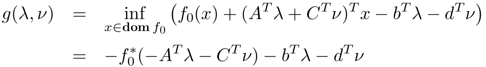

凸优化-对偶

<!-- more -->

## 对偶

### Lagrange 对偶问题

#### Lagrange 函数

考虑标准形式的优化问题，拉格朗日函数定义为：

$$
\begin{aligned}
&L:R^n\times R^m\times R^p\rightarrow R\\
&L(x, \lambda, \nu)=f_0(x)+\sum_{i=1}^m \lambda_if_i(x)+\sum_{i=1}^p \nu_ih_i(x)\\
\end{aligned}
$$

- 定义域为：$D\times R^m\times R^p$
- 目标函数和约束函数的加权和
- $\lambda_i$ 为第 i 个不等式约束的*拉格朗日乘子*
- $\nu_i$ 为第 i 个不等式约束的*拉格朗日乘子*

#### Lagrange 对偶函数

$$
\begin{aligned}
    &g:R^m\times R^p\rightarrow R\\
    &g=\inf_{x\in D} L(x,\lambda, \nu)
\end{aligned}
$$

- 函数 $g$ 为凹函数（任何优化问题的 Lagrange 对偶函数为凹函数）
  - $\sup L(x,\lambda, \nu)$ 为凸函数
- 最优值下界：若 $\lambda \ge 0$，则 $g(\lambda, \nu)\le p^ *$（$p^ *$ 为原优化问题最优值）

**例：线性方程组的最小二乘解**
$$
\begin{aligned}
\min~~&x^Tx\\
s.t.~~&Ax=b
\end{aligned}
$$
下界性质：$p^*\ge -\frac 1 4 \nu^TAA^T\nu-b^T\nu,\quad \forall \nu$

**例：标准形式的线性规划**

下界性质：$p^*\ge-b^T\nu,\quad if~A^T\nu +c\succeq 0$

**例：双向划分问题**
$$
\begin{aligned}
\min~~&x^TWx\\
s.t.~~&x_i^2=1,\quad i = 1,...,n
\end{aligned}
$$
下界性质：$p^*\ge -\mathbf 1^T\nu, \quad if~W+\mathbf{diag}(\nu)\succeq 0$

#### Lagrange 对偶函数与共轭函数

共轭函数 $f^*=\sup_{x\in D}(y^Tx-f(x))$

而对偶函数满足：

若已知共轭函数，可以简化对偶函数的表达

例如：熵的最大化

### 对偶问题

$$
\begin{aligned}
    \max~~&g(\lambda,\nu)\\
    s.t.~~&\lambda\succeq 0
\end{aligned}
$$

- 凸优化问题的最优值表示为 $d^*$
- 通过 Lagrange 对偶函数获取 $p^*$ 的最佳下界
- 凸优化问题：$d^*\le p^*$

**例：线性规划**
$$
\begin{aligned}
\min.&c^Tx\\
s.t.&Ax=b\\&x\succeq 0
\end{aligned}
$$

对偶问题为：

$$
\begin{aligned}
  \max.&-b^Tv\\
  s.t.&A^Tv+c\succeq0
\end{aligned}
$$

> *对于一个线性规划问题，其对偶问题也是线性规划问题*

### 弱对偶与强对偶

**Thm**（弱对偶）对于凸优化和非凸优化都有：$d^*\le p^*$

- 可以⽤来寻找困难问题的⾮平凡下界

**Thm**（强对偶）对偶间隙 $p^*-d^* =0$

- 并非总是满足，但在凸优化问题中常常满足

凸优化问题中保证强对偶的条件称为**约束准则**。

### 几何解释

考虑只有一个约束 $f_1(0)\le 0$ 的问题

定义集合：$G=\{(f_0(x),f_1(x)|x\in D\}$

如果是凸的：

### 最优性条件

**Def**（相对内部）$\mathrm{Rel~int}~D=\{x\in D|B(x,r)\cap\mathrm{aff~}D\sub D,\exist r>0\}$

#### Slater 约束准则

**Thm**：若某个凸优化问题中，存在一点 $x\in \mathrm{relint}~D=\{x\in D|B(x,r)\cap \mathrm{aff}D\subset D\}$ 使得该问题是**严格可行**的（$x\in relint~D,f_i(x)<0,Ax=b$）则为强对偶问题。

弱化后：若不等式约束时仿射的，只要可行域非空，则必有$d^*=p^*$

#### KKT 最优性条件

##### KKT 条件

一般可微优化问题，对偶间隙为 0 需要满足 KKT 条件，包含以下四个部分：

1. （互补松弛性）$\lambda^*_if_i(x^*)=0$
2. （原始可行性）$f_i(x)\le 0, h_i(x)=0$
3. （对偶可行性）$\lambda_i\ge 0$
4. （稳定性条件）$\displaystyle\frac{\partial}{\partial x}L(x,\lambda,\nu)=0$

**例：注水**

##### 互补松弛性

若对偶问题满足 $p^*=d^*$ 且所有函数可微，则最优解满足：
$$
\lambda_i^*f_i(x^*)=0
$$

##### 稳定性

$$
\inf L=L(x^*,\lambda^*,\nu^*)
$$

则：
$$
\frac{\partial L(x,\lambda^*,\nu^*)}{\partial x}|_{x=x^*}=0
$$

##### 对偶、问题重形式化

常用方法：

1. 引入新的变量和对应的约束
2. 将显示约束转换为隐式表达（反之亦然）
3. 变换目标或约束函数变换

###### 引入新的变量和对应的约束

例如：$\min~~f_0(Ax+b)$

对偶问题：$g=\inf_xf_0(Ax+b)=p^*$

重形式化后：
$$
\begin{aligned}
\min~~&f_0(y)&\\
s.t.~~&Ax+b-y=0&\\
\rightarrow~~ &g(\nu)=
\begin{cases}
-f_0^*(\nu)+b^T\nu &A^T\nu = 0\\
-\infty&otherwise
\end{cases}
\end{aligned}
$$
例：范数逼近问题
$$
\begin{aligned}
\min~~&\|Ax-b\|\\
\rightarrow\min~~&\|y\|\\
s.t.~~&y=Ax-b
\end{aligned}
$$

###### 隐式约束

例如：带框的线性规划

### 扰动、灵敏度分析

优化问题及其对偶问题的形式为：

则其扰动问题及其对偶

其中，$x$ 为原问题的优化变量，$u,~v$ 为参数

得到的 $p^*(u,v)$ 为最优值，是 $u$ 和 $v$ 的函数

#### 扰动问题的性质

**Thm**：若原问题是凸的，则 $p^*(u,v)$ 是凸函数

**Thm**：若原问题为凸，且对偶间隙为 0，$\lambda^*,w^*$ 为原问题的最优解，则：$p^*(u,v)\ge p^*(0,0)-\lambda^{*T}u-w^{*T}v$

#### 灵敏度分析

$p^*(u,v)\ge p^*(0,0)-\lambda^{*T}u-w^{*T}v$

##### 局部灵敏度分析

**Thm**：若原问题是凸的，且强对偶性成立， $p^*(u,v)$ 在 $(0,0)$ 可微，则有
$$
\lambda_i^*=-\frac{\partial p^*(0,0)}{\partial u_i},\quad \nu_i^*=-\frac{\partial p^*(0,0)}{\partial v_i}
$$

### 广义不等式

> 

- 不等式约束的 Lagrange 乘子为向量 $\lambda_i\in R^{k_i}$
- 拉格朗日函数为：$L=f_0(x)+\sum_{i=1}^m\lambda_i^Tf_i(x)+\sum_{i=1}^p\nu_ih_i(x)$

**Thm**（下界性质）若 $\lambda_i\succeq_{K_i^*}0$ 则 $g\le p^*$

**例：半定规划**

> 