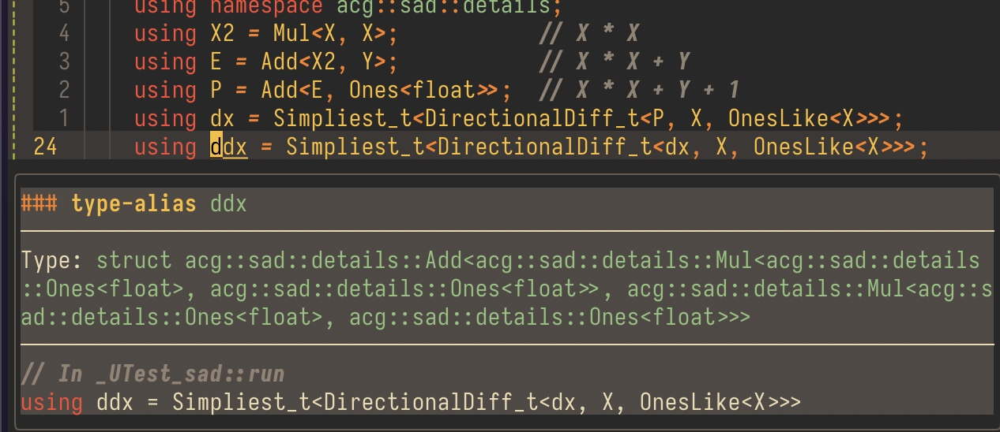
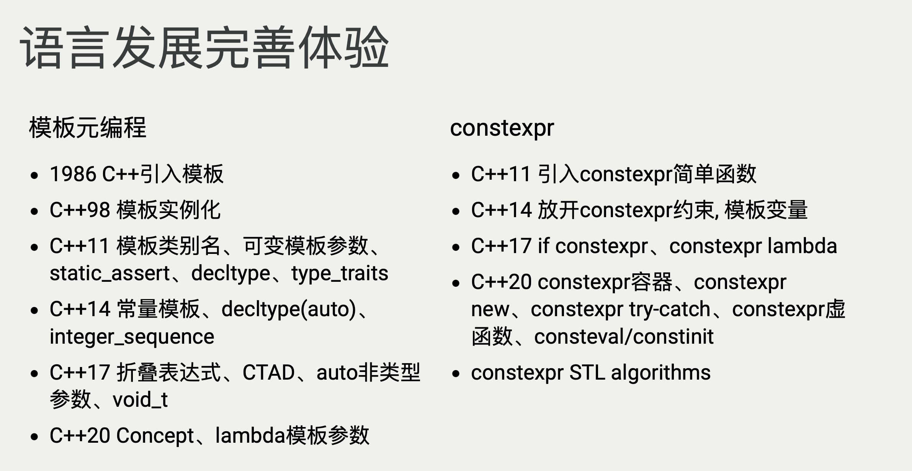
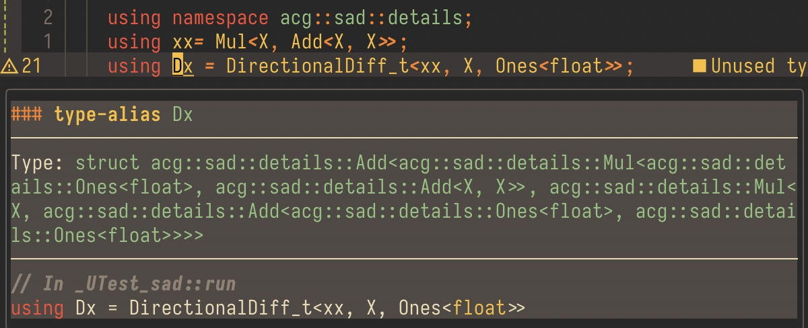

本来是想发在知乎的，但想了想还是先首发在自己的blog上。

<!-- more -->

> Template metaprogramming is a family of techniques to create new types and compute values at compile time. C++ templates are Turing complete if there are no limits to the amount of recursive instantiations and the number of allowed state variables. Erwin Unruh was the first to demonstrate template metaprogramming at a committee meeting by instructing the compiler to print out prime numbers in error messages. The standard recommends an implementation support at least 1024 levels of recursive instantiation, and infinite recursion in template instantiations is undefined behavior.

## 为什么我们需要自动求导，为什么是编译期自动求导

首先回答第一个问题：在我看来自动求导能够避免不必要的错误、方便想法的快速实现。例如在物理仿真领域的计算中，大都需要“能量函数”（特别是弹性能量）的梯度、Hessian，以支持牛顿迭代法进行快速求解。而大多数的能量形式都十分复杂，直接手推公式十分容易出错，并且写出的表达式也不利于机器进行优化（例如Eigen的Lazy Evaluation），因此自动求导是十分有必要的。[Ref](https://zhuanlan.zhihu.com/p/413934057)

再回答另一个问题，为什么是编译期的自动求导，主要是原因：

1. 物理仿真中的导数形式相对固定，没有必要多次进行计算图的构建；
2. 计算图模型的每一个节点都进行了数据的存储，不利于Eigen等数学库的Lazy Evaluation优化，也不利于SIMD指令的优化（例如$ax+b$，会被拆分为乘法、加法两个节点）但静态的编译期自动求导则可以利用到，这些编译期优化。



这篇文章大致分为三个模块

1. 模版元、自动求导的算法与数学基础
2. 一个基本的自动求导实现
3. 性能优化与展望

## 引言：模版元和自动求导的基础

### 模版元编程到底做了什么、为什么需要模版元编程

实际上我感觉模版元编程在大学本科阶段中介绍的并不多，而真正使用过模版元编程的同学也少之又少，我觉得原因主要是：

1. 课堂中教授的有关泛型的内容，并不是一个后续解决问题时的核心手段：对于大一并没有专业方向的同学而言，后续的发展的多样性非常高，而泛型只是个别语言中的核心特性，且具有和C++相类似的模版推导能力的语言并不多；
2. 模版元编程并不是最主流的设计，也不是最经济的设计方法：总体上模版元还是一个较为新颖的方法，一来一些机器上无法通过编译（C++11/17），模版元并不是一个“稳定”的解决方案，相比面向对象等已经广泛应用的方法而言，其应用上还是具有一定的局限；二来在算法的设计、coding本身的复杂度上都相较于原有的面向对象方法提升了不止一个档次，入门门槛变高；
3. 模版元编程解决的并不是原本（指泛型）不能解决的问题，而是提升算法运行时效率/提升抽象程度的一个手段

其实还有一些原因，但受限于我的开发经验并不多，而且本文的主要目的是介绍模版元编程，就仅仅在此提一嘴。

回到正题，抛开模版本身的复杂程度，在实际应用上的价值是很大的：

#### ～C++11

对于原本（指C++11前）的模版而言，其主要起到的功能是作为类型构造器存在，例如：

```cpp
template<typename T> class vector {
 	// ...
private:
  T* data_;
};
```

这也是STL中的大多数**容器**起到的功能，通过设置模版参数，能够简化并封装对于数组 `vector/array`、关联容器 `map/unordered_map`、链表`list/deque` 等的封装。

以及也有容器适配器，例如`stack`类模版，其本身并不是一个容器模版：

```cpp
template<class T, class Container = deque<T>> class stack;
```

其依赖于 `Container` 来表明底层实际使用的容器，再通过自身封装的接口为用户提供栈这种数据结构的功能。

总结一下，C++11之前，模版的功能还是相对单一，模版主要提供一个类型/函数构造的方法，即：

```cpp
template <typename T> struct Array{};
```

`Array`本身**并不是类型**，只有`Array<int>`才是类型。这也是为什么模版类/模版函数的实现一定要放在头文件里面的原因，因为从概念上讲，template标记的东西并不直接生成机器二进制代码，而只有你尝试将其变为类型，也就是你使用模版的时候才进行二进制代码生成。

在C++11之前，模版已经引入了特化的功能，最经典的例子是`std::vector<bool>`：如果没有特化的功能，在使用这个类的时候，有多少个`bool`就会开辟多少空间，这样是很浪费的，就算一个`bool`只有一字节（最少也是），也会为此浪费8倍的存储空间。具体的实现大家可以去各大平台逛一逛，大多数还是讲的很清楚的，这里就暂时略过。总之，模版特化是一种为特定的模版参数进行“定制”的方法，在使用的时候，c++会优先使用特化的模版，而非原本没有特化的模版（Partial Ordering）。

```cpp
template<typename T> class Array {/* impl */}
template<> class Array<bool> {/* spec impl */}
Array<bool> // 使用 spec impl 而非 impl
```

特化的一个重要功能是，能够在编译期给出一个类型的某些特性，例如

```cpp
template<typename T> struct is_floating_point{
  constexpr static value = false;
};
template<> struct is_floating_point<float> {
  constexpr static value = true;
};
template<> struct is_floating_point<double> {
  constexpr static value = true;
};
```

#### C++11～C++17

主要的功能是添加了SFINAE，即替换失败并不是错误，举个比较教科书的例子好了：

```cpp
// Ref: https://en.cppreference.com/w/cpp/language/sfinae
template<class T> int f(typename T::B*);
template<class T> int f(T);
 
int i = f<int>(0); // uses second overload
```

其能够通过`int`没有成员`int::B`来判断应该使用哪一个模版，即使这两个模版是同名的。

其最经典的例子则是`enable_if` 和 一系列 `is_xxx` 的使用：

```cpp
template<bool B, class T = void> struct enable_if {};
template<class T> struct enable_if<true, T> { typedef T type; };
```

例如：

```cpp
template<typename T>
typename enable_if<is_floating_point<T>::value, void>::type func(T x) {
  // floating impl.
}
template<typename T>
typename enable_if<! is_floating_point<T>::value, void>::type func(T x) {
  // other impl.
}
```

如果没有SFINAE，那么在调用 `func<int>(1)`的时候，会检查各个模版，当检查到第一个模版的时候，由于`enable_if<false, T>`中并没有成员`type`，则会产生一个错误（E）。但拥有SFINAE后则不会报错，编译器会尝试使用所有的可能情况，选择最合适的模版使用，如果没有模版能够成功替换才会报错。

在C++11中另一个大升级是可变参数模版，即`parameter-pack`，简而言之，就是现在模版可以和函数一样，接受任意多个参数：

```cpp
template<typename ...T> class Tuple;
Tuple<> tp1;
Tuple<int> tp2;
Tuple<int, float, long> tp3;
```

其可以用于构造这样的类型表，并且给出表中的元素个数：

```cpp
template<typename ... T> struct List {
	static constexpr size_t length = sizeof...(T);
};
```

至此我们已经能够隐约知道模版的一些基本功能，并且由于SFINAE的存在，我们甚至可以来写一些简单的类型推导：

```cpp
struct Empty {};

// H, T... => H
template <typename... T> struct Front {};

template <> struct Front<> {
  using type = Empty;
};

template <typename H, typename... T> struct Front<H, T...> {
  using type = H;
};

// H..., T => T
template <typename... T> struct Back;

template <> struct Back<> {
  using type = Empty;
};

template <typename T> struct Back<T> {
  using type = T;
};

template <typename H, typename... T> struct Back<H, T...> {
  using type = typename Back<T...>::type;
};
```

这里实现的是取出类型参数表的头和尾的操作。我们可以扩展这个操作，即获得一个类型的`List`：

```cpp
template <typename... T> struct List {
  // 本身
  using type = List<T...>;
  // 长度
  constexpr static acg::size_t size_ = sizeof...(T);
  // 转换，例如: List<int, float, char>::cast<std::tuple> => std::tuple<int, float, char>
  template <template <typename...> typename C> using cast = C<T...>;
  // 尾部扩展
  template <typename Ts> using append = List<T..., Ts>;
  // 头上扩展
  template <typename Ts> using prepend = List<Ts, T...>;
  using front = typename Front<T...>::type;
  using back = typename Back<T...>::type;
};
```

有了偏特化我们可以做啥呢：

```cpp
// Car: [h, t...] => h
//      [h] => h
//      [] => Empty
template <typename T> struct Car {};

template <typename... T> struct Car<List<T...>> {
  using type = typename List<T...>::front;
};

// Cdr: [h, t...] => [t...]
//      [h] => []
//      [] => Empty
//      ?  =>
template <typename T> struct Cdr {};

template <typename H, typename... T> struct Cdr<List<H, T...>> {
  using type = List<T...>;
};

template <typename H> struct Cdr<List<H>> {
  using type = List<>;
};
```

是不是有函数式编程那味了？我们继续：

```cpp
// GetElem
template <int x, typename T> struct GetElem {};

// GetElem x [] => Empty
template <int x> struct GetElem<x, List<>> {
  using type = Empty;
};

// GetElem 0 [H T ...] => H
template <typename H, typename... T> struct GetElem<0, List<H, T...>> {
  using type = H;
};

// GetElem x [H T ...] => GetElem (x - 1) [T ...]
template <int x, typename... T> struct GetElem<x, List<T...>>
    : public GetElem<x - 1, typename Cdr<List<T...>>::type> {};

// Concat
template <typename L, typename R> struct Concat;

// Concat [L...] [R...] => [L... R...]
template <typename... LT, typename... RT> struct Concat<List<LT...>, List<RT...>> {
  using type = List<LT..., RT...>;
};
```

实际上了解过Haskell的童鞋已经发现了，它和Haskell的风格真的很像！通过偏特化和SFINAE，我们实现了类似于函数式里的模式匹配功能。以及在模版替换过程中，实际上是有一定的Lazy Evaluation的存在的：

```cpp
struct Empty {};
template <typename T> struct GetType {
  struct Inner { using type = typename T::type; };
};

int main() {
  GetType<Empty> x; // No Error! because GetType<Empty>::Inner is not instantiated!
  // GetType<Empty>::Inner x; -> Error!
  // 		error: no type named 'type' in 'Empty'
  //  		... in instantiation of member class 'GetType<Empty>::Inner' requested here
  return 0;
}
```

#### C++17～

这里主要就是针对之前的一些痛点做出的优化，比如CTAD这些，能够更方便的帮你实现一些骚操作，例如：

```cpp
std::pair p(2, 4.5);     // deduces to std::pair<int, double> p(2, 4.5);
std::tuple t(4, 3, 2.5); // same as auto t = std::make_tuple(4, 3, 2.5);
std::less l;             // same as std::less<void> l;
```

这里原本是需要给出模版参数的，但由于CTAD的存在，其可以通过构造函数来自动推断出你需要的类型。



### 那么模版到底有什么更实际的作用呢？

首先，可以用这样的类型数据结构来实现编译时算法，例如 TaskFlow 的这个PR：[New Feature](Add TaskBuild DSL to describe a graph! by netcan · Pull Request #222 · taskflow/taskflowgithub.com/taskflow/taskflow/pull/222)

```cpp
def_task((A), { std::cout << "TaskA\n"; };);
def_task((B), { std::cout << "TaskB\n"; };);
def_task((C), { std::cout << "TaskC\n"; };);
def_task((D), { std::cout << "TaskD\n"; };);
def_task((E), { std::cout << "TaskE\n"; };);

auto tasks = taskbuild(
  task(A)
    -> fork(B, C)
    -> task(D),
  merge(A, B)
    -> task(E)
)(taskflow);
```

通过这样简单的语法就能够快速且准确地描述任务之间的拓扑连接关系。这和我们的终极目标——AutoDiff很像！AutoDiff大多需要通过计算图模型来进行梯度计算，例如[PyTorch](https://pytorch.org/tutorials/beginner/blitz/autograd_tutorial.html#computational-graphpytorch.org/tutorials/beginner/blitz/autograd_tutorial.html#computational-graph)

Taskflow中，描述Task之间关系的图也是有向无环的，而计算图模型也是有向无环的。TaskFlow利用模版元编程实现了进行静态的任务调度，即通过对于图节点进行拓扑排序，在编译期利用模版自动推导、并确定任务执行顺序，在运行时直接按照该顺序执行，即可省去原来在运行时计算拓扑排序：

[设计并实现一个拓扑排序 DSL](netcan.github.io/2020/08/15/%E8%AE%BE%E8%AE%A1%E5%B9%B6%E5%AE%9E%E7%8E%B0%E4%B8%80%E4%B8%AA%E6%8B%93%E6%89%91%E6%8E%92%E5%BA%8FDSL/)

我们的Autodiff中，何处使用了类似的思想呢，我们来仔细讲讲

### Meta AutoDiff
这里我们初步构思一下AutoDiff实现的大致方案和思路。

> P.S. 由于高阶导数是导数的导数，因此我们（如果有解析表达式的情况下）只需要考虑一阶导数如何进行计算。

#### 方向导数计算的数学基础

> P.S. 在这里先考虑函数光滑。

首先是，一阶导数到底是如何求出的？这里我们选择使用求方向导数的方法。现有的AutoDiff库，以及ceres都使用了这类方法

> [reference](https://zhuanlan.zhihu.com/p/248865580)

我们进行一个简单的推导，先考虑光滑的一元函数函数 $f,g,h:\mathbb R\rightarrow \mathbb R$ 的情况（表述上可能不是很严谨）：

链式法则告诉我们：若 $f = g\circ h$，且$f(x) = g(h(x))$，$\frac{\mathrm d f}{\mathrm d x}(x) = \frac{\mathrm d g}{\mathrm d h} (x)\frac{\mathrm d h}{\mathrm d x} (x)$，举个例子：

$$
\begin{aligned} &f(x) = \cos x^2, g(x) = \cos(x), h(x) = x^2\\ \implies& \frac{\mathrm d f}{\mathrm d x} (x)= \frac{\mathrm d g}{\mathrm d h} (x)\frac{\mathrm d h}{\mathrm d x} (x)= -\sin(x^2) \cdot 2x\\ \implies &\mathrm{d}f = - 2x \cdot \sin(x^2)\mathrm{d}x \end{aligned}
$$

由于一元函数/标量的标量值函数并没有方向的概念（始终认为 dx 就是沿着 x 正向走的一个小量），我们来第二个例子，来分析其中的导数是如何进行传递的，假设我们有一个二元函数$f(x, y): (x, y)\rightarrowtail xy, \mathbb R\times \mathbb R \rightarrow \mathbb R$

我们想知道的是，关于 $x,y$ 的偏导数的解析式，我们可以尝试对 $f$ 进行**全微分**：

$$
\mathrm df = x \mathrm dy + y\mathrm dx
$$

考虑到实际上全微分描述的是函数在一点的线性近似，改写为：

$$
f + \delta f = xy +x \delta y + y\delta x
$$

实际上，我们只需要线性近似，因此我们可以认为二阶小量为0，即

$$
f+\delta f = (x+\delta x)(y+\delta y) \approx xy + x\delta y+y\delta x
$$

在这个意义下，我们直接取 $\delta x, \delta y$ 的系数，就能得到关于 $x,y$ 的**偏导数**的解析表达！实际上 $f$ 看作一个向量函数情况下，即$f:\mathbb R^2\rightarrow \mathbb R$ ，那么之前提到的 $\delta x$ 前的系数实际上是它的方向导数，方向是 $x$ 正方向。

另一方面，根据方向导数的定义其描述的是自变量沿着某一个方向走出一小步（$\delta x =: e$），对于最终函数的影响有多大（ $\delta f$ ）：例如在上式中，我们只沿着 $x$ 走一步 $e$ ，即 $\delta x =e, \delta y = 0$ ，那么

$$
f + \delta f = xy + y \cdot e
$$

取出这个系数即可得到 $f_x$ 。

> P.S. 为啥不一起求 $f_x,f_y$ 的表达式，实际上是为了让这个问题变得简单，因为必须区分 $x,y$ 对于 $f$ 的贡献，从而就会引入两个类似于 e 的变元，在后续实现上较为复杂。另一方面，由于所有表达式都是在编译期推导的，运行时仅仅进行表达式计算，因此不会因此带来额外的运行时消耗。

我们一般意义上说的梯度，实际上是一个标量值函数，对于其输入向量的各个维度的导数，即：

$$
f:\mathbb R^n \rightarrow \mathbb R\implies (\nabla f)^T = \left( \frac{\partial f}{\partial x_1}, \frac{\partial f}{\partial x_2}, \cdots,\frac{\partial f}{\partial x_n} \right)
$$

那么我们在计算第一个偏导数的时候，设定 $e = (1, 0, \cdots, 0)$，最终就能求出得到的$\frac{\partial f}{\partial x_1}$。

这个方法的推导过程中，表达式常常被称为Dual，因为整个表达式由两部分组成，一部分是原本的表达式，另一部分是表达式关于某个方向的方向导数值，记作$f(x) + e\cdot g(x)$。由于$e$实际上是代表选定方向的一个一阶无穷小量，并且我们也只需要一阶无穷小量，因此关于$e$定义

$$
e^2 = 0
$$

其他的四则运算则与原本一致。这里给出一些例子（仅对于$x$求偏导，也就是x正方向的方向导数）：

$$
\begin{aligned}
f(x) = x^2 &\implies f + \delta f = (x + e) ^2 = x^2 + e\cdot 2x\\
f(x, y) = xy & \implies f + \delta f = (x + e)y = xy + e \cdot y\\
f(x, y) = x+y & \implies f + \delta f = (x + e)+y = x+y + e \cdot1
\end{aligned}
$$

另外，如果是向量函数，我们也可以求出其关于第1个维度的方向导数，例如设$x, y\in \mathbb R^3$，下列函数关于$\delta x = e (1, 0, 0)^T$的方向导数可以用相类似的方法进行推导

$$
\begin{aligned}
f(x) = x^Tx = \| x\|^2 &\implies f + \delta f = (x + \delta x) ^T(x+\delta x) = x^Tx + 2x\cdot \delta x
= x^Tx + e\cdot (2x \cdot (1, 0, 0)^T) \\
f(x, y) = x^Ty & \implies f + \delta f = (x + \delta x)y = xy + e(1, 0, 0)^T\cdot y\\
f(x, y) = x+y & \implies f + \delta f = (x + e)+y = x+y + e (1, 0, 0)^T
\end{aligned}
$$

从第三个例子我们可以看出，使用方向导数我们不仅仅能够获得对于标量值函数的方向导数，我们还能够得到对于向量值函数的方向导数。

另外我们需要注意的是，如果是多元函数，在应用链式法则的时候需要注意求出每一个输入的导数，再组合出最终结果：

$$
f(x) = g(h_1(x), h_2(x), \cdots, h_n(x)) \implies 
\frac{\partial f}{\partial x} = \sum _{ i = 1}^n \frac{\partial g}{\partial h _ i} \frac{\partial h _ i}{\partial x}
$$

### 如何将公式变为代码 — 基于类型的符号计算

如何进行符号计算，特别是编译期的符号计算。区别于AutoDiff的实现：

[Autodiff/reverse/var](https://github.com/autodiff/autodiff/blob/main/autodiff/reverse/var/var.hpp)

该实现的原理是在每一次发生计算的时，依赖于运算符重载自动生成计算图。对于计算图的生成在本质上是在编译时的，但对于导数的计算是运行时的，即其并没有得到导数的解析表达式，而是通过运行时来计算得到的。例如对于 Hessian 的计算：


```cpp
/// Return the Hessian matrix of variable y with respect to variables x.
template<typename T, typename X, typename GradientVec>
auto hessian(const Variable<T>& y, Eigen::DenseBase<X>& x, GradientVec& g)
{
    using U = VariableValueType<T>;

    using ScalarX = typename X::Scalar;
    static_assert(isVariable<ScalarX>, "Argument x is not a vector with Variable<T> (aka var) objects.");

    using ScalarG = typename GradientVec::Scalar;
    static_assert(std::is_same_v<U, ScalarG>, "Argument g does not have the same arithmetic type as y.");

    constexpr auto Rows = X::RowsAtCompileTime;
    constexpr auto MaxRows = X::MaxRowsAtCompileTime;

    const auto n = x.size();

    // Form a vector containing gradient expressions for each variable
    using ExpressionGradient = Vec<ScalarX, Rows, MaxRows>;
    ExpressionGradient G(n);

    for(auto k = 0; k < n; ++k)
        x[k].expr->bind_expr(&G(k).expr);

    /* Build a full gradient expression in DFS tree traversal, updating
     * gradient expressions when encountering variables
     */
    y.expr->propagatex(constant<T>(1.0));

    for(auto k = 0; k < n; ++k) {
      x[k].expr->bind_expr(nullptr);
    }

    // Read the gradient value from gradient expressions' cached values
    g.resize(n);
    for(auto i = 0; i < n; ++i)
        g[i] = val(G[i]);

    // Form a numeric hessian using the gradient expressions
    using Hessian = Mat<U, Rows, Rows, MaxRows, MaxRows>;
    Hessian H = Hessian::Zero(n, n);
    for(auto i = 0; i < n; ++i)
    {
        for(auto k = 0; k < n; ++k)
            x[k].expr->bind_value(&H(i, k));

        // Propagate a second derivative value calculation down the gradient expression tree for variable i
        G[i].expr->propagate(1.0);

        for(auto k = 0; k < n; ++k)
            x[k].expr->bind_value(nullptr);
    }

    return H;
}
```

其不仅仅可能产生多次重复的计算结果，而且中间在计算上大量使用了`shared_ptr`导致了计算效率低下的问题。

我们的目标是在**编译期**产生解析的**方向导数**（也就是这个方向导数的解析表达式），因此我们的（数学上的）输入变量一定不是（编程中的）变量！

在C++中，变量是运行时的一个概念，通常认为能够对应到一个物理存在的内存块，能够参与运行时的计算。而类型才是C++中编译时的概念，在没有RAII的情况下，绝大多数程序并不能直接得到某个物理内存块上存储的变量所对应的类型。因此，如果我们需要产生尽量少的运行时开销，那么我们用来推导导数所使用的一定只能是基于类型，而非变量。

更形象化来说，通常可能你认为的Add类是这样的：

```cpp
class Add: public Expr /* 表示一个计算图节点 */ {
public:
  Add(Node* lhs, Node* rhs);
private:
  Node* lhs, rhs; // Runtime Consumption
  ValueType val;
};

class Input: public Expr {
public:
  void SetValue(ValueType );
private:
  ValueType val;
}
```

但实际上我们想要的是这样的：

```cpp
template<typename L, typename R> struct Add: public Expr { 
  using type = Add<L, R>; 
  static constexpr bool is_leaf = false;
};
struct Input: public Expr{
  static constexpr bool is_leaf = true;
};
```

我们生成的一个表达式可能是这样的：

```cpp
struct X: public Input{};
struct Y: public Input{};
using Result = Mult<Add<X, Y>, Y>;
```

这样，`X`和`Y`不再是运行时的变量，而是一个类型，便于我们后续进行推导。

## 一个初步的实现

### 基础表达式的设计

```cpp
template <typename T, typename... E> struct Expr {
  // 记录该函数输入表达式，Add<L, R>::InputExpr => List<L, R>
  using InputExpr = List<E...>;
  // 记录该表达式的所有输入例如 Add<X, Ones<float>>::InputNodes == List<X>;
  using InputNodes = Unique_t<Reduce_t<Concat, List<List<>, typename E::InputNodes...>>>;
  // 表示真实计算时的数据类型
  using type = T;
  // 表示所有其依赖的子表达式
  using SubNodes = Unique_t<Reduce_t<Concat, List<List<E...>, typename E::SubNodes...>>>;
  // 是否是常数
  static constexpr bool is_constant = false;
  // 是否是输入节点（自变量）
  static constexpr bool is_input = false;
};

// 链式法则，求出 F，F 的输入为 I（一个表达式表），关于 X， 方向为 D 的导数
template <typename F, typename I, typename X, typename D> struct Chain;
// 方向导数，对于Y，求关于X，方向为 D 的导数
template <typename Y, typename X, typename D> struct DirectionalDiff {
  // 根据多元函数链式法则，就是对于各个输入节点的导数。
  using type = typename Chain<Y, typename Y::InputExpr, X, D>::type;
};
// 如果是空列表，那么返回0
template <typename F, typename X, typename D> struct Chain<F, List<>, X, D> {
  using type = Zeros<typename F::type>;
};
// 如果输入只有一个，即f是一个一元函数（不一定是标量），直接用一元函数链式法则。
template <typename F, typename I, typename X, typename D> struct Chain<F, List<I>, X, D> {
  // 先得到 dI，即I对X方向为D的导数表达式。
  using ix = typename DirectionalDiff<I, X, D>::type;
  // 然后算 dF Grad_t描述了表达式 F，对于输入I，已知I对X的D方向导数为ix情况下的方向导数。
  using type = typename F::template Grad_t<I, ix>;
};
// 如果输入有多个，那么先取出第一个输入，应用链式法则得到 fhx，然后对剩下输入进行递归，得到剩下的部分导数表达式，加起来得到最终结果。
template <typename F, typename X, typename D, typename IH, typename... IT>
struct Chain<F, List<IH, IT...>, X, D> {
  using hx = typename DirectionalDiff<IH, X, D>::type;
  using fhx = typename F::template Grad_t<IH, dual_hx>;
  using type = Add<fhx, typename Chain<F, List<IT...>, X, D>::type>;
};
// 递归终点：如果是 X 对 X 求方向D的导数，那么结果就是D
template <typename X, typename D> struct DirectionalDiff<X, X, D> {
  using type = D;
};
```

以加法为例：

```cpp
// Add Operation, L::type should equals to R::type
template <typename L, typename R> struct Add : public Expr<typename L::type, L, R> {
  static_assert(std::is_same_v<typename L::type, typename R::type>,
                "L::type should be same as R::type.");

  template <typename Li, typename Ri>
  inline decltype(auto) operator()(Li&& l, Ri&& r) const noexcept {
    return l + r;
  }

  template <typename X, typename G> using Grad_t = G;
};
```

Add对应的数学函数是：$f(x_1, x_2) = x_1 + x_2$，注意到，`Grad_t`是一个模版，第一个参数`X`用于表明是对哪一个位置求偏导，第二个参数`G`表示的是Dual计算是的$e$项的系数，例如：

$$
f(F(x), y) \implies f+\delta f=f(F(x)+Ae, y) = (F(x)+y) + e \cdot 1
$$

对应了

```cpp
Add<F, Y>::Grad_t<F, A> => A
```
其中 `A` 存储了计算到 `F` 对于 `X` 的某一方向导数。

```cpp
template <typename L, typename R>
struct Mul<L, R> : public Expr<typename L::type, L, R> {
  template <typename Li, typename Ri>
  inline decltype(auto) operator()(Li&& l, Ri&& r) const noexcept {
    return l * r;
  }
  template <typename X, typename G> using Grad_t
      = std::conditional_t<std::is_same_v<X, R>, Mul<L, G>, Mul<G, R>>;
};
```

对于乘法，若是关于$x_1$的方向导数：

$$
f(x_1, x_2) = x_1 x_2\implies f(x_1 + e, x_2) = f+ \delta f = x_1x_2 x_2 e
$$

对 $x_2$ 亦然。

至此我们已经能够得到一些初步的结果：



未完待续……


